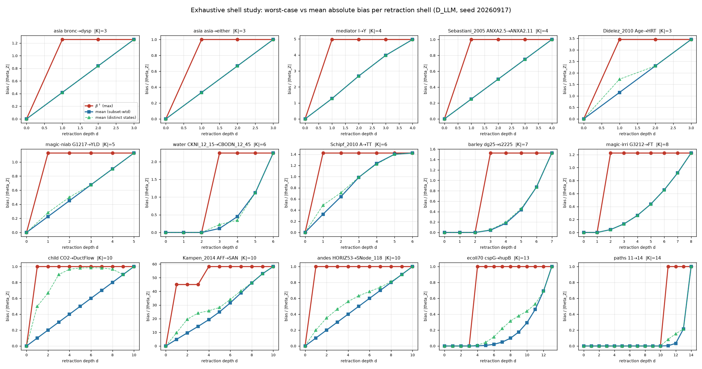

# Exploratory — mean vs max absolute bias per shell

Exploratory study of the proposal to redefine `beta_up(d)` from the **maximum** of `B` over the
retraction shell to its **mean**. Nothing is adopted here; this is evidence for the design
decision. Every number traces to `results/mean_vs_max/`, produced by
`experiments/mean_vs_max_shell.py`.

**Method.** 15 instances spanning `|K_G0|` 3–14, `r_val` 1–11 and `B(Ĉ)` 1.00–58.15. For each,
**every** one of the `2^|K_G0|` retraction subsets was enumerated, closed under Meek, and `B`
evaluated at each distinct resulting state: 28,248 subsets, 1,535 distinct states, 121 shells,
50 s total. No sampling, no early stop, no thresholding — so the output answers any ε after the
fact, including ε below 0.01 and above 20. Condition `D_LLM`, seed 20260917, so the SEMs are the
same ones the committed panel used. The per-state `B` is unchanged (still the exact worst case
over that state's ambiguity set); only the **shell-level** aggregation varies, which is the
design decision actually under review.

Two means are reported and they are different quantities:

- `mean_states` — over the **distinct closures** in the shell, each counted once.
- `mean_subsets` — over the `C(|K_G0|, d)` **subsets**, so a closure that many subsets collapse
  to is weighted by how many. This is what an analyst facing a uniformly random set of `d`
  mistaken claims would expect.

Validation: the `max` column reproduces the certified `beta_top` and staircase from
`results/final_table_eps_gt1/` to full floating-point precision on every instance.

---

## 1. The proposal does what it was meant to do

**The mean gives 3.6× the resolution of the max.** Over a 12-point ε grid from 0.001 to 50:

| Rule | mean distinct finite radii per instance |
|---|--:|
| `max` (current `r_eps`) | **1.07** |
| `mean_subsets` | **3.87** |

The max rule is flat almost everywhere: on 14 of 15 instances it returns the *same* radius at
every ε it returns anything at, so the ε axis carries essentially no information — which is the
dissatisfaction that prompted this. The mean rule produces a genuinely graded staircase, e.g.

- `ecoli70 cspG→hupB`: 4, 6, 8, 9, 10, 12, 13 across ε = 0.001 … 1
- `child CO2→DuctFlow`: 1, 1, 1, 1, 3, 5, 10
- `magic-irri G3212→FT`: 2, 2, 3, 3, 4, 6, 8

That is a real gain in discriminating power, and it is what the figure shows: the red curve is a
step, the blue one is a ramp.

## 2. But it is never more conservative, and that is not a tie-break

Across all 180 (instance, ε) cells:

| | count |
|---|--:|
| mean radius **larger** than max radius (**overstates robustness**) | **49** |
| mean radius smaller (more conservative) | **0** |
| equal | 131 |

The mean radius is never below the max radius — necessarily, since the mean of a shell never
exceeds its max, so it crosses any threshold later or never. Every one of those 49 cells is a
claim that the analyst can afford *more* wrong beliefs than the worst case permits. This is the
direction the paper already identifies as unacceptable for the sampled-mean variant: not a
conservative approximation, but an answer that errs towards overstating robustness.

The guarantee changes shape too. `max` supports "if at most `k` of your claims are wrong, your
effect is off by at most ε". A mean supports only "…is off by at most ε **on average over a
uniformly random set of `k` wrong claims**" — a statement about a distribution over analyst
errors that nothing in the setting supplies, and which is not the quantity a worst-case
certificate exists to bound.

## 3. What the mean is actually measuring

On **89 of 106 shells** (84%), `mean_subsets` equals `frac_nonzero_subsets × max` **exactly**, to
within 1e-12. In those shells every contaminated state carries the *identical* bias, so the mean
contains no magnitude information at all beyond the contamination rate — it is a rescaled count
of how many states are broken, not a measure of how badly.

`child CO2→DuctFlow` is the clean case: `max` is flat at 1.0 from `d = 1`, and `mean_subsets` is
exactly `d/10` at every depth. The apparent ramp is the contaminated fraction rising linearly,
nothing else.

The 17 shells where the mean genuinely averages differing magnitudes all belong to the two
instances with large `B(Ĉ)` (`Kampen_2014 AFF→SAN` at 58.15, `mediator I→Y` at 4.97). So the
extra resolution is real but it is mostly resolution in *how likely* the analyst is to be broken,
not in *how badly* — which is a legitimate thing to want, and a different thing from what
`r_eps` currently claims.

## 4. If a mean is adopted, it must be subset-weighted

Exact monotonicity check over all 106 adjacent-shell comparisons:

| Statistic | non-monotone steps |
|---|--:|
| `max` | **0** |
| `mean_subsets` | **0** |
| `mean_states` | **3** |

All 3 violations are on `child CO2→DuctFlow`, where `mean_states` rises to 0.9861 at `d = 6` and
then *falls* through 0.9828, 0.9667, 0.9000 before jumping to 1.0 at `d = 10`. The cause is that
the distinct-state count is itself non-monotone in `d` (it peaks at 72 states at `d = 6`), so
averaging over closures re-weights the shell as `d` grows. Weighting by subsets removes this.

So "mean over the distinct states in the shell" is **not** a usable definition — a first-crossing
radius on a curve that falls is not well defined. `mean_subsets` was monotone everywhere here,
which is encouraging but is 106 comparisons on 15 instances, **not a proof**.

## 5. The soundness gate, which this study does not clear

`beta_up` is computed over the **retraction up-set**, not over the whole space, and that is
licensed by Theorem C.4: the maximum over the retraction shell at `d` *equals* the maximum over
the ball at `d`. The search can therefore ignore everything else.

**No analogue of that theorem holds for a mean.** An average over a subset of the space is not
the average over the space, so a mean-based radius computed the way the code computes things
today would be an average over the retraction up-set specifically — a quantity whose relation to
any average over the full space is unestablished. The existing counterexample work already found
that the retraction-only search disagrees with brute force on 269 of 644 threshold probes for the
sampled mean, in the direction of reporting nothing reachable when something is.

This study deliberately did **not** test that: it enumerates the retraction up-set exhaustively,
which is the right object for characterising the curve but says nothing about the full space.

> **RESOLVED — see `docs/RESULT_MEAN_SOUNDNESS_GATE.md`.** The brute-force comparison against
> the whole enumerated space was run over 79 instances. The mean-based radius is **unsound**,
> not merely unproven: it overstates robustness on 29% of instances, with real-network
> witnesses. It is not conservative in either direction, and the full-space mean it aims at is
> itself non-monotone on 43% of instances, so there is no well-defined radius to compute. The
> retraction-computed curve is monotone everywhere and hides all of it. The max design passed
> every control exactly. **Do not adopt the mean-based radius**; the §7 recommendation below
> stands.

## 6. The mean does not fix the ceiling

Worth stating plainly, because it is the thing the ε > 1 re-run was chasing: switching to a mean
leaves the `UNREACHED` count **exactly unchanged at 67 of 180 cells**. Both statistics are bounded
above by the same `B(Ĉ)`, so any ε above an instance's ceiling is unreachable under either rule.
The mean buys resolution *below* the ceiling; it does not raise it. On this corpus at `D_LLM` the
ceiling is what kills the ε axis above 1, and no shell-level aggregation changes that.

## 7. Where this leaves the design

The proposal delivers the resolution it promised, and the subset-weighted form is well behaved
on every instance tested. Against that: it is uniformly anti-conservative (49 cells looser, 0
tighter), on 84% of shells it is a contamination count wearing a bias's units, it changes the
guarantee from worst-case to average-case-over-an-unspecified-distribution, and the theorem that
licenses the cheap search has no known mean analogue.

A reading that keeps both: **report the mean alongside `beta_up`, do not threshold a radius off
it.** The contaminated fraction is genuinely informative — it is the thing that actually varies
with depth on this corpus — and `frac_nonzero_subsets` is already in `shells.jsonl`. Reporting it
as its own column says "at depth `d`, this share of the ways you could be wrong break the
estimate" without claiming it bounds anything. That answers the dissatisfaction (a flat ε axis)
without weakening the certificate.

All claims here are scoped to these 15 instances, this corpus and `D_LLM`.
