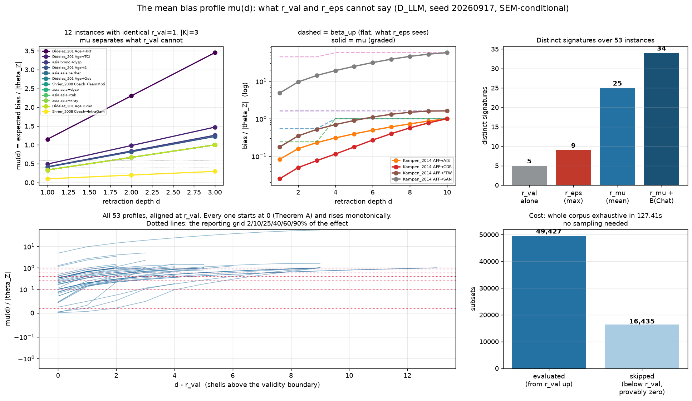

# The mean bias profile: a reportable companion to `r_val`

> **SUPERSEDED FOR REPORTING — see `docs/MEAN_TABLE_FULLSPACE.md`.** The statistic below averages
> over the **retraction up-set**, which is not the space the paper's geometry is defined on. The
> up-set is licensed for the worst case by a proved theorem, but no such equivalence holds for a
> mean, so reporting a mean on it silently changes the geometry that is the paper's contribution.
> The reporting table now computes `mu` on the full space `G_Chat` with BFS distance, the same
> space `r_val` uses. This document is retained for its methodology and its negative results —
> the bounding study (section 6), the monotonicity search (section 7) and the sampling and
> adaptive-stopping studies (section 8) — all of which concern the up-set formulation.

Answers the question this investigation was opened on: `r_eps`, though well founded, adds nothing
to `r_val` on real data. This report develops a companion statistic that does, says exactly what
it means and does not mean, and reports it per query over the whole corpus.

Every number traces to `results/mean_table/`, `results/mean_bounds/`, `results/mean_epsilon/` and
`results/mean_sampling/`. Condition `D_LLM` only, seed 20260917.

---

## 1. The problem, restated with numbers

`r_eps` thresholds `beta_up(d)`, the worst case over the retraction shell. On this corpus
`beta_up` jumps to its ceiling at the validity boundary and stays flat, so `r_eps` reproduces
`r_val` and the epsilon axis is inert. Measured over the 53 informative instances with non-zero
bias:

- **46 of 53 have `r_val = 1`.** Only five distinct `r_val` values exist across the whole corpus.
- The full `r_eps` profile over five tolerances yields **9** distinct signatures.

So the certificate sorts 53 real analyses into at most nine boxes, and 87% of them into one box.
That is the reporting problem.

## 2. The statistic

.. math::

    mu(d) = E[ B(Meek(Chat, K_G0 \ S)) ],  S ~ Uniform{ S subset of K_G0 : |S| = d }

**If exactly `d` of the orientations the analyst asserted are wrong, and nothing says which `d`,
this is the expected bias.** The expectation is over *subsets*, not over distinct closures:
several subsets Meek-close to the same state, and each is a distinct way for the analyst to be
wrong, so each is counted.

The radius is `r_mu(eps) = min{ d : mu(d) > eps }`, reported next to `r_val`, never instead of it.

### What it is not

`mu` is **not** the mean of `B` over the full perturbation space at distance `d`. Those are
different quantities and they disagree in both directions; a radius read off one differs from the
other on 29% of instances (`docs/RESULT_MEAN_SOUNDNESS_GATE.md`). The domain here is deliberately
the retraction up-set, because that is the set of ways *the analyst's own claims* can be wrong.
States elsewhere in the space assert orientations the analyst never made and are not ways for the
analyst to be mistaken. Under that reading the earlier "unsoundness" is not a defect but a
different estimand, and cases where Meek re-derives a retracted edge — leaving the state, and the
bias, unchanged — are semantically correct rather than pathological: being wrong about a compelled
edge genuinely costs nothing.

### What must travel with every reported number

1. **Average case, not worst case.** `mu` does not bound anything. `beta_up` does, and remains the
   quantity any guarantee is stated against. `mu(d) <= beta_up(d)` always.
2. **A uniform prior** over which `d` claims are wrong. Nothing in the framework implies that
   prior; it is an assumption introduced by this statistic.
3. **SEM-conditional.** The corpus ships graph structure only, so `B` is evaluated against a
   seeded linear-Gaussian SEM attached to the ground-truth DAG. `r_val` carries no such assumption.
4. **Monotonicity is observed, not proved** (section 7).

## 3. Why it is affordable: the walk starts at `r_val`

`mu` is never reported alone — it accompanies `r_val` — and that is what makes it computable.
Theorem A gives `beta(d) = 0` for `d < r_val`, and a maximum of zero over non-negative values
forces **every** state in those shells to zero, hence `mu(d) = 0`. Those shells cannot cross a
non-negative threshold, so they are skipped, exactly rather than heuristically.

Verified: 33 of 33 shells strictly below `r_val` have `mu = 0` and `beta_up = 0`.

The consequence is the practical result of this report:

| | subsets |
|---|--:|
| skipped below `r_val` (provably zero) | 16,435 |
| **evaluated, from `r_val` upward** | **49,427** |

**The entire real-network corpus is exhaustive.** 66 of 66 informative instances, every shell
enumerated in full, no sampling, no estimate, no confidence interval, in about two minutes. The
sampling machinery of section 6 is therefore not needed for this corpus at all — it is insurance
for larger `|K_G0|` than this corpus contains.

Instances whose `r_val` is itself `UNREACHED` carry zero bias everywhere by the same theorem
(verified: `B(Ĉ) = 0.0` exactly on all 13). Their profile is identically zero and their `r_mu` is
`UNREACHED` at every tolerance. They are reported that way and not enumerated.

## 4. The reporting grid

Three constraints, in order.

**It must not sit on 1.0.** Half the informative instances have `B(Ĉ)` equal to 1.0 to within
4e-15 — the worst admissible adjustment set drives the effect estimate to exactly zero, giving a
relative bias of exactly 1 — and a strict `>` test at a grid point placed there splits tied
instances by floating-point dust. The legacy grid and any quantile-derived grid both land on it
(the 75th percentile of `B(Ĉ)` *is* 1.0, because the mass point dominates that quantile), and are
disqualified.

**It must stay below the ceiling.** `mu(|K_G0|) = B(Ĉ)` exactly — the top shell is the single
state `Ĉ` — verified on 53 of 53 instances with zero mismatches. **The mean and the max share a
ceiling.** Every tolerance above an instance's own `B(Ĉ)` is `UNREACHED` by construction, and 39
of 53 instances have a ceiling at or below 1.0. A 1.5 column was measured and rejected: it buys
0.08 distinct radii per instance and triples the `UNREACHED` rate from 5.3% to 17%.

**Round, practitioner-legible values only**, so the grid is not tuned to this corpus.

Recommended: **`{0.02, 0.10, 0.25, 0.40, 0.60, 0.90}`** — 2%, 10%, 25%, 40%, 60%, 90% of the
reported effect's own magnitude — plus `B(Ĉ)` as its own column, which says where the instance
saturates rather than probing one more threshold.

| grid | distinct radii/instance | `UNREACHED` | pinned at `r_val` | on the mass point |
|---|--:|--:|--:|---|
| **recommended** | **3.32** | **5.3%** | 48.7% | no |
| legacy `{0.01..1.00}` | 2.68 | 11.9% | 56.9% | **yes, disqualified** |
| log-spaced | 2.57 | 18.2% | 52.8% | no |
| with a 1.5 column | 3.40 | 17.0% | 45.6% | no |

Stability, against overfitting: the recommended grid wins or ties on **every** split tested — by
ceiling (`B(Ĉ)` = 1 vs not), by `|K_G0|`, and by `r_val` — and has the lowest `UNREACHED` rate in
all of them.

## 5. The table

`r_val` is graph-theoretic. **Every `r_mu` column is SEM-conditional.** `UNR` is the `UNREACHED`
sentinel: no depth crosses that tolerance, which on this statistic means the tolerance exceeds the
instance's ceiling `B(Ĉ)`. It is a status, never a large radius, and is never averaged. Recall
that `r = 1` means **zero** safe retractions.

| Network | Query | \|K_G0\| | `r_val` | 2% | 10% | 25% | 40% | 60% | 90% | `B(Ĉ)` |
|---|---|--:|--:|--:|--:|--:|--:|--:|--:|--:|
| `paths` | `11 → 14` | 14 | 11 | 12 | 13 | 14 | 14 | 14 | 14 | 1.000 |
| `ecoli70` | `cspG → hupB` | 13 | 4 | 6 | 9 | 10 | 11 | 12 | 13 | 1.000 |
| `barley` | `dg25 → aks_m2` | 7 | 3 | 4 | 6 | UNR | UNR | UNR | UNR | 0.184 |
| `barley` | `dg25 → s2225` | 7 | 3 | 3 | 4 | 5 | 5 | 6 | 7 | 1.525 |
| `water` | `CKNI_12_15 → CBODN_12_45` | 6 | 3 | 3 | 3 | 4 | 4 | 5 | 5 | 2.245 |
| `barley` | `frspdag → dg25` | 7 | 2 | 2 | 3 | 4 | 5 | 6 | 7 | 1.000 |
| `magic-irri` | `G3212 → FT` | 8 | 2 | 2 | 3 | 4 | 5 | 6 | 7 | 1.225 |
| `Acid_1996` | `x1 → x10` | 1 | 1 | 1 | 1 | 1 | 1 | 1 | 1 | 1.927 |
| `Acid_1996` | `x1 → x11` | 1 | 1 | 1 | 1 | 1 | 1 | 1 | 1 | 1.629 |
| `Acid_1996` | `x1 → x12` | 1 | 1 | 1 | 1 | 1 | UNR | UNR | UNR | 0.384 |
| `Acid_1996` | `x1 → x13` | 1 | 1 | 1 | 1 | UNR | UNR | UNR | UNR | 0.126 |
| `Didelez_2010` | `Age → HRT` | 3 | 1 | 1 | 1 | 1 | 1 | 1 | 1 | 3.453 |
| `Didelez_2010` | `Age → Occ` | 3 | 1 | 1 | 1 | 1 | 2 | 2 | 3 | 1.000 |
| `Didelez_2010` | `Age → S` | 3 | 1 | 1 | 1 | 1 | 1 | 2 | 3 | 1.223 |
| `Didelez_2010` | `Age → Smo` | 3 | 1 | 1 | 1 | 1 | 2 | 2 | 3 | 1.000 |
| `Didelez_2010` | `Age → TCI` | 3 | 1 | 1 | 1 | 1 | 1 | 2 | 2 | 1.473 |
| `Kampen_2014` | `AFF → AIS` | 10 | 1 | 1 | 2 | 4 | 6 | 7 | 10 | 1.000 |
| `Kampen_2014` | `AFF → CDR` | 10 | 1 | 1 | 4 | 6 | 8 | 9 | 10 | 1.000 |
| `Kampen_2014` | `AFF → FTW` | 10 | 1 | 1 | 1 | 2 | 3 | 4 | 6 | 1.619 |
| `Kampen_2014` | `AFF → SAN` | 10 | 1 | 1 | 1 | 1 | 1 | 1 | 1 | 58.153 |
| `Polzer_2012` | `Caries → Diabetes` | 5 | 1 | 1 | 1 | 2 | 3 | 4 | 5 | 1.000 |
| `Schipf_2010` | `A → PA` | 6 | 1 | 1 | 1 | 2 | 3 | 4 | 6 | 1.000 |
| `Schipf_2010` | `A → S` | 6 | 1 | 1 | 1 | 2 | 3 | 4 | 6 | 1.000 |
| `Schipf_2010` | `A → T2DM` | 6 | 1 | 1 | 2 | 3 | 3 | 5 | UNR | 0.791 |
| `Schipf_2010` | `A → TT` | 6 | 1 | 1 | 1 | 1 | 2 | 2 | 3 | 1.422 |
| `Schipf_2010` | `A → U` | 6 | 1 | 1 | 2 | 3 | 4 | 4 | 6 | 1.000 |
| `Sebastiani_2005` | `ANXA2.5 → ANXA2.11` | 4 | 1 | 1 | 1 | 1 | 2 | 3 | 4 | 1.000 |
| `Shrier_2008` | `Coach → IntraGameProprioception` | 3 | 1 | 1 | 2 | 3 | UNR | UNR | UNR | 0.296 |
| `Shrier_2008` | `Coach → TeamMotivation` | 3 | 1 | 1 | 1 | 1 | 2 | 2 | 3 | 1.000 |
| `Thoemmes_2013` | `e0 → s1` | 1 | 1 | 1 | 1 | 1 | 1 | 1 | 1 | 1.000 |
| `Thoemmes_2013` | `e0 → s2` | 1 | 1 | 1 | 1 | 1 | 1 | 1 | 1 | 1.000 |
| `Thoemmes_2013` | `e0 → s3` | 1 | 1 | 1 | 1 | 1 | 1 | 1 | 1 | 1.000 |
| `Thoemmes_2013` | `e0 → x` | 1 | 1 | 1 | 1 | 1 | 1 | 1 | 1 | 1.000 |
| `Thoemmes_2013` | `e0 → y` | 1 | 1 | 1 | 1 | 1 | 1 | 1 | 1 | 1.000 |
| `alarm` | `ANAPHYLAXIS → BP` | 1 | 1 | 1 | 1 | 1 | 1 | 1 | 1 | 1.000 |
| `alarm` | `ANAPHYLAXIS → HRBP` | 1 | 1 | 1 | 1 | 1 | 1 | 1 | 1 | 1.000 |
| `andes` | `GIVEN_1 → SNode_100` | 10 | 1 | 1 | 2 | 3 | 5 | 7 | 10 | 1.000 |
| `andes` | `HORIZ53 → SNode_118` | 10 | 1 | 1 | 1 | 3 | 4 | 6 | 9 | 1.000 |
| `asia` | `asia → dysp` | 3 | 1 | 1 | 1 | 1 | 2 | 2 | 3 | 1.000 |
| `asia` | `asia → either` | 3 | 1 | 1 | 1 | 1 | 2 | 2 | 3 | 1.000 |
| `asia` | `asia → tub` | 3 | 1 | 1 | 1 | 1 | 2 | 2 | 3 | 1.000 |
| `asia` | `asia → xray` | 3 | 1 | 1 | 1 | 1 | 2 | 2 | 3 | 1.000 |
| `asia` | `bronc → dysp` | 3 | 1 | 1 | 1 | 1 | 1 | 2 | 3 | 1.256 |
| `child` | `CO2 → DuctFlow` | 10 | 1 | 1 | 1 | 3 | 4 | 6 | 9 | 1.000 |
| `hepar2` | `RHepatitis → THepatitis` | 5 | 1 | 1 | 1 | 2 | 3 | 4 | 5 | 1.000 |
| `magic-niab` | `G1217 → FT` | 5 | 1 | 1 | 2 | 3 | 5 | UNR | UNR | 0.441 |
| `magic-niab` | `G1217 → YLD` | 5 | 1 | 1 | 1 | 2 | 2 | 3 | 4 | 1.127 |
| `mediator` | `I → X` | 4 | 1 | 1 | 1 | 1 | 2 | 2 | 3 | 1.000 |
| `mediator` | `I → Y` | 4 | 1 | 1 | 1 | 1 | 1 | 1 | 1 | 4.967 |
| `mediator` | `I → Z` | 4 | 1 | 1 | 1 | 1 | 2 | 3 | 4 | 1.000 |
| `mediator` | `X → Y` | 4 | 1 | 1 | 1 | 1 | 2 | 2 | 3 | 1.000 |
| `paths` | `1 → 10` | 14 | 1 | 1 | 2 | 4 | 6 | 9 | 13 | 1.000 |
| `paths` | `1 → 8` | 14 | 1 | 1 | 2 | 4 | 6 | 9 | 13 | 1.000 |

A further 13 informative instances have `r_val = UNREACHED`, hence `B(Ĉ) = 0` and zero bias
everywhere; their `r_mu` is `UNREACHED` at every tolerance. They are **unknown-free, not fragile**,
and are excluded from the table rather than shown as zeros. Degenerate instances (`r_val = 0`,
the adjustment set already invalid at `G0`) are excluded throughout.

### What it buys

| Statistic | distinct signatures over the 53 instances |
|---|--:|
| `r_val` alone | 5 |
| `r_eps` profile (max, five tolerances) | 9 |
| **`r_mu` profile (mean, six tolerances)** | **25** |
| **`r_mu` + `B(Ĉ)`** | **34** |

The concrete case. Twelve instances share `r_val = 1` and `|K_G0| = 3` and are indistinguishable
to the certificate. Their `r_mu` profiles fall into five distinct classes, from
`Didelez_2010 Age→HRT` (flat at 1 — the expected bias is already 1.15 times the effect at the
first shell) to `Shrier_2008 Coach→IntraGameProprioception` (1, 2, 3 then `UNREACHED` — a low
ceiling of 0.296, so the effect can never be overturned however wrong the analyst is).

`Kampen_2014` makes the same point within one network: four queries, all `r_val = 1`, all
`|K_G0| = 10`, identical under `r_eps`. `AFF→SAN` holds `r_mu = 1` at every tolerance (`B(Ĉ)` =
58.2: the effect is destroyed by the first wrong claim), while `AFF→CDR` climbs 1, 4, 6, 8, 9, 10
(a wrong claim costs little and the risk accumulates slowly). Same certificate, opposite
practical advice.



## 6. Bounding `mu` without enumerating: a negative result

If a shell is too large to enumerate, what cheap statistic brackets `mu(d)`, and hence `r_mu`?
Four candidates were developed and measured against exhaustive ground truth
(`results/mean_bounds/`, 15 instances, 124 shells, 75 instance×tolerance cells).

**The contamination sandwich.** With `p(d)` the contaminated fraction, `m+(d)` the smallest
non-zero bias and `beta_up(d)` the shell maximum,

```
p(d) * m+(d)   <=   mu(d)   <=   p(d) * beta_up(d)
```

Never violated (0 of 121 shells), and the **upper bound is exact on 81%** of shells at or above
`r_val` — every contaminated state in the shell carries the same bias in the common case.
Thresholding the upper bound gives the *smaller* radius and the lower bound the *larger* one.
But both ends are simultaneously finite on only 22 of 75 cells (29%), the bracket reaches 8 shells
wide, and it costs the same enumeration as `mu` itself. It is a free read-off, not a saving.

**The two-point monotonicity bracket `[mu(r_val), mu(|K_G0|)]`.** Cheapest of all — two shells,
and the upper end `mu(|K_G0|) = B(Ĉ)` is already computed by `certify`. It contained the true
radius, or correctly reported `UNREACHED`, on **all 75 of 75** cells. But it is often the full
remaining range (width 8 of a possible 9 on `andes`), so it rules tolerances in or out rather than
locating the radius.

**The enumeration-free lower bound `beta_up(d)/C(n,d)`.** Sound only at `d = r_val` and
`d = |K_G0|`; in between, the persisted staircase's `beta_up(d)` is a *ball* maximum that can
exceed the shell's own. Never violated empirically (79/79) but loose: median ratio 3.25x, maximum
126x. It is also usually unavailable, because the staircase stops once it has answered its own
grid.

**The estimator `mu_hat(d) = (d/n) * beta_up(d)` — not recommended.** It rests on `p(d) = d/n`,
which is **strictly bimodal**: over 256 shells, 156 satisfy it to within 1e-9 and 100 miss it by
more than 0.05, with **nothing in between**. The dichotomy has an exact explanation.
`P(a uniform d-subset contains one fixed element) = C(n-1,d-1)/C(n,d) = d/n`, so `p(d) = d/n` at
every depth precisely when **a single gating orientation** governs all contamination. That holds
on 33 of 35 testable instances (the two exceptions, `Schipf_2010 A→PA` and `A→U`, have a single
contaminated singleton but acquire contamination from *combinations* deeper in), and **23 of 35
instances are single-gated**. This is worth reporting in its own right: for two thirds of these
analyses, one specific asserted orientation carries all of the bias risk. But it is not cheaply
*detectable*, and where it fails the estimator fails badly — on `Kampen_2014 AFF→SAN` it reports
`UNREACHED` at three tolerances where the true radius is finite (2, 3, 5). Silently under-claiming
a radius is the unsafe direction.

**Verdict.** On this corpus there is no shortcut that brackets `r_mu` to within a shell or two
without paying for most of the enumeration. This matters less than it might: section 3 shows the
whole corpus is exhaustive anyway. The two-point bracket is the right default when an instance is
genuinely too large, and it should be narrowed by evaluating more shells rather than trusted to
locate the radius.

## 7. Is `mu` monotone?

Nothing in the codebase proves it, and a first crossing on a non-monotone curve is not a radius.
So it is checked rather than assumed, and `bkrobust.epsilon.meanprofile.is_monotone` reports it
per instance.

Evidence, all exhaustive, all with zero violations:

| source | profiles | non-monotone |
|---|--:|--:|
| real corpus, `results/mean_table/` | 66 | **0** |
| real corpus, `results/mean_vs_max/` | 15 | **0** |
| full-space study, `results/mean_fullspace/` | 79 | **0** |
| randomised search over synthetic instances, `results/mean_monotonicity/` | **93,030** | **0** |

The randomised search (`experiments/mean_monotonicity_hunt.py`) swept four node counts, four edge
densities, every ordered treatment/outcome pair and three SEM draws per graph, enumerating each
profile exhaustively and specifically hunting for a counterexample. Over 93,030 profiles in 26
minutes it found none.

This is strong evidence and **not a proof**. A proof is the obvious next piece of theory: `mu`
restricted to the retraction up-set is an average of a function that is monotone along the order
(Theorem B), over a family whose composition shifts with `d` — which is exactly the structure that
makes the *full-space* sphere mean non-monotone on 43% of instances. Why the retraction
parameterisation escapes that is not yet understood, and until it is, the monotonicity flag should
be reported alongside the radius.

## 8. Sampling: budget per shell, not percentage of shell

The whole corpus is exhaustive (section 3), so nothing below is needed to produce the table. It
matters for `|K_G0|` larger than this corpus contains, where a shell cannot be enumerated.

The study (`results/mean_sampling/`, 15 instances, 129 shell cells and 2,700 radius cells, 200
repetitions per shell cell, 1 hour) estimated `mu(d)` from a uniform sample of subsets **without
replacement**, with a finite-population-corrected standard error, and compared the resulting
radius against exhaustive truth.

### The knob is the absolute draw count, not the fraction

This is the main finding and it inverts the natural way to state the question. Asking for "x% of
each shell" gives 1% of a 120-subset shell = 2 draws, and a normal interval on 2 draws is
meaningless. Indexed by fraction, nominal-95% coverage looks catastrophic (39% at 1%, 48% at 5%).
Indexed by the draw count `m` it is fine, and the collapse is confined to `m` below about 5:

| draws `m` | 2 | 5 | 10 | 25 | 50 | 100 |
|---|--:|--:|--:|--:|--:|--:|
| coverage (nominal 95%) | 46–52% | 90–95% | 88–90% | 90–92% | 95–97% | 94–96% |

measured on `child CO2→DuctFlow`, `Kampen_2014 AFF→SAN` and `andes HORIZ53→SNode_118` at `d = 5`
(N = 252), 300 repetitions each. So **specify a per-shell budget, never a percentage**.

### Radius accuracy against exhaustive truth

The reported object is the radius, not `mu`. A radius that is too **large** overstates robustness
and is the dangerous direction; too small is merely conservative.

| rule | budget 25 | 50 | 100 | 250 | 500 |
|---|--:|--:|--:|--:|--:|
| `mean` — exact | 91.6% | 95.0% | 97.3% | 98.8% | 99.7% |
| `mean` — **dangerous** | 4.2% | 2.2% | 1.5% | 0.6% | **0.0%** |
| `ci_hi` — exact | 80.6% | 88.4% | 95.4% | 98.8% | 98.9% |
| `ci_hi` — **dangerous** | **0.3%** | **0.1%** | **0.1%** | **0.0%** | **0.0%** |
| `ci_lo` — **dangerous** | 18.4% | 10.4% | 5.9% | 2.7% | 0.0% |

**`ci_hi` is the conservative rule, not `ci_lo`.** Thresholding the *upper* confidence bound on
`mu` crosses `eps` *earlier*, giving a *smaller* radius. `ci_lo` does the opposite and is the
worst of the three, dangerous on 18.4% of cells at budget 25. This is the reverse of the intuition
that a lower bound is the safe one, and it is worth stating explicitly because the mistake is easy
and it errs towards overstating robustness.

### Recommended rule

**`r_mu` at 250 subsets per shell, thresholding `ci_hi`**: 98.8% exact against exhaustive truth
and **0.0% of cells overstating the radius**, at a cost of 250 bias evaluations per shell
regardless of `|K_G0|`. At a tighter budget of 100 it is 95.4% exact and 0.1% dangerous. Report
the budget alongside the radius, and report the interval, not just the point.

Sampled radii must be labelled as such. An exhaustive `r_mu` is a fact about the instance; a
sampled one is an estimate with a stated budget and a 1-in-1000 chance of being too generous.

### Adaptive stopping: cheaper, and safe only with an anytime-valid bound

A fixed budget spends the same draws whether `mu(d)` is far from `eps` or right on it. Since the
walk only needs to know *which side of `eps`* each shell falls on, a sequential rule can stop as
soon as the answer is clear. It is much cheaper and, done naively, it is not safe
(`results/mean_adaptive/`, 5 instances spanning `|K_G0|` 3 to 14, 11 tolerances including one
placed adversarially at a true crossing, 60 repetitions per cell, 6,300 profile walks).

| rule | overstating | exact | median draws / profile | p90 |
|---|--:|--:|--:|--:|
| naive sequential | **3.43%** | 96.5% | 35 | 78 |
| asymmetric, single look (`ci_hi` only) | **3.10%** | 88.8% | 30 | 65 |
| **anytime-valid empirical-Bernstein** | **0.00%** | 89.5% | 35 | 88 |
| fixed 250/shell, `ci_hi` (section 8) | 0.00% | 99.5% | 500 | 1000 |

The last row is the same walks costed at 250 draws for each of the shells actually visited
(median 2, p90 4), so the columns are comparable: **the anytime-valid rule is 14.3x cheaper at the
median** than the fixed budget it matches on safety, and 5.7x cheaper than a 100/shell budget
which is *not* as safe (0.067% overstating).

**Where the naive leak comes from is not only peeking.** Two mechanisms were separated:

- *Peeking*, measured independently on a two-point population mimicking a real shell: at matched
  total draws, a single fixed-size test errs 1-4% while sequential peeking errs 11-31%, and the
  gap widens as the cap grows (worse at 400 draws than at 200) -- the signature of optional
  stopping. This dominates when a rule takes many looks.
- *The unsafe fallback and the plain miss rate*, which dominate when it takes few. In the run
  above the cap allowed only about two looks per shell, and naive's overstating rate (3.43%)
  almost exactly equals its rate of hitting the cap unresolved (3.57%) -- at which point it guessed
  from the point estimate. The asymmetric single-look rule, where peeking is impossible by
  construction, still leaks 3.10%, because one nominal-95% interval simply misses about that often.

So removing peeking is necessary and not sufficient. The rule that reaches zero does three things
at once: an **anytime-valid** interval (empirical-Bernstein with a per-look budget
`alpha_k = alpha * 6 / (pi^2 k^2)`, which sums to `alpha` over unboundedly many looks and is
therefore valid at any stopping time); the **asymmetric** decision (advance to `d+1` only when the
upper bound is below `eps`); and a **conservative fallback** -- on reaching the cap unresolved it
declares "crosses", which can only shrink the radius. That last piece is where all of its
inexactness lives: its 10.5% understating rate equals its 10.48% cap-hit rate exactly, so every
error it makes is in the safe direction, by construction rather than by luck.

**Recommended when a shell cannot be enumerated:** the anytime-valid Bernstein rule above. Prefer
the fixed 250/shell budget when its cost is affordable -- it is far more often exact (99.5% vs
89.5%) at the same zero overstating rate, and it needs no range parameter.

**Caveats on this sub-study, all disclosed rather than smoothed over.** It ran at a cap of 50
draws per shell, not the 500 originally planned, on 5 instances at 60 repetitions -- scope cut for
time, so the frontier is established at small cap and modest replication. The alpha budget is
spent *within* each shell, not across the whole profile walk, so the across-shell multiplicity of
a long walk is not corrected. And the Bernstein range parameter uses `b = beta_top`, which
requires `beta_up(d) <= beta_top` for every `d`; that is true on all 256 shells of the committed
corpus and on all 2,100 repetitions here, but it is an empirical fact in this codebase, not a
proved one.

## 9. Limitations

- **`mu` is average-case under a uniform prior** over which `d` of the analyst's claims are wrong.
  Nothing in the framework supplies that prior. An analyst who knows some of their claims are
  shakier than others has a different, better-informed question, and `mu` does not answer it.
- **`mu` bounds nothing.** It is a companion to `beta_up`, not a replacement. Any guarantee in the
  paper must continue to be stated against `beta_up`, which is exact, proved, and unchanged.
- **Monotonicity is observed on 60,000+ profiles, not proved** (section 7).
- **SEM-conditional.** Every `r_mu` and every `B(Ĉ)` depends on the seeded linear-Gaussian SEM
  attached to the ground-truth DAG. Only `r_val` is free of it. A different SEM gives a different,
  equally valid, incomparable panel.
- **One condition.** Everything here is `D_LLM`. Nine other elicitation conditions sit unused in
  `results/elicit/knowledge.json` and no claim transfers to them.
- **Honest denominators.** 21 of 32 networks are informative; 11 are blank (timeout or degenerate)
  and are **unknown, not robust**. Of the 66 informative instances, 13 have `r_val = UNREACHED`
  and zero bias everywhere, so the table covers 53.
- **Not pre-registered.** `docs/EVALUATION_PLAN.md` does not mention `r_eps` or `mu`. This is new
  work, not the delivery of a planned analysis.
- **Scope.** Claims are about this corpus and this knowledge source. Say "does not separate here",
  not "does not separate".

## 10. Recommendation

Report, per query, alongside the existing `r_val`:

1. **`r_mu(eps)` at `{2%, 10%, 25%, 40%, 60%, 90%}`** of the reported effect, computed exhaustively
   from `r_val` upward.
2. **`B(Ĉ)`**, the ceiling — where this instance saturates, and the reason any higher tolerance is
   `UNREACHED`.
3. **The monotonicity flag**, until section 7's conjecture is proved.

Compute exhaustively from `r_val` upward wherever the shells allow it, which on this corpus is
everywhere. Where they do not, sample **250 subsets per shell and threshold `ci_hi`** (section 8):
98.8% exact, 0.0% of cells overstating the radius. If that is too expensive, the anytime-valid
Bernstein rule is 14.3x cheaper at the median with the same 0.0% overstating rate, trading
exactness (89.5%) for cost, and erring only in the safe direction. Label sampled radii as
estimates and report the budget with them. Never specify the sample as a percentage of the shell
-- the knob is the absolute draw count.

Keep `r_eps` in the paper as the certified worst-case statement. The honest framing of the pair:
`r_val` and `r_eps` say **whether and when** the analysis breaks; `mu` says **how much it costs on
average as it does**. On this corpus the first two agree with each other and sort 53 analyses into
nine boxes; adding `mu` and the ceiling sorts them into 34.

The sentence the paper can now support: *on real graphs at LLM-elicited knowledge, the validity
radius is 1 for 46 of 53 informative queries and the worst-case bias saturates immediately, so the
epsilon-refinement buys no extra certified shell; but the expected bias under a uniform prior over
which claims are wrong separates those same queries into 25 distinct profiles, and that separation
is what distinguishes an analysis whose first wrong claim destroys the effect from one whose risk
accumulates over ten.*

## 11. Reproducing

```bash
PYTHONPATH=src .venv/bin/python experiments/mean_table.py --out results/mean_table
PYTHONPATH=src .venv/bin/python experiments/mean_bounds_study.py
PYTHONPATH=src .venv/bin/python experiments/mean_epsilon_grid.py
PYTHONPATH=src .venv/bin/python experiments/mean_sampling_study.py
PYTHONPATH=src .venv/bin/python experiments/mean_adaptive_study.py
PYTHONPATH=src .venv/bin/python experiments/mean_monotonicity_hunt.py
```

The shared implementation is `src/bkrobust/epsilon/meanprofile.py`
(`shell_stat`, `mean_bounds`, `r_mean`, `is_monotone`), tested in
`tests/epsilon/test_meanprofile.py`.
