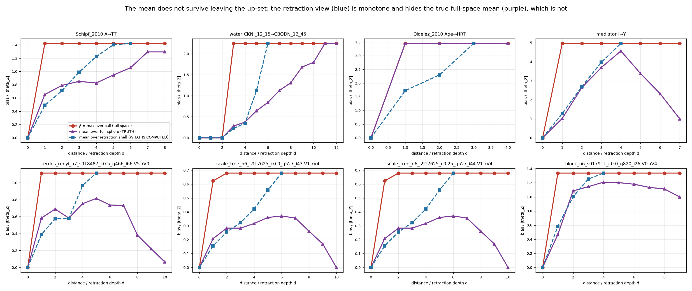

# Result — the mean-based radius is unsound, not merely unproven

Settles the gate left open in §5 of `docs/EXPERIMENT_MEAN_VS_MAX.md`. Every number traces to
`results/mean_fullspace/`, produced by `experiments/mean_fullspace_check.py`.

**The question.** `beta_up` is computed over the retraction up-set `^G0`, not over the whole
space, and Theorem C(3)–(5) of `docs/R_EPSILON_THEORY.md` licenses that for a **max**: the
maximum over the retraction shell at `d` equals the maximum over the ball at `d`, so the first
crossing of `beta_up` and of the full-space profile `beta` coincide and the cheap search is
exact. No analogue is known for a **mean**. This measures the gap directly.

**Method.** 79 instances — 10 real-network at `D_LLM`/seed 20260917, 69 synthetic over four
generators, `n` 4–7, three corruption rates. For each, the **whole** space is enumerated, `B` is
evaluated at every element, and the per-shell max and mean are compared three ways: over the
full sphere, over the full ball, and over the retraction shell. 752 shell records.

Two choices that would otherwise corrupt the measurement:

- The space is built with `bkrobust.search.space_fixed.build_space_correct`, **not**
  `core.spacelib.build_space`. The latter filters candidates through a chordality test that
  characterises CPDAGs and is wrong for MPDAGs; it drops up to 10% of elements, the loss growing
  with density. `mediator` has 52 states, not the 50 the defective builder reports. A max barely
  notices a missing tenth of the space; a mean is corrupted by it in an uncontrolled direction.
- `B` is evaluated with the definitional `method="enumerate"`. The semi-local shortcut was run
  alongside on every element as a differential test: **0 disagreements**.



---

## 1. The controls: the max design is exact

| Control | Result |
|---|---|
| `retr_max == ball_max` per shell (Thm C(3)+(4)) | **0 violations** |
| First crossing of `beta_up` == first crossing of `beta` (Thm C(5)) | **0 disagreements / 948** |
| `beta` non-decreasing in `d` (Thm C(1)) | **0 violations** |
| `B` monotone over comparable pairs, i.e. `F_eps` is an up-set (Thm B) | **0 violations / 25,889 pairs** |
| semi-local vs definitional `B` | **0 disagreements**, all elements |
| Retraction states falling outside the corrected space | **0** |

The retraction-only search is exact for the max, verified against brute force over the whole
space. Nothing below indicts the current design.

## 2. The mean-based radius is unsound

Over 79 instances × 12 epsilons from 0.001 to 50, comparing the radius a mean computed on the
retraction shell would report against the radius the full-space sphere mean actually implies:

| | count |
|---|--:|
| agree | 849 / 948 |
| retraction radius **smaller** (conservative) | 72 |
| retraction radius **larger** — *overstates robustness* | **27** |

Those 27 cells fall on **23 distinct instances, 29% of the corpus**, and 3 are real networks:
`Schipf_2010 A→TT` (ε = 0.5: retraction says `r = 2`, truth is `1`), `Didelez_2010 Age→HRT`
(ε = 2.0: `2` vs `1`), `water CKNI_12_15→CBODN_12_45` (ε = 0.25: `4` vs `3`).

This is a soundness failure, not a gap in a proof. Each case is an explicit instance where the
retraction computation certifies more safe retractions than the space permits.

## 3. Why: Corollary R1's sandwich is harmless for a max and fatal for a mean

Corollary R1 does not say the retraction shell at `d` **is** the sphere at `d`. It says it is
*sandwiched*:

```
sphere(d)  ⊆  { Meek(Ĉ, K₀ \ S) : |S| = d }  ⊆  ball(d)
```

So the shell contains states **nearer than `d`**. For a max that is provably harmless: nearer
states carry smaller `B` by Theorem B, and Theorem C(3) guarantees the ball maximum is attained
on the sphere anyway, so they cannot change the answer. For a mean they are **averaged in**, not
dominated away.

`Schipf_2010 A→TT` at `d = 1`, enumerated explicitly:

| state in the retraction shell at `d = 1` | true distance | `B` |
|---|--:|--:|
| from dropping `A→U` | **0** | 0.0000 |
| from dropping `A→PA` | 1 | 1.4220 |
| from dropping `A→S` | 1 | 0.5366 |
| from dropping `PA→WC` | 1 | 0.0000 |

Retracting `A→U` leaves `G0` **unchanged** — Meek re-derives it, so it was a compelled
consequence rather than independent knowledge. That state sits at true distance 0 with `B = 0`
and is nonetheless counted in shell 1, pulling the shell mean from the sphere's 0.6529 down to
0.4897 and across the ε = 0.5 threshold. At `d = 2`, 4 of the 10 shell states are nearer than 2.

## 4. And there is no conservative direction to round toward

Two biases act in opposite directions and neither dominates:

- **Dilution** — the shell holds nearer, lower-`B` states, biasing the mean **down** (crossing
  late, radius too large).
- **Up-set selection** — the shell holds only states *above* `G0`, which are more ignorant and
  so carry higher `B` by Theorem B, while the full sphere also holds incomparable states that
  may carry less. This biases the mean **up**.

Measured per shell: the retraction mean is **higher on 192**, **lower on 120**, equal on 116,
with the signed gap spanning −136.18 to +27.25 (median +0.08). So the retraction mean is neither
an upper nor a lower bound on the sphere mean, and no correction factor or one-sided rounding
rescues it.

*One qualification.* Against the full **ball** mean rather than the sphere mean, the retraction
radius is never larger (109 smaller, **0 larger**). A ball-mean target would therefore be
approached conservatively. It does not rescue the design, because of §5.

## 5. The deeper problem: the target itself is not a radius

**The full-space mean is not monotone in `d`.** Over 79 instances:

| statistic | non-monotone steps | instances affected |
|---|--:|--:|
| `beta` = max over ball | 0 | 0 |
| max over retraction shell | 0 | 0 |
| **mean over full sphere** | **102** | **34 of 79 (43%)** |
| mean over full ball | 52 | 22 of 79 |
| mean over retraction shell | **0** | **0** |

`mediator I→Y` is typical: the sphere mean rises to 4.57 at `d = 4`, then falls to 3.38, 2.32,
1.00. Far shells contain heavily-oriented states that pin the effect down, so they carry *low*
bias. "The first `d` at which the mean exceeds ε" is therefore not a radius at all — crossing it
does not mean you stay across it, and the guarantee a certificate exists to provide ("if at most
`k` of your claims are wrong…") does not follow from it.

The last row is the sharpest part of the result. **The retraction-computed mean is monotone on
every one of the 79 instances**, because it only ever walks upward in the order, where `B` is
monotone by Theorem B. It therefore produces a clean, plausible, non-decreasing staircase that
looks exactly like a well-behaved profile — while the quantity it purports to estimate is
falling. The failure is invisible from inside the computation. That is worse than a failure that
announces itself, and it is why this had to be checked against the whole space rather than
reasoned about from the retraction view.

## 6. Verdict

The mean-based redefinition should **not** be adopted:

1. It is unsound on 29% of instances, overstating robustness, with named real-network witnesses.
2. It is not conservative in either direction, so no one-sided correction fixes it.
3. Its target is non-monotone on 43% of instances, so there is no well-defined radius to compute.
4. The retraction view hides all of this behind a monotone curve.

Points 3 and 4 are independent of the retraction question and would survive any change to the
search: they are properties of thresholding a mean over a shell, whatever it is computed on.

This does not retract §1 of `docs/EXPERIMENT_MEAN_VS_MAX.md` — the mean really does deliver 3.6×
the radius resolution of the max, and the flat ε axis really is a genuine shortcoming of the
current reporting. It says the resolution cannot be bought this way. The recommendation there
stands and is now the stronger one: **report the contaminated fraction
(`frac_nonzero_subsets`) as its own column and leave the radius thresholded on `beta_up`.** It
is well defined on the retraction shell, it needs no theorem this codebase does not have, and it
is the quantity that actually varies with depth.

All claims are scoped to these 79 instances and, for the real ones, to this corpus and `D_LLM`.
