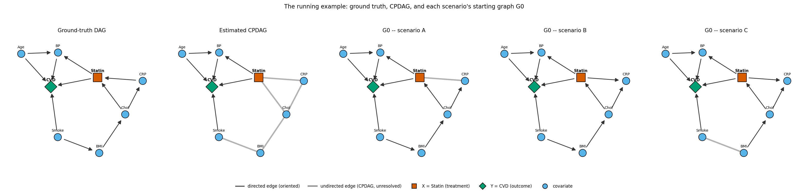
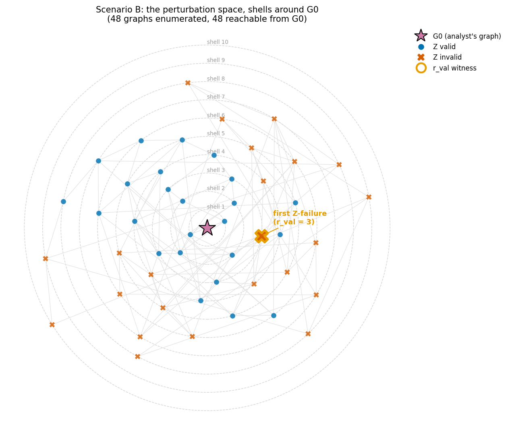
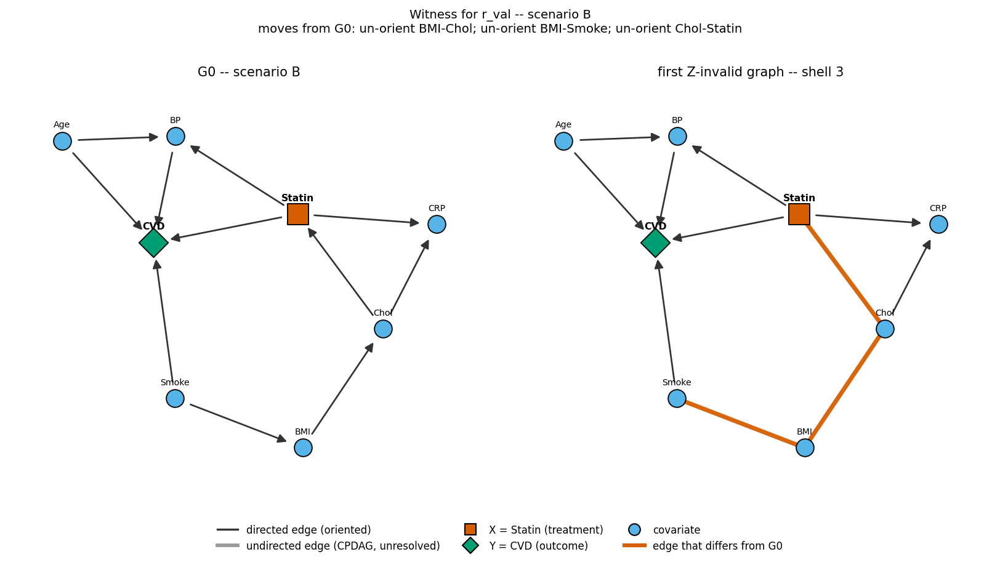
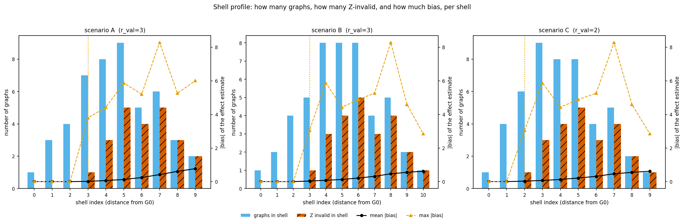
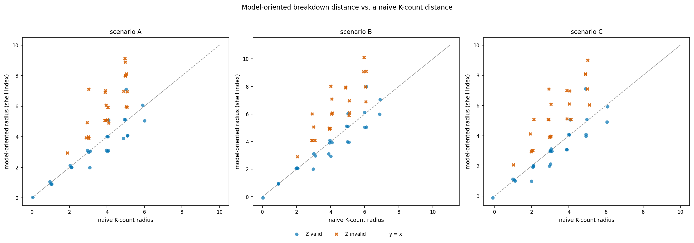
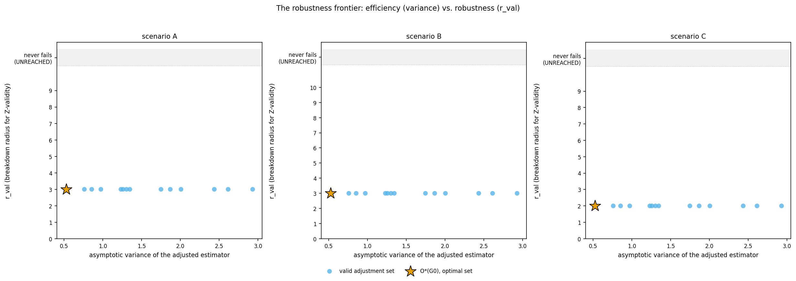

# The breakdown radius: a fully worked example

*A pedagogical walkthrough. Everything here was computed by brute force on a
graph small enough to enumerate exhaustively, so every number is exact by
construction. No proofs, no asymptotics, no conjectured shortcuts.*

---

## 1. What this demonstrates

An analyst estimates a CPDAG from data, supplies background knowledge as edge
orientations, applies Meek's rules to get an MPDAG, reads off an adjustment set,
and estimates a causal effect. The correctness of that knowledge is assumed and
never quantified.

The **breakdown radius** asks a different question: *how many elementary
revisions of the knowledge can be made before the adjustment set stops working?*

This report answers that question concretely on one 8-variable clinical example.
It shows what one unit of perturbation is, builds the whole perturbation space
layer by layer, walks outward until the adjustment set fails, and reports what
the resulting numbers mean for a practitioner.

---

## 2. The example

**The question.** Does statin therapy reduce cardiovascular events? Eight
variables: `Age`, `Smoke`, `BMI`, `Chol` (cholesterol), `CRP` (C-reactive
protein, an inflammation marker), `Statin` (treatment, **X**), `BP` (blood
pressure), `CVD` (events, **Y**).

**The ground truth** (known to us, not to the analyst):

```
Smoke -> BMI -> Chol -> CRP -> Statin        Chol -> Statin
Statin -> BP -> CVD    Statin -> CVD    Age -> BP    Age -> CVD    Smoke -> CVD
```

**What the data identifies.** The CPDAG has six **compelled** edges, forced by
v-structures and Meek propagation, which no background knowledge may touch:

```
Age->BP   Age->CVD   BP->CVD   Smoke->CVD   Statin->BP   Statin->CVD
```

and five **undirected** edges, which the data cannot orient:

```
BMI-Chol   BMI-Smoke   CRP-Chol   CRP-Statin   Chol-Statin
```

Those five form a single chordal component on `{Smoke, BMI, Chol, CRP, Statin}`.



*Figure 1. Ground-truth DAG, the CPDAG the analyst actually estimates, and the
MPDAG `G0` each scenario ends up with. Take from this: the treatment `Statin`
sits inside the undirected component, so the data alone does not tell the
analyst whether `CRP` comes before or after treatment.*

### Why this example

The design gates were fixed in advance and checked computationally
(`src/bkrobust/demo/example.py`). Six candidate scenarios were hand-designed
from plausible clinical stories; **four were rejected**:

| Candidate | Outcome | Reason |
|---|---|---|
| C1 `block_far` | rejected | undirected component has 7 edges (gate: 4–6), and sits far from the back-door paths |
| C2 `treatment_in_block` | **passed** | |
| C3 `clique4` | rejected | only 7 vertices (gate: 8–10) |
| C4 `crp_pendant` | **passed — chosen** | |
| C5 `two_confounder_routes` | rejected | component has 7 edges |
| C6 `mediator_and_confounder` | rejected | component collapses to 1 edge |

Candidates were hand-written rather than sampled because the witness graphs have
to be *contestable*: the point of the exercise is that a domain expert can look
at a failure and argue with it, and random DAGs pass every structural gate while
failing that one.

C4 was chosen over C2 because its knowledge set contains `CRP -> Statin`. The
flip of that single edge is a live clinical question — statins genuinely do lower
CRP — and flipping it converts a legitimate pre-treatment confounder into a
post-treatment mediator. That is the canonical applied error.

**The sanity gate.** Before proceeding we verified that at least one single
atomic perturbation changes a validity status. It does. We also verified the
converse risk: the optimal adjustment set turns out to be `{Age, Smoke}`, and
neither variable looks perturbable at a glance — but `Smoke` lies *inside* the
undirected component, and 3 of the 10 DAGs in the equivalence class make it a
descendant of `Statin`. Had that count been zero, the example would have been
vacuous and would have been redesigned.

### The analyst's knowledge

`K_true` is four claims a clinician would volunteer, all true:

```
Smoke -> BMI     BMI -> Chol     Chol -> CRP     CRP -> Statin
```

Asserting all four recovers the ground-truth DAG exactly. **Only two of them are
strictly needed** — `Smoke -> BMI` and `CRP -> Statin` — because Meek's rules
force the other three. That redundancy is the first thing to notice: knowledge
propagates, and an analyst stating four claims is committing to more than four
orientations.

### Three knowledge states

| Scenario | `K_assumed` vs `K_true` | Reading |
|---|---|---|
| **A — mild** | omits `CRP -> Statin` | declines to say whether inflammation precedes treatment |
| **B — wrong** | flips `CRP -> Statin` to `Statin -> CRP` | believes statins lower CRP; consistent with the data, and false |
| **C — compound** | flips `CRP -> Statin` *and* omits `Smoke -> BMI` | one false belief plus one gap |

A and B target the *same* edge — one withholds the claim, the other asserts its
opposite — so they are directly comparable. All three are **consistent** with
the CPDAG: Meek's Algorithm 1 accepts every one of them.

> A note on how scenario C was designed. Our first version omitted `BMI -> Chol`
> instead of `Smoke -> BMI`, and it produced a graph *identical to scenario B* —
> Meek simply re-derives the omitted claim, so the omission was a no-op. That is
> pinned by a regression test now
> (`test_scenario.py::test_scenarios_are_distinct`).

---

## 3. What is being perturbed

Under causal sufficiency, faithfulness and consistent CI testing, the **skeleton
is identified by the data**. Background knowledge is therefore *orientation
knowledge*, and the perturbation space is the Markov equivalence class of the
estimated CPDAG.

**Frozen edges.** The six compelled edges are never perturbed. Contradicting
`Statin -> CVD` is not "wrong knowledge" — it is knowledge inconsistent with the
data, which existing tooling already rejects. Only the five undirected edges are
in play.

**Atomic moves.** Two of them:

- **orient** an undirected edge — adding a claim;
- **un-orient** a knowledge-induced directed edge — retracting a claim.

**A flip costs two moves.** Changing `CRP -> Statin` into `Statin -> CRP` is a
retraction followed by an assertion. This is visible in the results rather than
merely asserted: in scenario B, shell 2 contains the element reached by

```
un-orient BMI-Smoke ; orient BMI->Smoke
```

— a single flip, two moves, landing one shell further out than any single
retraction. Shell 1 contains only the two single retractions.

---

## 4. Building the space

**Enumeration.** The space is every valid MPDAG `G` that refines the CPDAG, in
the sense that `[G] ⊆ [Ĉ]` where `[G]` is the set of DAGs `G` represents. For
this example, **|𝔊| = 48**.

> A subtlety that cost us a bug. Our first specification defined the space as
> "same skeleton, contains the CPDAG's directed edges, and is a valid MPDAG".
> That is unsound: validity is checked against the graph *itself*, so on a chain
> `A−B−C` the collider `A→B←C` passes trivially (a DAG is vacuously Meek-closed
> and extends itself) while belonging to a *different equivalence class*. The
> model-inclusion condition `[G] ⊆ [Ĉ]` is required. This was caught during
> implementation and is pinned by a test.

**The covering relation.** Computed directly from model inclusion, with no
conjectured characterisation: `G1 ⪯ G2` iff `[G1] ⊆ [G2]`, by enumerating
represented DAGs; `G1 ⋖ G2` iff nothing lies strictly between. This gives **96
covering pairs**, which are exactly the edges of the neighbour graph.

**Distance.** BFS hop count on the neighbour graph from `G0`.

**The metric check.** Verified empirically over **all 110,592 ordered triples**:
identity of indiscernibles, symmetry and the triangle inequality all hold, with
**zero violations**. All 48 elements are reachable from `G0` in every scenario.

---

## 5. Walking outward, shell by shell

This is the core of the demonstration. We do scenario **B** — the analyst who
believes statins lower CRP — explicitly, then summarise A and C.



*Figure 2. The perturbation space for scenario B, laid out by shell index around
`G0`. Blue circles: the adjustment set is valid. Orange crosses: it is not. Take
from this: the failures are not scattered — they begin at a definite radius and
grow outward, and the innermost two shells are entirely clean.*

The analyst's graph `G0` is fully oriented. Reading off the optimal adjustment
set gives **Z = {Age, Smoke}**.

| Shell | graphs | Z invalid | mean abs. bias | max abs. bias |
|---:|---:|---:|---:|---:|
| 0 | 1 | 0 | 1.6e-16 | 8.9e-16 |
| 1 | 2 | 0 | 1.6e-16 | 1.3e-15 |
| 2 | 4 | 0 | 1.5e-16 | 1.3e-15 |
| **3** | **5** | **1** | **0.033** | **3.06** |
| 4 | 8 | 3 | 0.077 | 5.87 |
| 5 | 8 | 4 | 0.127 | 4.43 |
| 6 | 8 | 5 | 0.214 | 4.88 |
| 7 | 4 | 3 | 0.314 | 5.26 |
| 8 | 5 | 4 | 0.466 | 8.28 |
| 9 | 2 | 2 | 0.551 | 4.60 |
| 10 | 1 | 1 | 0.619 | 2.85 |

**Shell 0** — `G0` itself. Z is valid, bias is zero to machine precision.

**Shell 1** — two elements, both single retractions: un-orient `CRP−Statin`, or
un-orient `BMI−Smoke`. Retracting a claim *enlarges* `[G]`, so Z now has to be
valid in more DAGs than before. It still is.

**Shell 2** — four elements: two double-retractions, and two **flips**
(`BMI→Smoke` and `CRP→Statin`, each a retract-then-assert pair). Z survives all
four. Note that the flip of `CRP−Statin` here returns the analyst to the *truth*
— and it is two moves away, not one.

**Shell 3 — the first failure.** One of the five elements breaks Z:

```
un-orient BMI-Chol ; un-orient BMI-Smoke ; un-orient Chol-Statin
```



*Figure 4. `G0` beside the first failing graph, differing edges highlighted.
Take from this: the failure is reached by retracting three claims, not by
asserting anything false.*

**Beyond shell 3**, failures accumulate monotonically and mean bias rises
steadily to 0.62 at shell 10.



*Figure 3. Shell index against graph counts and bias, all three scenarios. Take
from this: bias is exactly zero while Z remains valid and rises only once
validity is lost — the two are not independent failure modes here.*

### What the first failure means, in words

Un-orienting those three edges leaves the graph unable to rule out an
orientation in which `Statin` is an ancestor of the whole confounder block. In
that DAG, `Smoke` is a **descendant of treatment**, so adjusting for it is no
longer valid — it is conditioning on a consequence of the exposure, not a common
cause. In plain terms:

> *If you are not willing to assert that BMI raises cholesterol, that smoking
> raises BMI, and that cholesterol drives prescribing, then the data cannot rule
> out that smoking status is downstream of statin therapy — and adjusting for it
> would then bias the estimate.*

A clinician can contest that. They would probably say smoking is obviously not
caused by statins, which is exactly right — **and that is the point**. That
objection *is* background knowledge, and stating it is what buys back the
radius.

### Scenarios A and C

| Scenario | `r_val` | first failure reached by |
|---|---|---|
| A — mild | 3 | 3 retractions |
| B — wrong | 3 | 3 retractions |
| C — compound | **2** | 2 retractions |

A and B have the same radius. The compound scenario C is strictly more fragile:
holding a false belief *and* a gap moves the first failure one shell closer.
Scenario A's `G0` retains one undirected edge, giving it a slightly different
shell structure (max shell 9 vs B's 10) while the radius is unchanged.

The corresponding space and witness figures for the other two scenarios are
`figures/fig2_layered_space_A.png`, `figures/fig2_layered_space_C.png`,
`figures/fig4_witness_A.png` and `figures/fig4_witness_C.png`.

---

## 6. The radii

Two ε values are tied to the effect scale and one to a plausible standard error.
Across all scenarios the mean absolute total effect is **1.15**, and the
asymptotic standard error of the adjusted estimator at *n* = 1000 is **0.024**,
so **2·SE = 0.049**.

| Scenario | `r_val` | `r_opt` | `r_ε` (ε=0.049, 2·SE) | `r_ε` (ε=0.057, 5%) | `r_ε` (ε=0.287, 25%) |
|---|---|---|---|---|---|
| A — mild | 3 | 3 | 3 | 3 | **5** |
| B — wrong | 3 | 3 | 3 | 3 | **4** |
| C — compound | 2 | 2 | 2 | 2 | **3** |

`r_val` and `r_opt` coincide everywhere here. That is worth stating plainly
rather than dressing up: in this example, the moment Z stops being valid is
also the moment it stops being optimal, because the same structural event
causes both.

**On the maximum bias.** The per-element maxima (3–8) are a *sampled proxy for a
worst case, not a supremum*: coefficients are drawn, not optimised over. The
instability is real and we measured it — the max moved from 4.36 to 2.68 between
two runs differing only in draw count. The radii are therefore keyed off the
**mean** bias, which is stable; the maxima are reported as a diagnostic only.

---

## 7. Interpretation

**What a practitioner does with these numbers.**

`r_val = 3` in scenario B says: *three elementary revisions of your stated
knowledge are required before your adjustment set stops being valid.* Since a
flip costs two, that is a little over one flipped belief — not a comfortable
margin.

**Fragile identification, stable estimate.** The gap between `r_val = 3` and
`r_ε(25%) = 4` is the practically important one. Identification breaks at shell
3, but the resulting mean bias there is 0.033 — about 1.4 standard errors at
*n* = 1000, and about 3% of the effect size. You have to go one shell further
before the bias reaches a quarter of the effect. So the honest summary for this
analyst is:

> *Your identification argument is fragile — it rests on roughly one and a half
> orientation claims. But the estimate itself is fairly stable: the first thing
> that goes wrong costs you a few percent of the effect, not a sign flip.*

That distinction is invisible to any check that only asks "is my knowledge
consistent?", which everything here is.

**Where robustness actually comes from.** The first failure is reached by
*retraction*, not by asserting something false. This is worth dwelling on,
because intuition runs the other way. Retracting a claim enlarges the set of
DAGs the graph represents, and validity must hold in *all* of them — so
withholding knowledge is what breaks the adjustment set. The analyst's claims
are load-bearing. A framework that only considered wrong assertions would miss
this failure mode entirely.

---

## 8. Comparisons

### Naive assertion counting

The obvious alternative to the model-oriented distance is Hamming distance on
the knowledge set itself: count the assertions that differ.

| Scenario | model `r_val` | naive `r_val` | Spearman | Pearson | elements disagreeing by ≥2 |
|---|---|---|---|---|---|
| A | 3 | 2 | 0.734 | 0.763 | 14 / 48 |
| B | 3 | 2 | 0.771 | 0.793 | 14 / 48 |
| C | 2 | 1 | 0.752 | 0.747 | 14 / 48 |

The two correlate strongly but not tightly, and they are **not the same unit** —
one counts assertion edits, the other counts covering-relation hops — so the
off-by-one is not an error of either against the other. What the comparison does
show is that the naive count **systematically understates** how far a graph is
in the model-inclusion order, because a single assertion edit can cascade
through Meek's rules into several covering steps. Roughly 29% of elements
disagree by two hops or more.

**A concrete case.** The element

```
Age->BP Age->CVD BMI->Smoke BP->CVD CRP->Chol Chol->BMI Smoke->CVD
Statin->BP Statin->CRP Statin->CVD Statin->Chol
```

sits **8 model-hops** from `G0` but only **4 naive edits** away. By the naive
count it looks like a modest revision — change four assertions. In the
model-inclusion order it is twice as far, because those four edits reverse the
orientation of the entire confounder block and Meek propagation chains them
into eight covering steps. An analyst reasoning in assertion counts would badly
underestimate how different that world is from theirs.



*Figure 5. Model-oriented radius against naive K-count radius. Take from this:
the relationship is monotone but loose, and the naive count sits below the
diagonal — it consistently reads as "closer" than the graph really is.*

### Knowledge perturbations that are not even consistent

Of all single-assertion perturbations of the analyst's knowledge, a substantial
fraction produce **no valid MPDAG at all** — Meek's Algorithm 1 rejects them:

| Scenario | inconsistent | remove | add | flip |
|---|---|---|---|---|
| A | 3/10 = **30%** | 0/3 | 1/4 | 2/3 |
| B | 3/10 = **30%** | 0/4 | 1/2 | 2/4 |
| C | 2/10 = **20%** | 0/3 | 1/4 | 1/3 |

Retractions are always consistent; flips are the dangerous operation, with up to
two-thirds of them rejected outright. This matters for the framing of the whole
exercise: the perturbations that survive the consistency check are a *filtered*
population, and they are exactly the ones existing tooling cannot flag.

### Calibration

Since the truth is known here, the certificate can be checked. Treating every
element of the space in turn as a hypothetical truth gives a proper contingency
table:

| Scenario | coverage (inside radius ⇒ Z valid) | conservativeness (outside radius, Z still valid) |
|---|---|---|
| A | **1.00** | 0.425 |
| B | **1.00** | 0.439 |
| C | **1.00** | 0.465 |

**Coverage is 1.00 everywhere** — as it must be by construction; a value below 1
would indicate a bug, not a finding, and the test suite treats it that way.

**Conservativeness is 0.43–0.47**: of the graphs lying *outside* the certified
radius, roughly 44% still admit Z as a valid adjustment set. The certificate is
a genuine guarantee, but a pessimistic one — being outside the radius is not a
prediction of failure.

The single real data point makes this concrete. The actual ground-truth DAG lies
at distance 1 from `G0` in scenario A and 2 in scenario B — inside the radius
both times. In **scenario C it lies at distance 3, outside the certified radius
of 2 — and Z is nonetheless genuinely valid there.** That is conservativeness in
action: the certificate declined to vouch for a case that was in fact fine.

### Robust selection

We computed `r_val` for *every* valid adjustment set of `G0`, not just the
optimal one.



*Figure 6. Breakdown radius against asymptotic variance across all valid
adjustment sets. Take from this: the frontier is flat — there is no
efficiency–robustness tradeoff to exploit in this example.*

**There is no tradeoff here.** All 14 valid adjustment sets in scenario B have
`r_val = 3`. The optimal set `{Age, Smoke}` is the most efficient (asymptotic
variance 0.53 against up to 2.93 for the worst) and is **exactly as robust as
every alternative**. The brief anticipated that the optimal set might be the
least robust, which would have been the headline; the honest result is that it
is not.

We checked *why*, rather than reporting a flat line as noise. At the shell-3
witness, one of the four DAG extensions makes `Statin` an ancestor of the entire
confounder block, so `BMI`, `Chol`, `Smoke` and `CRP` all become descendants of
treatment simultaneously. Since the empty set is confounded, every valid
adjustment set must contain at least one of them — so the entire lattice loses
validity at the same instant. The flatness is a structural property of this
example, and it would not survive a graph where the confounders could be
disconnected from one another.

---

## 9. What this example does and does not show

**Does show.** That the breakdown radius is computable exactly on a realistic
small graph; that it is a genuine metric here; that it distinguishes
misspecification severity (compound is more fragile than simple); that
identification fragility and estimate stability come apart; and that retraction,
not just false assertion, is a route to failure.

**Does not show, and must not be read as showing:**

- **One example.** Every number is a property of this 8-node graph with this
  ground truth. The flat robustness frontier in particular is explained by a
  structural feature of this example and should not be expected in general.
- **Sampled bias proxy.** Maximum bias is a maximum over drawn coefficients, not
  a supremum over the model class. We measured its instability rather than
  hiding it.
- **Fixed skeleton.** The skeleton is assumed identified. Real CI testing at
  finite *n* returns a wrong skeleton some of the time, and that error is
  entirely outside this analysis.
- **Perfect faithfulness and causal sufficiency.** Both assumed throughout. An
  unmeasured confounder would not perturb the graph — it would invalidate the
  space.
- **No claim about general behaviour.** Whether the naive count is *always*
  exactly one below the model radius, whether coverage is *always* 1, whether
  conservativeness is *typically* ~44% — none of these are established. Those
  are questions for a study over many graphs, which this is not.

---

## 10. Reproduction

```bash
PYTHONPATH=src python3 -m bkrobust.demo.run_all
```

Writes `results/breakdown_radius_demo/scenario_{A,B,C}/{elements,shells,adjustment_sets}.csv`
and `summary.json`, and 20 figure files (PDF + PNG) to `figures/`.

```bash
PYTHONPATH=src python3 -m pytest tests/demo/ -q
```

**Environment.** Python 3.9.6, numpy 2.0.2, networkx 3.2.1, matplotlib 3.9.4,
pandas 2.3.3, scipy 1.13.1. (The rest of this repository targets Python 3.11+;
this demonstration was written to run on the interpreter actually available, and
avoids runtime-only 3.10+ syntax.)

**Seeds.** Root seed `20260919`, 100 coefficient draws per DAG. All randomness
descends from that seed; no module touches a global RNG.

**Runtime.** Full pipeline ~7 s; test suite ~19 s. Well under the 30-minute
budget.

**Reproducibility.** Output is bit-identical across runs and across
`PYTHONHASHSEED` values, verified by
`test_scenario.py::test_pipeline_is_bit_reproducible_across_hash_seeds`. This
was not free — see below.

---

## Appendix: correctness checks, and the bugs they caught

Every check the brief asked for was run. Three of them failed on first
execution, and are recorded here rather than quietly fixed.

| Check | Result |
|---|---|
| Meek closure independent of rule application order | Pass — 200 random PDAGs × 10 orders |
| Every enumerated element is a valid MPDAG; every valid MPDAG is enumerated | Pass — cross-checked against independent 3^k brute force |
| Distance satisfies the metric axioms | Pass — all 110,592 triples, zero violations |
| `d(G0, G0) = 0` and `r ≥ 1` | Pass |
| MPDAG validity agrees with a second independent implementation | Pass — d-separation cross-checked against `networkx` on 220 random DAGs |
| CPDAG construction | Pass — on 300 random DAGs the extensions of `dag_to_cpdag(D)` exactly equal the brute-force Markov equivalence class, and the CPDAG is invariant across the class |

**Three real bugs, found by these checks:**

1. **A chordality test with an inverted comparison.** The maximum-cardinality-search
   perfect-elimination check numbered vertices in the wrong direction. Caught by
   the cross-check against `networkx.is_chordal`, which disagreed on a graph
   with a genuine chordal separator. This is exactly what independent-library
   cross-checks are for.

2. **An unsound definition of the space** (ours, not the implementation's).
   Filtering by self-validity admits graphs from a *different* Markov
   equivalence class. Described in §4.

3. **Non-reproducible results from set iteration order.** Two separate places
   consumed hash-order-dependent iteration: `random_sem` drew coefficients while
   iterating a frozenset of edges, so the RNG stream itself differed between
   processes; and the total-effect path sum added products in set order, and
   floating-point addition is not associative. Results were stable *within* a
   process and silently different *between* runs — three runs of the same call
   gave three different values of `r_ε`. Both are fixed and pinned by
   regression tests.

**Two spurious-looking results that were investigated and are not bugs:**

- numpy 2.0 on the macOS Accelerate BLAS backend emits "divide by zero" and
  "overflow" warnings on well-conditioned matrix products. Verified spurious
  over 500 draws: every covariance was finite, symmetric positive-definite, and
  equal to an independent Neumann-series computation, with `det(I−B) = 1` and
  condition number ≈ 10. Suppressed narrowly, with a finiteness guard so a
  genuine failure cannot hide behind the suppression.
- The 3-node chain space has **6** elements, not the 4 our specification
  asserted. Orienting *away* from the shared node of a chain forces nothing
  (Meek's R1 fires only on edges oriented *into* it), so there are two genuine
  partially-oriented elements we had overlooked. The specification was wrong;
  the code is right.
