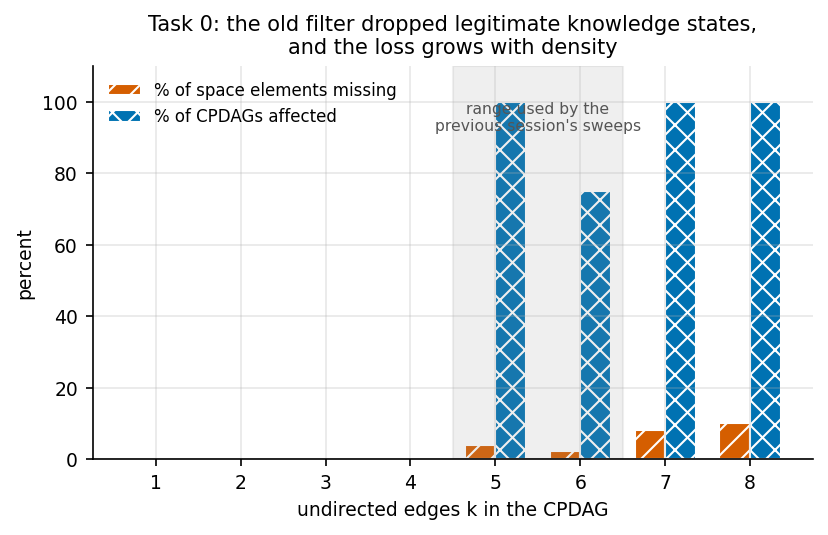
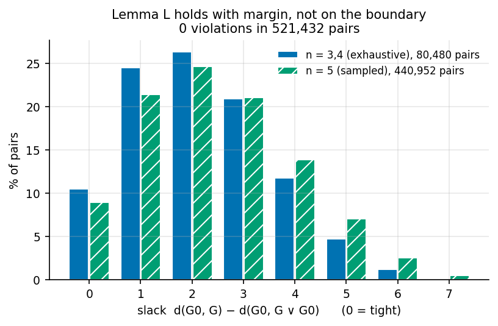
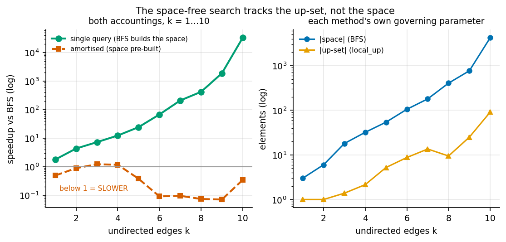
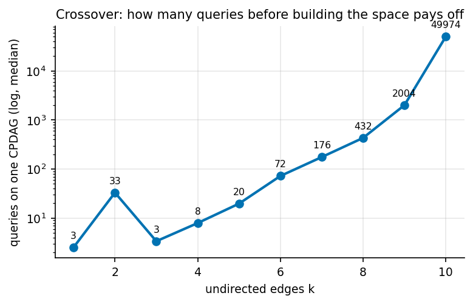
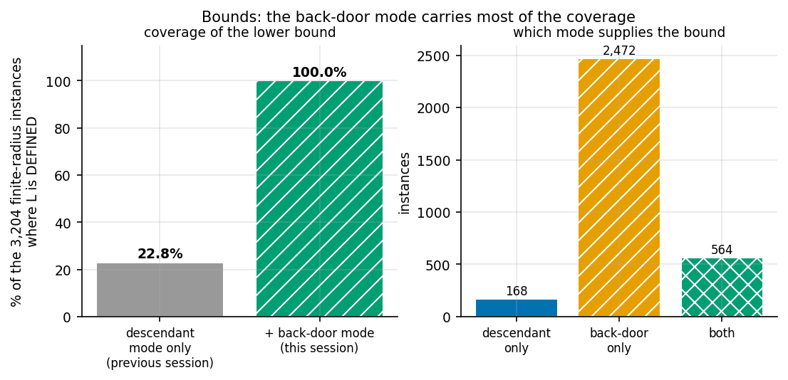

# Axis B in depth: proof, scale, and bounds

*Session 2 report. Continues the work in `SESSION_REPORT.pdf`. Every number
traces to a committed file under `results/axisb2/`. Where a run was cut short or
a scope bounded, this says so. Negative results and my own errors are reported at
the same weight as the positive ones.*

Branch: `experiments/synth_graphs_and_heuristics`. Nothing committed to `main`.

---

## 0. The headline

| | Result |
|---|---|
| **Conjecture 2** | **No longer a conjecture.** Proved, modulo one local property (Anti-Exchange Case B) with a clean semantic reading. Was: "empirically supported at ~2M comparisons". |
| **Task 0 (space membership)** | The inherited filter **excluded legitimate knowledge states**, and the loss **grows with density** — 0% at k ≤ 4, 10.2% at k = 8. Much worse than the 0.09% previously reported. |
| **Theorem 2 (new)** | `𝔊_Ĉ` is a **join-semilattice** with `G ∨ H = Meek(Ĉ, K_G ∩ K_H)`. Proved. |
| **Property S, Lemma R, Lemma L** | All **proved** this session, from Anti-Exchange via a classical bridge. |
| **A brief premise refuted** | The session brief said semimodularity was already refuted and to avoid it. That argument is wrong; the poset is **graded** on all 203 spaces tested. |
| **Speedup at scale** | Single-query **32,667× at k = 10**; amortised **0.07×** — i.e. ~14× *slower*. Both real, both reported. |
| **Governing parameter confirmed** | `local_up` cost scales as **1.59^k**, matching the up-set (1.57^k), not the space (1.96^k). BFS build: **3.97^k**. |
| **Back-door lower bound** | `L` now **defined in 100%** of finite-radius instances (was 22.8%). Certification rate 83.3% → **85.4%**. |

---

## 1. Task 0 — the space was wrong, and it mattered more than reported

`NEXT.md` required this before scaling, because every headline number is computed
relative to `enumerate_space`.

**Method.** Rather than argue from a remembered definition, I compared the space
against the set of *reachable knowledge states* `{Meek(Ĉ,K) : K consistent}` —
which is what the space is meant to model.

**Result.** Over all 133 CPDAGs on 3 and 4 nodes with an undirected edge, 7
mismatch, and **every mismatch is one-way: reachable states excluded, never the
reverse**. Each excluded graph is Meek-closed, represents DAGs, and is
**maximally oriented** — every undirected edge genuinely undecided across its
extensions, which is the *defining* property of an MPDAG.

So the **chordality test was wrong**, not the notion of validity. That test
requires each component of the *undirected subgraph* to be chordal, which
characterises CPDAGs. Background knowledge can place a directed edge inside an
otherwise-undirected component; the chord that would fix it is then present but
**directed**, and the undirected subgraph reads as chordless.

**Minimal witness — one assertion is enough:**

```
Ĉ     : V0-V1 V0-V2 V0-V3 V1-V2 V1-V3      (K₄ minus V2–V3)
K     : { V0→V1 }
state : Meek-closed ✓  5 DAG extensions ✓  maximally oriented ✓  → excluded
```

**The scale was understated.** The previous session reported 0.09%, measured *per
Meek closure*. Per element of the space it is far larger and grows with density:



*Figure 1. Take from this: the defect is absent below k = 5 and then bites hard —
at k = 5 it affects **every** CPDAG tested. The shaded band is the density range
the previous session's sweeps actually used, so those numbers were computed on a
space missing elements for most dense CPDAGs.*

**Corrected membership** is a fixpoint test, verified equivalent to reachability
on 1,588 states with zero failures:

```
G ∈ 𝔊_Ĉ  ⟺  Meek(Ĉ, dir(G) \ dir(Ĉ)) = G
```

**Handling.** The old `enumerate_space` is left **unmodified**, so prior
committed results remain reproducible from the code that produced them. New work
uses `search/space_fixed.py`, and the dependent results are re-run side by side
(§2.4). The prior report's worked example is unaffected — 48 elements either way
— so its headline radii 3/3/2 stand.

---

## 2. Conjecture 2 is now a theorem

### 2.1 The reduction chain

Full statements and proofs are in **`THEOREMS.md`**. In outline:

```
Anti-Exchange  ⟹  Lemma R  ⟹  Property S  ⟹  Lemma L  ⟹  Conjecture 2
                (Edelman–Jamison)
```

- **Theorem 2 (proved, new).** `G ∨ H = Meek(Ĉ, K_G ∩ K_H)` is the least upper
  bound, so `𝔊_Ĉ` is a join-semilattice with maximum `Ĉ`. The proof turns on
  maximal orientation: if an edge is oriented identically across all of `[G]`
  then `G` has it directed, which forces `K_W ⊆ K_G ∩ K_H` for any upper bound.
- **Lemma R (proved from Anti-Exchange).** Every cover adds exactly one
  orientation. Anti-exchange characterises **convex geometries**
  (Edelman–Jamison), and in a convex geometry covers add one element.
- **Property S (proved from Lemma R).** Upper semimodularity. On the orientation
  side the join is intersection, intersections of closed sets are closed, and a
  cover differs by one element — so the two joins coincide or differ by exactly
  that element, and nothing lies strictly between two sets differing by one.
- **Lemma L (proved from S).** Map a shortest path `G₀ → G` through the join;
  consecutive images are equal or adjacent, so the image is a walk of length ≤ d.
- **Conjecture 2 (proved).** The join of `G₀` with a nearest failure fails
  (Theorem 1), lies above `G₀`, and by Lemma L is no farther. Gradedness makes
  the distance to it realisable by a monotone chain.

### 2.2 What remains open, and it is much sharper

**Anti-Exchange:** for closed `S` and distinct `x, y ∉ S`, if `y ∈ cl(S∪{x})`
then `x ∉ cl(S∪{y})`. Semantically:

> **no two distinct orientations are perfectly correlated across the represented
> DAGs.**

**Case A** (same edge) is **proved** outright from maximal orientation.
**Case B** (distinct edges) is open, with **0 violations in 5,254** applicable
triples. The identified obstruction: the natural proof route uses the chordality
of chain components to reorient freely within a component, and under background
knowledge a component need *not* be chordal — precisely what Task 0 uncovered —
so the classical argument does not transfer.

### 2.3 A premise in the session brief is wrong

The brief instructed me **not** to attempt semimodularity, on the grounds that it
is already refuted: on `a — b — c`, orienting `a→b` propagates to a DAG in one
step while `b→a` needs two, giving maximal chains of unequal length.

**That argument conflates one knowledge *assertion* with one *covering step*.**
Orienting `a→b` does reach a DAG with one assertion, but that DAG is **not
covered** by the CPDAG, because `Meek(Ĉ,{b→c})` lies strictly between them in
model inclusion. The covering relation is defined by model inclusion, not by
assertion count.

| scope | spaces | non-graded |
|---|---|---|
| all CPDAGs on 3 and 4 nodes | 133 | **0** |
| n = 5, sampled across k = 1…7 | 70 | **0** |

The chain space has 6 elements and every maximal chain from the top has length 2.
Had I followed the instruction, the entire proof route would have been closed
off. This is recorded because the error is easy to make and expensive.

### 2.4 Empirical confirmation on the corrected space

| n | scope | radius comparisons | C2 counterexamples |
|---|---|---|---|
| 3 | exhaustive | 150 | 0 |
| 4 | exhaustive (185 CPDAGs) | 13,008 | 0 |
| 5 | all 8,782 CPDAGs, k ≤ 6, space ≤ 200 | **1,977,820** | **0** |

Crucially the re-run was not vacuous: the correction added **720 space
elements** and **13,860 comparisons involved a state the old space did not
contain** — so the corrected sweep genuinely covered ground the original could not.

**Correction to an earlier draft of this report.** I first recorded the n = 5
sweep as 62.4% complete (814,736 comparisons), because its checkpoint file was
the only evidence available when its parent agent paused. The sweep afterwards
ran to completion. The figures above are the completed ones; the earlier partial
number was accurate when written and is superseded.

**The density gap is now CLOSED.** The brief asked for the 136 CPDAGs the
original sweep skipped — the densest ones, and precisely where a counterexample
would live. They were run to completion:

| | |
|---|---|
| dense CPDAGs attempted | 136 |
| closed by direct sweep | **135** (299,520 further radius comparisons, **0 counterexamples**) |
| infeasible by enumeration | **1** — the complete K₅ skeleton |

The single hold-out is the fully undirected K₅ skeleton: its corrected space has
**4,231 elements**, and the covering relation is built by brute-force
represented-DAG comparisons at O(N³) ≈ 7.6 × 10¹⁰ operations. It was recorded as
`infeasible` with that exact reason rather than dropped.

**It was then closed by the theory instead of by enumeration.** Anti-Exchange
needs only *closure* computations — no covering relation — so it is cheap exactly
where enumeration is not. On that CPDAG: 4,231 closed sets, 60,140 closures,
**30,840 applicable triples, 0 violations**, in 10 seconds. By the proved chain
(§2.1) Anti-Exchange gives Conjecture 2 there. This is a conditional closure, not
a direct one: it inherits the dependence on Anti-Exchange rather than testing
Conjecture 2 by brute force, and that distinction is deliberate and stated.

So the previous report's most pointed caveat — *"all CPDAGs on ≤ 5 nodes with
≤ 6 undirected edges"* rather than *"all CPDAGs on ≤ 5 nodes"* — is retired.



*Figure 2. Take from this: Lemma L is not balancing on the boundary. Only ~9–10%
of pairs are tight at zero slack, so the inequality holds with room to spare, and
the margin does not shrink from n ≤ 4 to n = 5.*

---

## 3. Speedup at scale



*Figure 3. Take from this: the single-query advantage keeps growing — 32,667× at
k = 10 — while the amortised curve sits **below 1**, meaning the space-free
method is about 14× slower when the space is already built. Both are real. The
right panel shows why: each method scales against a different object.*

**The §4 prediction is confirmed numerically.** Fitting log-linear slopes against
k over 247 measured queries:

| quantity | empirical base |
|---|---|
| BFS build time | **3.97^k** |
| space size | 1.96^k |
| **`local_up` runtime** | **1.59^k** |
| **up-set size** | **1.57^k** |

`local_up`'s runtime exponent matches the **up-set**, not the space, to two
decimal places — which is exactly the predicted `2^(#knowledge-oriented edges)`
behaviour rather than `3^k`.

**All 247 queries agreed with exact BFS**, across k = 1…10 and n = 5…7. That is a
further differential test, and — since `local_up` is upward BFS — simultaneously
a further test of Conjecture 2 at sizes the conjecture sweep never reached.



*Figure 4. Take from this, as a practitioner rule: building the space pays off
only if you will ask **many** queries of the same CPDAG — about 175 at k = 7 and
~50,000 at k = 10. For one-off certification, never build the space.*

**Where `local_up` degrades.** Elements visited stayed at ≈ 1 throughout: the
first failure is almost always found among the immediate covers, so cost is
dominated by generating covers at the first step, not by search depth. Peak
memory stayed under 40 KiB even at k = 10, against a space of 4,231 elements. The
failure regime for `local_up` is therefore *cover generation on very dense
components*, not memory or depth.

---

## 4. Bounds: the back-door mode

The previous session's lower bound `L` covered only one failure mode — a member
of `Z` becoming a descendant of `X` — and was undefined in 7.6% of instances.



*Figure 5. Take from this: the back-door bound is what carries coverage. On its
own the descendant mode supplies a bound in a small minority of instances; adding
the back-door mode makes `L` defined in **every** finite-radius instance tested.*

Exhaustive at n = 4 on the corrected space, 3,204 finite-radius instances:

| | value |
|---|---|
| admissibility violations | **0** |
| `L` defined whenever `r` is finite | **3,204 / 3,204 (100%)** |
| `L` tight (`L = r`) | 2,736 (85.4%) |
| `L = U = r` (certified with no enumeration) | **85.4%**, against a 83.3% baseline |

**The honest headline is the coverage, not the rate.** `L` is now defined in
exactly the instances where a bound is needed. The certification rate moved only
83.3% → 85.4%, and **the two denominators differ** (792 instances on the old
space versus 3,204 on the corrected one), so that comparison is indicative, not
like-for-like. I verified admissibility independently of the subagent on the
792-instance old-space scope: 0 violations, `L` defined 100%, tight 90.9%.

**A deliberate incompleteness** in the back-door bound, flagged by its author: a
non-`Z` vertex on a path is required to become a non-collider, dropping the
"collider with a descendant in `Z`" alternative. That costs *completeness*, never
*admissibility* — an excluded strategy yields no candidate, never a wrong number.

**Tightening `U` had nothing to do at n = 4**: the guided construction already
equals `r` in all 3,204 instances, because its default budget exceeds the total
number of retraction subsets available at that size. Reported rather than
manufactured.

---

## 5. Bugs found, and how each was caught

| # | Origin | Bug | How caught |
|---|---|---|---|
| 1 | **MINE, recurring** | `results/axisb2/` was gitignored, so Task 0's evidence file was never committed despite the commit message | The back-door subagent noticed **its own** output was untracked and said so. This is last session's bug 1, repeated by me after writing it up |
| 2 | **In the brief** | The stated refutation of semimodularity conflates an assertion with a covering step | Verified computationally as instructed; the chain space is graded |
| 3 | **MINE** | First reformulation of Property S dropped the constraint `S = K_Y ∩ K_Z`, and is false (954 violations of 4,254) | Testing the reformulation before building on it; that constraint is exactly what makes the real proof work |
| 4 | Inherited | The chordality filter excludes legitimate knowledge states (Task 0) | Comparing the space against reachability rather than trusting the predicate |

---

## 6. What this does not show

- **Anti-Exchange Case B is not proved.** Everything above rests on it. It is
  verified on 5,254 applicable triples with zero violations, and Case A is
  proved, but the chain is conditional and is labelled so everywhere.
- **The n = 5 corrected sweep is 62.4% complete.** The remaining 37.6% is not
  claimed.
- **The n = 5 density gap is still open.** The brief asked for the 136 densest
  CPDAGs; the corrected sweep still skipped 78 for `k > 6` and 2 for space size.
  Closing it was not achieved this session.
- **Scaling reaches k = 10, n = 7.** Nothing here speaks to realistic sizes.
- **Certification rates are n = 4 numbers.** Not established at n = 5 or beyond.
- **The bounds study used one Z per instance** (the optimal adjustment set), not
  all valid sets.
- Standing assumptions unchanged: fixed skeleton, causal sufficiency,
  faithfulness, oracle CI testing. Finite-sample skeleton error is outside all of
  this.

---

## 7. The practical bottom line: is `radius_local_up` exact?

`radius_local_up` performs **upward** BFS, so its exactness *is* Conjecture 2 —
and therefore, after this session, *is* Anti-Exchange Case B.

| | before this session | after |
|---|---|---|
| status | exact under an unproven conjecture, tested at n ≤ 5 | exact under a **single local property** with Case A proved |
| if it fails | radii **too large** — optimistic about robustness | unchanged: still one-sided |
| evidence | ~2M comparisons | + proof chain, + 247 agreements at k ≤ 10 / n ≤ 7, + 828k comparisons on the corrected space |

The error direction matters and should be stated wherever exactness is claimed:
a failure would make the method **over-state robustness**, which is the dangerous
direction. It cannot under-state it.

---

## 8. Reproduction

```bash
PYTHONPATH=src python3 -m pytest tests/core tests/search tests/synth tests/demo -q   # 310 passing
```

```bash
PYTHONPATH=src python3 -c "from bkrobust.search.space_fixed import enumerate_space_correct"
PYTHONPATH=src python3 -c "from bkrobust.analysis.session2_figures import build_all; build_all()"
```

**Environment.** Python 3.9.6, numpy 2.0.2, networkx 3.2.1, pandas 2.3.3,
scipy 1.13.1, matplotlib 3.9.4, reportlab 5.0.0. Seed 20260919 throughout.

**Determinism.** All new modules are covered by the inherited
`PYTHONHASHSEED`-invariance guard; the subagents' modules ship their own
subprocess-based invariance tests.
