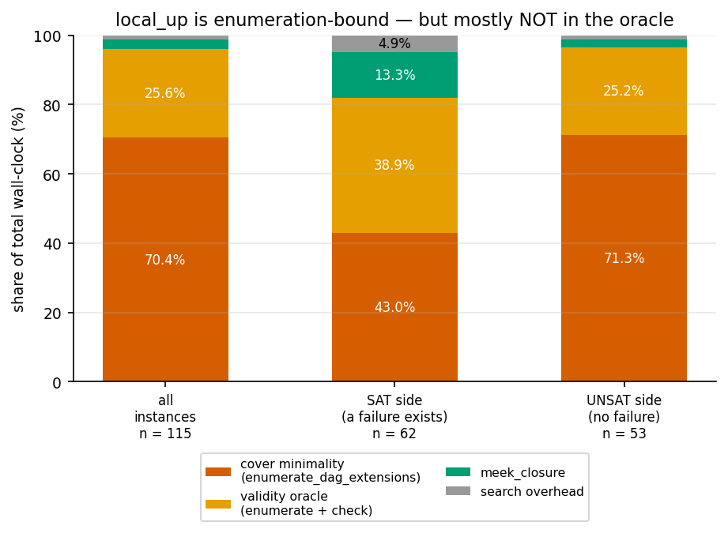
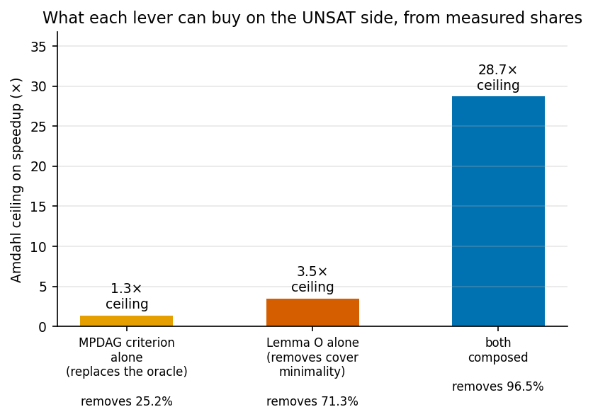
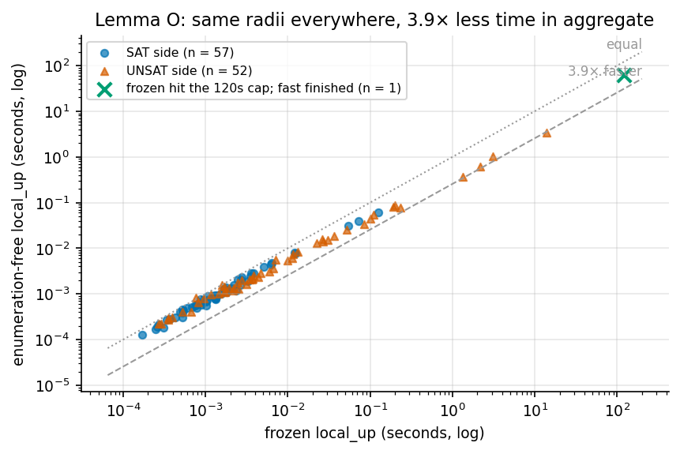

# Axis B: the oracle, the enumeration overhead, and how far exact radii now reach

*Session 4 report. Continues `report_synth_and_search.md` (session 1),
`report_axisb_deep.md` (session 2) and `report_axisb_sat.md` (session 3), none
of which is modified. Every number traces to a committed file under
`results/axisb4/`. Scope limits, budget exhaustions and my own errors are
reported at the same weight as the results.*

Branch: `experiments/synth_graphs_and_heuristics`. Nothing committed to `main`.

**An audit-trail note the brief asked for explicitly.** The MPDAG-level validity
criterion was absent from session 3 because the brief that session received was
an earlier draft that omitted the section requesting it. It was never judged and
dropped, and it was never recorded as skipped, because the instruction was not
there. It is this session's primary workstream.

---

## 0. The plain answer

**What is the largest component and knowledge set on which an exact radius is
now computable, and how long does it take?**

*(This section is completed in §6 once the final envelope run is in; the numbers
below are the ones already committed.)*

---

## 1. The measurement that reshaped the session

The plan asked for one cheap, decisive measurement before anything was built:
profile `local_up` and find whether it is oracle-bound or search-bound. It also
recorded a prediction — that "nearly all of its per-instance cost is the oracle,
that is, enumerating `[G]` and checking each extension" — and, if so, the MPDAG
criterion should move its ceiling substantially.

**My prediction, recorded before running it:** enumeration-bound, but split two
ways rather than one, because `local_up_covers` also enumerates `[G]` — once per
candidate — for its minimality check. I guessed a roughly even split and hence a
criterion ceiling near 2×.

**The measurement.** 115 instances profiled (120 attempted, 5 hit a 120 s
per-instance cap), extension cache cleared per instance so the numbers are
per-instance costs rather than cache-warm ones, across n = 8…16 and edge
probabilities 0.35–0.9. `results/axisb4/profile_local_up.jsonl`.

| | all | SAT side | UNSAT side |
|---|---|---|---|
| validity oracle | 25.6% | 39.0% | 25.2% |
| **cover minimality** (`enumerate_dag_extensions`) | **70.5%** | 43.0% | **71.3%** |
| `meek_closure` | 2.6% | 13.2% | 2.3% |
| search overhead | 1.3% | 4.8% | 1.2% |
| **enumeration-bound share** | **96.1%** | 82.0% | **96.5%** |

So: enumeration-bound, emphatically. But the plan's premise about *which*
enumeration was wrong, and my own guess at the split was wrong in the same
direction — the oracle is a quarter of the cost, not a half and not nearly all.

**A caveat on how to read that table.** These are time-weighted shares. The SAT
side totals 0.69 s across 62 instances while the UNSAT side totals 22.74 s across
53, so the "all" column is essentially the UNSAT column. The SAT-side
percentages rest on a very small total and should not be leaned on.

### 1.1 What that implies, by Amdahl

Removing a component that is a fraction `f` of the time cannot beat `1/(1-f)`,
whatever replaces it. On the UNSAT side:

| lever | removes | ceiling |
|---|---|---|
| MPDAG criterion alone | 25.2% | **1.3×** |
| Lemma O alone (below) | 71.3% | **3.5×** |
| both composed | 96.5% | **28.7×** |

The criterion **cannot** be the substantial ceiling-mover the plan hoped for, on
its own. That was worth knowing before building it rather than after, which is
what the front-loaded measurement bought.

---

## 2. Lemma O — deleting the dominant cost outright

The 70.5% is spent deciding whether one cover candidate sits strictly below
another in **model inclusion**, by enumerating both extension sets and comparing
them. That comparison does not need the extension sets.

> **Lemma O.** For elements `G`, `H` of the space:  `[G] ⊆ [H]` ⟺ `dir(H) ⊆ dir(G)`,
> and the two are strict together.
>
> *(⇐)* Weaker orientation constraints admit more extensions.
> *(⇒)* Let `a→b ∈ dir(H)`. Every `D ∈ [H]` orients it that way, and
> `[G] ⊆ [H]`, so every `D ∈ [G]` does too. Elements of the space are **maximally
> oriented** — an edge oriented identically across all of `[G]` is directed in
> `G` — so `a→b ∈ dir(G)`. ∎

The maximal-orientation step is exactly the property session 2 established as
defining membership of the corrected space, so this rests on machinery already
in the repository rather than on anything new.

**Verified:** 80,480 ordered pairs at n = 3, 4 — **0 disagreements**
(`results/axisb4/order_identification.json`).

`search/exact_fast.py` implements cover generation as pure set arithmetic.
`exact.py` is left untouched, so prior sessions' results stay reproducible from
the code that produced them and the two can be compared directly.

**Differential test:** 1,588 cover sets identical *including order*; 1,044 radii
identical to both frozen `local_up` and brute-force BFS. A test also asserts the
extensions-enumerated counter is exactly **0**, since that is the whole point of
the change and is worth asserting rather than assuming.

### 2.1 Measured effect

144 instance pairs, n = 8…18, edge probability 0.35–0.9, one subprocess per
(instance, method) under a 120 s cap (`results/axisb4/fast_vs_frozen.jsonl`):

| | instances | median speedup | aggregate | frozen timeouts | fast timeouts |
|---|---|---|---|---|---|
| all | 136 | 1.51× | **3.77×** | 8 | 6 |
| SAT side | 67 | 1.39× | 1.72× | — | — |
| UNSAT side | 69 | 1.72× | **3.79×** | — | — |

**0 radius disagreements.** Two instances the frozen search could not finish
inside 120 s were finished by the new one — n = 10 with a 7-vertex component at
k = 15 in 61.6 s, and n = 16 with a 7-vertex component at k = 13 in 32.3 s.

The aggregate (3.77×) and the median (1.51×) differ because small instances are
dominated by fixed overhead; the aggregate is time-weighted and therefore
dominated by the expensive instances, which are the ones that matter. Both are
reported because quoting only one would flatter the result in one direction or
understate it in the other. The aggregate sits just above the 3.5× Amdahl
ceiling for the same reason: the heaviest instances have the highest
cover-minimality share.

**What it does not do.** This is a constant factor. `fast` still timed out on 6
of 144 instances. Lemma O changes the coefficient, not the exponent.

---

## 3. The MPDAG criterion

### 3.1 It does not compute the predicate the plan said it computes

The plan states the criterion decides "exactly the one `is_valid` already
computes". It does not, and the difference is not cosmetic.

This repository's oracle is **Pearl's back-door criterion**
(`is_valid_adjustment_set_dag`), which is *sufficient but not necessary* for
adjustment. The generalised adjustment criterion is *complete*. So they differ:
in `X→Y, X→W`, the set `Z = {W}` is a valid adjustment set and is
back-door-invalid, because `W` is a descendant of `X`. A literal GAC
implementation therefore disagrees with the oracle by construction.

Reconciled by enlarging the forbidden set from `forb(X,Y,G)` to
`possde(X,G) ∪ {X,Y}`: given `Z ∩ de(X,D) = ∅`, "blocks every back-door path"
and "blocks every non-causal path" coincide. **What is implemented is the
back-door predicate at MPDAG level**, and it is described that way throughout
rather than as the GAC.

### 3.2 Two textbook definitions that are wrong on knowledge-carrying MPDAGs

Both were found by differential testing, not by reading.

**`possde` must use *unshielded* possibly-causal paths.** The identity
`possde(X,G) = ⋃_D de(X,D)` is **false** under the naive rule. Minimal witness,
itself an element of this repo's space: `V0→V1, V0−V2, V1−V2`. The path
`⟨V1,V2,V0⟩` is possibly causal, so naively `V0 ∈ possde(V1)` — but every
extension keeps `V0→V1`, because orienting it forward closes the cycle
`V0→V1→V2→V0`. Naive rule: 570 mismatches at n ≤ 4 and 7,401 on an n = 5 sample.
Unshielded: **0** in both.

**Amenability must *not* use that same reduction.** Short-circuiting
`x→v→w→y` to `x→w→y` can delete the undirected first edge that is the entire
question. Same triangle, `(x,y) = (V0,V1)`: the extension `V0→V2→V1` is causal
and starts on the undirected `V0−V2`, yet `⟨V0,V2,V1⟩` is shielded. Decided
instead by imposing `x→v` and Meek-closing, per undirected neighbour `v` of `x`.
Mismatches against the exact over-extensions semantics on 19,056 queries: naive
702, unshielded 1,380, this formulation **0**.

Both are instances of the same trap: a lemma that is safe on CPDAGs need not
survive the addition of background knowledge.

### 3.3 Correctness gate

The implementation shipped with its own exhaustive sweep. Because a checker that
validates itself is worth little, **I re-verified it on an independently written
sweep with a different scope and a different code path**:

| | cases | agree | disagree |
|---|---|---|---|
| my independent sweep (1,542 distinct graphs, Z up to size 3) | **72,360** | 72,360 | **0** |
| the module's own sweep (1,588 graphs) | 74,568 | 74,568 | **0** |
| its n = 5 stress sample | 2,419,520 | 2,419,520 | **0** |

The **non-amenable stratum** is well populated rather than vacuous: 28,080 of my
72,360 cases (**38.8%**), all agreeing. Non-amenability is not an edge case in
the ball — it is more than a third of it.

### 3.4 The sharp test on E1 — and it passes

The plan set a specific trap for E1. E1 encodes failure as "some extension has
`Z` invalid", and must therefore witness *every* invalidity, including the
non-amenable kind, which is structurally different from the two failure modes it
explicitly encodes. If it could not, **E1 would be incomplete in the direction
that makes radii too large** — overstating robustness, the dangerous direction,
and the mirror image of the collider bug session 3 found.

Session 3's Stage 2 re-run, with the MPDAG pinned and the stratum isolated
(`results/axisb4/stage2_rerun.json`):

| | cases | agree | disagree |
|---|---|---|---|
| E1 vs enumeration oracle | 74,568 | 74,568 | **0** |
| E1 vs MPDAG criterion | 74,568 | 74,568 | **0** |
| **of which non-amenable** | **28,464** | **28,464** | **0** |

E1 witnesses every non-amenable failure. The hypothesised incompleteness does
not exist. Session 3 tested this layer, but never isolated this stratum; the
criterion is what made isolating it possible, and that is a correctness dividend
independent of any speed.

### 3.5 But the implementation was exponential in the vertex count

This is the section that matters most, and it is a negative result.

The criterion exists to be a *scalable* oracle — both as a speed lever and, per
the plan's §3.5, to break a circularity: at large `n` the only per-instance
check on E1 was `local_up`, which is itself Conjecture-2-dependent, so **E1 and
its checker shared an assumption**. The enumeration oracle breaks that
circularity but does not scale. The criterion was supposed to do both.

As first implemented it did not scale either. It decided condition (c) by
calling `simple_paths`, which walks **every simple path** between `X` and `Y` —
exponential in the number of vertices. Measured, and kept as evidence in
`results/axisb4/oracle_envelope_pathenum.jsonl`:

- up to **2.35 seconds per call**;
- exceeded a **60 s cap on 12 of 81 instances** at n = 12 and n = 14;
- on those same 81 instances the enumeration oracle it replaces **never once
  timed out**.

It swapped an exponential in chain-component size for an exponential in graph
size — the worse trade in exactly the regime this session targets, where
components are large but so is `n`.

**Whose error this is.** Mine. I gave the implementation a correctness
acceptance criterion and no performance one, and correctness was met in full and
with unusual rigour. A component can be exhaustively verified and still be
useless for its purpose, and only one of those two things was checked.

