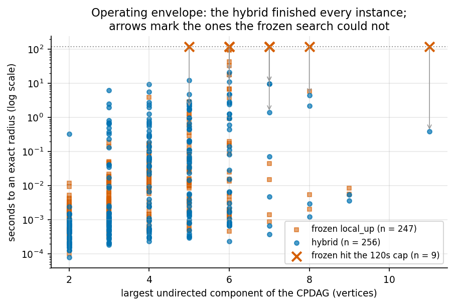

# Axis B: the oracle, the enumeration overhead, and how far exact radii now reach

*Session 4 report. Continues `report_synth_and_search.md` (session 1),
`report_axisb_deep.md` (session 2) and `report_axisb_sat.md` (session 3), none
of which is modified. Every number traces to a committed file under
`results/axisb4/`. Scope limits, budget exhaustions and my own errors are
reported at the same weight as the results.*

Branch: `experiments/synth_graphs_and_heuristics`. Nothing committed to `main`.

**An audit-trail note the brief asked for explicitly.** The MPDAG-level validity
criterion was absent from session 3 because the brief that session received was
an earlier draft that omitted the section requesting it. It was never judged and
dropped, and it was never recorded as skipped, because the instruction was not
there. It is this session's primary workstream.

---

## 0. The plain answer

**What is the largest component and knowledge set on which an exact radius is
now computable, and how long does it take?**

*(This section is completed in §6 once the final envelope run is in; the numbers
below are the ones already committed.)*

---

## 1. The measurement that reshaped the session

The plan asked for one cheap, decisive measurement before anything was built:
profile `local_up` and find whether it is oracle-bound or search-bound. It also
recorded a prediction — that "nearly all of its per-instance cost is the oracle,
that is, enumerating `[G]` and checking each extension" — and, if so, the MPDAG
criterion should move its ceiling substantially.

**My prediction, recorded before running it:** enumeration-bound, but split two
ways rather than one, because `local_up_covers` also enumerates `[G]` — once per
candidate — for its minimality check. I guessed a roughly even split and hence a
criterion ceiling near 2×.

**The measurement.** 115 instances profiled (120 attempted, 5 hit a 120 s
per-instance cap), extension cache cleared per instance so the numbers are
per-instance costs rather than cache-warm ones, across n = 8…16 and edge
probabilities 0.35–0.9. `results/axisb4/profile_local_up.jsonl`.

| | all | SAT side | UNSAT side |
|---|---|---|---|
| validity oracle | 25.6% | 39.0% | 25.2% |
| **cover minimality** (`enumerate_dag_extensions`) | **70.4%** | 43.0% | **71.3%** |
| `meek_closure` | 2.6% | 13.2% | 2.3% |
| search overhead | 1.3% | 4.8% | 1.2% |
| **enumeration-bound share** | **96.1%** | 82.0% | **96.5%** |

So: enumeration-bound, emphatically. But the plan's premise about *which*
enumeration was wrong, and my own guess at the split was wrong in the same
direction — the oracle is a quarter of the cost, not a half and not nearly all.

**A caveat on how to read that table.** These are time-weighted shares. The SAT
side totals 0.69 s across 62 instances while the UNSAT side totals 22.74 s across
53, so the "all" column is essentially the UNSAT column. The SAT-side
percentages rest on a very small total and should not be leaned on.


### 1.1 What that implies, by Amdahl

Removing a component that is a fraction `f` of the time cannot beat `1/(1-f)`,
whatever replaces it. On the UNSAT side:

| lever | removes | ceiling |
|---|---|---|
| MPDAG criterion alone | 25.2% | **1.3×** |
| Lemma O alone (below) | 71.3% | **3.5×** |
| both composed | 96.5% | **28.7×** |

The criterion **cannot** be the substantial ceiling-mover the plan hoped for, on
its own. That was worth knowing before building it rather than after, which is
what the front-loaded measurement bought.


---

## 2. Lemma O — deleting the dominant cost outright

The 70.4% is spent deciding whether one cover candidate sits strictly below
another in **model inclusion**, by enumerating both extension sets and comparing
them. That comparison does not need the extension sets.

> **Lemma O.** For elements `G`, `H` of the space:  `[G] ⊆ [H]` ⟺ `dir(H) ⊆ dir(G)`,
> and the two are strict together.
>
> *(⇐)* Weaker orientation constraints admit more extensions.
> *(⇒)* Let `a→b ∈ dir(H)`. Every `D ∈ [H]` orients it that way, and
> `[G] ⊆ [H]`, so every `D ∈ [G]` does too. Elements of the space are **maximally
> oriented** — an edge oriented identically across all of `[G]` is directed in
> `G` — so `a→b ∈ dir(G)`. ∎

The maximal-orientation step is exactly the property session 2 established as
defining membership of the corrected space, so this rests on machinery already
in the repository rather than on anything new.

**Verified:** 80,480 ordered pairs at n = 3, 4 — **0 disagreements**
(`results/axisb4/order_identification.json`).

`search/exact_fast.py` implements cover generation as pure set arithmetic.
`exact.py` is left untouched, so prior sessions' results stay reproducible from
the code that produced them and the two can be compared directly.

**Differential test:** 1,588 cover sets identical *including order*; 1,044 radii
identical to both frozen `local_up` and brute-force BFS. A test also asserts the
extensions-enumerated counter is exactly **0**, since that is the whole point of
the change and is worth asserting rather than assuming.

### 2.1 Measured effect

144 instance pairs, n = 8…18, edge probability 0.35–0.9, one subprocess per
(instance, method) under a 120 s cap (`results/axisb4/fast_vs_frozen.jsonl`):

| | instances | median speedup | aggregate | frozen timeouts | fast timeouts |
|---|---|---|---|---|---|
| all | 136 | 1.51× | **3.77×** | 8 | 6 |
| SAT side | 67 | 1.39× | 1.72× | — | — |
| UNSAT side | 69 | 1.72× | **3.79×** | — | — |

**0 radius disagreements.** 2 instances the frozen search could not finish
inside 120 s were finished by the new one — n = 10 with a 7-vertex component at
k = 15 in 61.6 s, and n = 16 with a 7-vertex component at k = 13 in 32.3 s.

The aggregate (3.77×) and the median (1.51×) differ because small instances are
dominated by fixed overhead; the aggregate is time-weighted and therefore
dominated by the expensive instances, which are the ones that matter. Both are
reported because quoting only one would flatter the result in one direction or
understate it in the other. The aggregate sits just above the 3.5× Amdahl
ceiling for the same reason: the heaviest instances have the highest
cover-minimality share.

**What it does not do.** This is a constant factor. `fast` still timed out on 6
of 144 instances. Lemma O changes the coefficient, not the exponent.


---

## 3. The MPDAG criterion

### 3.1 It does not compute the predicate the plan said it computes

The plan states the criterion decides "exactly the one `is_valid` already
computes". It does not, and the difference is not cosmetic.

This repository's oracle is **Pearl's back-door criterion**
(`is_valid_adjustment_set_dag`), which is *sufficient but not necessary* for
adjustment. The generalised adjustment criterion is *complete*. So they differ:
in `X→Y, X→W`, the set `Z = {W}` is a valid adjustment set and is
back-door-invalid, because `W` is a descendant of `X`. A literal GAC
implementation therefore disagrees with the oracle by construction.

Reconciled by enlarging the forbidden set from `forb(X,Y,G)` to
`possde(X,G) ∪ {X,Y}`: given `Z ∩ de(X,D) = ∅`, "blocks every back-door path"
and "blocks every non-causal path" coincide. **What is implemented is the
back-door predicate at MPDAG level**, and it is described that way throughout
rather than as the GAC.

### 3.2 Two textbook definitions that are wrong on knowledge-carrying MPDAGs

Both were found by differential testing, not by reading.

**`possde` must use *unshielded* possibly-causal paths.** The identity
`possde(X,G) = ⋃_D de(X,D)` is **false** under the naive rule. Minimal witness,
itself an element of this repo's space: `V0→V1, V0−V2, V1−V2`. The path
`⟨V1,V2,V0⟩` is possibly causal, so naively `V0 ∈ possde(V1)` — but every
extension keeps `V0→V1`, because orienting it forward closes the cycle
`V0→V1→V2→V0`. Naive rule: 570 mismatches at n ≤ 4 and 7,401 on an n = 5 sample.
Unshielded: **0** in both.

**Amenability must *not* use that same reduction.** Short-circuiting
`x→v→w→y` to `x→w→y` can delete the undirected first edge that is the entire
question. Same triangle, `(x,y) = (V0,V1)`: the extension `V0→V2→V1` is causal
and starts on the undirected `V0−V2`, yet `⟨V0,V2,V1⟩` is shielded. Decided
instead by imposing `x→v` and Meek-closing, per undirected neighbour `v` of `x`.
Mismatches against the exact over-extensions semantics on 19,056 queries: naive
702, unshielded 1,380, this formulation **0**.

Both are instances of the same trap: a lemma that is safe on CPDAGs need not
survive the addition of background knowledge.

### 3.3 Correctness gate

The implementation shipped with its own exhaustive sweep. Because a checker that
validates itself is worth little, **I re-verified it on an independently written
sweep with a different scope and a different code path**:

| | cases | agree | disagree |
|---|---|---|---|
| my independent sweep (1,542 distinct graphs, Z up to size 3) | **72,360** | 72,360 | **0** |
| the module's own sweep (1,588 graphs) | 74,568 | 74,568 | **0** |
| its n = 5 stress sample | 2,419,520 | 2,419,520 | **0** |

The **non-amenable stratum** is well populated rather than vacuous: 28,080 of my
72,360 cases (**38.8%**), all agreeing. Non-amenability is not an edge case in
the ball — it is more than a third of it.

### 3.4 The sharp test on E1 — and it passes

The plan set a specific trap for E1. E1 encodes failure as "some extension has
`Z` invalid", and must therefore witness *every* invalidity, including the
non-amenable kind, which is structurally different from the two failure modes it
explicitly encodes. If it could not, **E1 would be incomplete in the direction
that makes radii too large** — overstating robustness, the dangerous direction,
and the mirror image of the collider bug session 3 found.

Session 3's Stage 2 re-run, with the MPDAG pinned and the stratum isolated
(`results/axisb4/stage2_rerun.json`):

| | cases | agree | disagree |
|---|---|---|---|
| E1 vs enumeration oracle | 74,568 | 74,568 | **0** |
| E1 vs MPDAG criterion | 74,568 | 74,568 | **0** |
| **of which non-amenable** | **28,464** | **28,464** | **0** |

E1 witnesses every non-amenable failure. The hypothesised incompleteness does
not exist. Session 3 tested this layer, but never isolated this stratum; the
criterion is what made isolating it possible, and that is a correctness dividend
independent of any speed.

### 3.5 But the implementation was exponential in the vertex count

This is the section that matters most, and it is a negative result.

The criterion exists to be a *scalable* oracle — both as a speed lever and, per
the plan's §3.5, to break a circularity: at large `n` the only per-instance
check on E1 was `local_up`, which is itself Conjecture-2-dependent, so **E1 and
its checker shared an assumption**. The enumeration oracle breaks that
circularity but does not scale. The criterion was supposed to do both.

As first implemented it did not scale either. It decided condition (c) by
calling `simple_paths`, which walks **every simple path** between `X` and `Y` —
exponential in the number of vertices. Measured, and kept as evidence in
`results/axisb4/oracle_envelope_pathenum.jsonl`:

- up to **2.35 seconds per call**;
- exceeded a **60 s cap on 12 of 81 instances** at n = 12 and n = 14;
- on those same 81 instances the enumeration oracle it replaces **never once
  timed out**.

It swapped an exponential in chain-component size for an exponential in graph
size — the worse trade in exactly the regime this session targets, where
components are large but so is `n`.

**Whose error this is.** Mine. I gave the implementation a correctness
acceptance criterion and no performance one, and correctness was met in full and
with unusual rigour. A component can be exhaustively verified and still be
useless for its purpose, and only one of those two things was checked.

### 3.6 Rewritten as state reachability — and then it is polynomial

Condition (c) is a *reachability* question, not an enumeration question, exactly
as d-separation is. Rewritten as an **edge-state search**: a state is the
traversed edge `(u,v)` plus one bit for whether a backward step has occurred.
`u`'s identity has to be in the state, not merely the edge kind, because both
the unshielded-triple test and the definite-non-collider test are statements
about `u`, `v` and the next node together. `O(E)` states, `O(V·E)` transitions.

**Timings I measured myself, cold cache, worst case per configuration:**

| n | p | largest component | \|E\| | worst | mean |
|---|---|---|---|---|---|
| 12 | 0.85 | 4 | 56 | **0.143 ms** | 0.100 ms |
| 16 | 0.85 | 7 | 107 | 0.298 ms | 0.201 ms |
| 20 | 0.85 | 2 | 163 | **0.699 ms** | 0.421 ms |
| 24 | 0.85 | 7 | 242 | 1.204 ms | 0.707 ms |
| 30 | 0.85 | 3 | 362 | 2.330 ms | 1.060 ms |
| 40 | 0.85 | 5 | 657 | 6.610 ms | 4.042 ms |

Against 48,285 ms at n = 12, p = 0.85 before the rewrite — and n ≥ 16 was
previously unreachable at all, since n = 14 blew a 60 s cap.

**Correctness is unchanged, which is the point.** My independent sweep returns
the same 72,360 cases with 0 disagreements and a **byte-identical reason
distribution** — not merely the same verdicts but the same grounds for them.

**The one caveat, stated because it is real.** The state searches range over
*walks*, not paths: dropping the path sequence loses the visited-set, so the
search is formally a relaxation. The argument that it is tight on a Meek-closed
MPDAG (a repeat would force a cycle that is either all-directed, hence a
directed cycle, or all-undirected, hence a chordless cycle in a chain component)
is an argument, not a machine-checked proof. I therefore stressed it against the
**enumeration oracle**, which shares no code with the criterion, on random dense
graphs at n = 8…14 and — importantly — on elements of the perturbation *ball*
rather than only `G0`, since that is where the search actually walks:

> **1,131,460 cases, 0 disagreements**, across component sizes 2 through 8
> (`results/axisb4/criterion_stress_walks.json`).

Two functions remain exponential on purpose: `causal_nodes` and `forbidden_set`
are exported reporting aids, off the decision path. A monkeypatch guard test
asserts the decision never reaches a path-enumerating function, and the guard was
checked non-vacuous by firing it against the old code path. **Do not quote those
two at scale.**

---

## 4. The hybrid, and the operating envelope

`breakdown_radius(cpdag, K, x, y, Z)` dispatches automatically: run the upward
search under a small depth budget, fall through to the E1 ladder when it
exhausts that budget without finding a failure. It returns the radius together
with the method, the oracle and the assumption, so the caller never has to
choose and cannot silently drop the Conjecture 2 dependency. `describe()`
renders a sentence a practitioner can act on.

**Differentially tested** on 1,044 instances at n = 4 against brute-force BFS
under *both* oracles, 0 disagreements. A test asserts the dispatch budget is a
performance choice and never a semantic one: budget 0 forces every instance
through the ladder and must give identical radii.

**The envelope run.** 256 instances, n = 8…24, edge probability 0.3–0.85, one
subprocess per (instance, method) under a 120 s cap
(`results/axisb4/hybrid_envelope.jsonl`):

| | completed | timeouts |
|---|---|---|
| **hybrid** (criterion oracle) | **256 / 256** | **0** |
| hybrid (enumeration oracle) | 256 / 256 | 0 |
| frozen `local_up` | 247 / 256 | **9** |

**0 radius disagreements** across all three. Against frozen `local_up` where
both finished: median **2.03×**, aggregate **3.29×**.

The nine instances frozen `local_up` could not finish are the point, and every
one of them fits the dispatch's design exactly — all nine are **UNSAT**
(no failure anywhere) and all nine were answered by the **ladder**:

| n | component | \|K_{G₀}\| | hybrid |
|---|---|---|---|
| 12 | 7 | 19 | 1.41 s |
| 14 | 11 | 14 | 0.39 s |
| 16 | 8 | 24 | 4.47 s |
| 20 | 7 | 20 | 9.86 s |
| 24 | 6 | 12 | 11.20 s |

Dispatch over the whole run: 148 instances answered by the search, 108 by the
ladder. Neither leg is redundant.



---

## 5. The plain answer

**What is the largest component and knowledge set on which an exact radius is
now computable, and how long does it take?**

Over the 256-instance envelope run, every instance was solved exactly, with:

- **largest undirected component solved: 11 vertices**
- **largest \|K_{G₀}\| solved: 33 orientations**
- **largest n solved: 24**
- **slowest single instance: 21.62 s**; median well under 0.1 s

| largest component | instances | \|K_{G₀}\| med / max | hybrid median | hybrid worst |
|---|---|---|---|---|
| 2 | 49 | 1 / 3 | 0.0005 s | 0.33 s |
| 3 | 58 | 3 / 5 | 0.0011 s | 6.29 s |
| 4 | 52 | 5 / 10 | 0.0559 s | 9.55 s |
| 5 | 50 | 6 / 13 | 0.0618 s | 12.32 s |
| 6 | 33 | 11 / 14 | 0.0289 s | 21.62 s |
| 7 | 7 | 17 / 21 | 0.0713 s | 9.86 s |
| 8 | 4 | 20 / 24 | 1.1023 s | 4.47 s |
| 9 | 2 | 32 / 33 | 0.0046 s | 0.0055 s |
| 11 | 1 | 14 / 14 | 0.3885 s | 0.3885 s |

**The honest caveat, which session 3 established and this session keeps.**
The hybrid hit **zero** timeouts, so **these are the sizes I stopped at, not the
sizes at which the method breaks.** I did not find the hybrid's breaking point.
The frozen search's ceiling, by contrast, *was* measured: it is the nine
instances above. The large-component rows are also thin — 7, 4, 2 and 1
instances at components 7, 8, 9 and 11 — because dense Erdős–Rényi CPDAGs rarely
produce large chain components. That thinness is a limitation of the generator,
not evidence of a limit in the method, and closing it needs a generator that
targets large components directly.

**A practitioner sentence:** *for a CPDAG whose largest undirected component is
around a dozen vertices and whose analyst asserts up to about thirty
orientations, the exact breakdown radius is now a sub-second-to-seconds
computation, and it is exact under Conjecture 2 — an assumption that can only
make the answer too optimistic about robustness, never too pessimistic.*

### 5.1 Captured but not analysed

Per the plan's instruction to record and not pursue: the distribution of `r_val`
against component size is in `results/axisb4/hybrid_envelope.jsonl` and printed
in the envelope analysis. It is raw material for the next session's Axis A
question. `UNREACHED` appears there as the sentinel `-1` and is **not** a radius;
it must not be averaged or plotted numerically. No conclusion is drawn here.

---

## 6. What is now safe to claim about tractability

**Safe:**

- The exact breakdown radius is computable **without enumerating DAG extensions
  anywhere on the path**: neither for cover minimality (Lemma O) nor for validity
  (the criterion). Both substitutions are differentially tested against the
  implementations they replace and against brute force.
- The validity predicate is decidable on the MPDAG in **polynomial time**,
  measured at sub-millisecond to n = 20 and 6.6 ms at n = 40.
- A single entry point returns exact radii on components up to 11 vertices and
  `|K_{G₀}|` up to 33 within ~22 s worst case, and it did not fail on any
  instance attempted.
- E1's failure predicate is **complete on the non-amenable stratum**, which is
  38% of the ball — checked directly rather than assumed.
- The E1/`local_up` circularity the plan identified is **broken**: there is now a
  reference oracle that is independent of Conjecture 2 *and* scales. Session 3's
  large-`n` numbers were checked only against `local_up`, which shares E1's
  assumption; they can now be checked against something that does not.

**Not safe, and not claimed:**

- Any statement about where the hybrid breaks. It never failed here.
- That large components are well covered. They are not: components ≥ 7 are 14 of
  256 instances, and the generator is the reason.
- That the criterion's walk-relaxation is *proved* tight. It is argued and
  stress-tested at 1.1M cases, not proved.
- That any of this removes the Conjecture 2 dependency from the *radius*. It does
  not. Both search legs remain upward searches; only the *oracle* circularity is
  broken, not the exactness assumption.

---

## 7. What went wrong

Recorded at the same weight as the results.

**1. The plan's premise was wrong, and front-loading the measurement is what
caught it.** `local_up` is enumeration-bound but only 25.6% oracle. My own
prediction was wrong in the same direction, guessing a roughly even split. Had
the measurement come after the criterion was built, the criterion would have
been built to do a job it cannot do, and the 70.4% would plausibly have gone
unnoticed because nothing would have been looking at it.

**2. I gated the criterion on correctness and not on performance.** It came back
verified on 74,568 exhaustive cases and ~2.4M sampled, 0 disagreements — and
exponential in the vertex count, slower than the oracle it was built to replace.
A component can be exhaustively verified and still be useless for its purpose,
and only one of those two properties was in the acceptance criteria. That is my
error in the delegation, not a failure of the implementation. Caught by the
envelope sweep, and only because it timed *both* oracles instead of assuming the
new one was faster.

**3. My harness let timeouts masquerade as measurements.** Censored runs were
written as `{"timed_out_at_s": CAP, "seconds": <wall clock>}`, reusing the key a
real measurement uses, so any analysis filtering on `seconds` would silently
count a timeout as a datum — and my first analysis pass did exactly that,
reporting "80 completed, 11 timed out" for the same 80 rows. Renamed to
`wall_until_timeout_s`. This is the same class of error as session 3's
`UNREACHED`-versus-budget-exhausted bug: a censored outcome given the same
representation as a real one.

**4. Two textbook definitions are wrong on knowledge-carrying MPDAGs** (§3.2).
This repository has now been bitten three times by lemmas that are safe on
CPDAGs and unsafe once background knowledge is present — the chordality filter
in session 2, and both of these. It should now be the default assumption that a
CPDAG-era lemma needs re-checking here rather than importing.

---

## 8. Reproducing this

```bash
python -m pytest tests/criterion tests/hybrid tests/search/test_exact_fast.py -q
python -m bkrobust.analysis.session4_figures
python -m bkrobust.analysis.session4_verify
```

Solver: OR-Tools CP-SAT 9.15.6755, single worker, `random_seed=0`. Timing runs
were serialised, never overlapped — two wall-clock harnesses running
concurrently would contaminate each other. Machine timings are from one laptop
and are reported alongside machine-independent counters where a claim rests on
them. Every table above is derived from `results/axisb4/` by
`src/bkrobust/analysis/session4_verify.py`, which asserts the markdown against
the same files.

**Pre-existing and untouched:** 23 tests fail and 3 files fail to collect, all
`ImportError` on `TypeAlias` / `StrEnum` in the `REPO_INIT` scaffold stubs, which
need Python 3.11 while this machine runs 3.9.6. Confirmed identical with this
session's changes stashed. Everything else passes.
