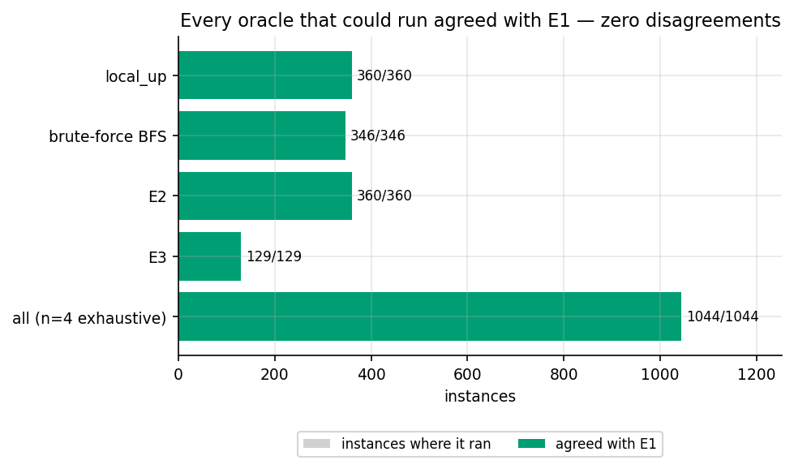
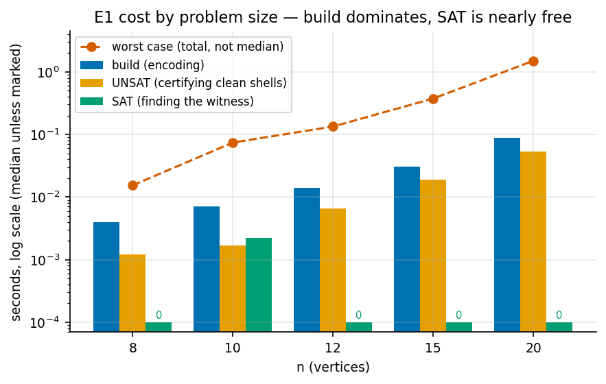
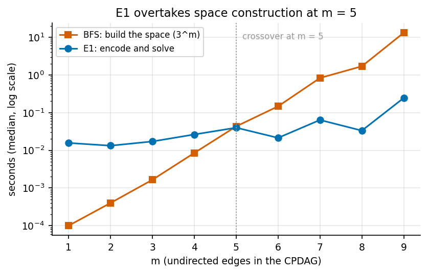
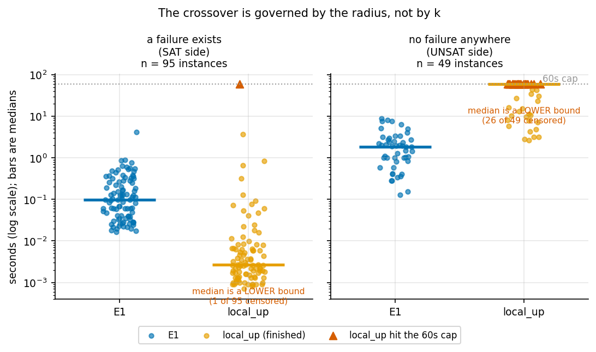
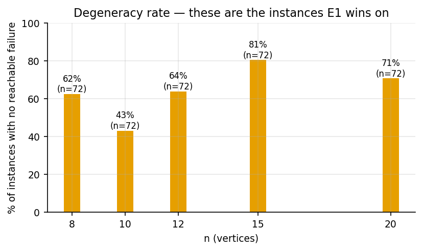
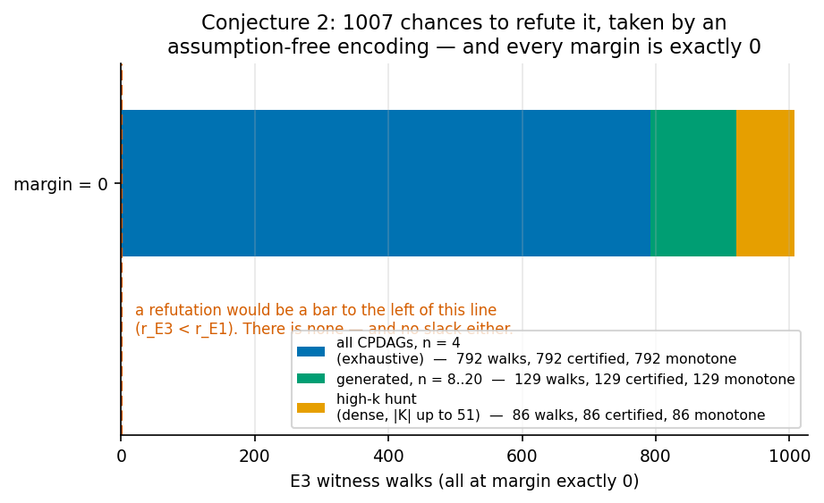

# Axis B, tractability: a declarative encoding of the breakdown radius

*Session 3 report. Continues `report_synth_and_search.md` (session 1) and
`report_axisb_deep.md` (session 2), neither of which is modified here. Every
number traces to a committed file under `results/axisb3/`. Scope limits, budget
exhaustions and my own errors are reported at the same weight as the results.*

Branch: `experiments/synth_graphs_and_heuristics`. Nothing committed to `main`.

**In scope, per the brief:** the SAT/CP encoding (item B2.8), scaling, and
stress-testing Conjecture 2 beyond brute force. **Explicitly parked:** the
Anti-Exchange Case B proof, the L/U bounds work, and Axis A. None of them were
touched.

---

## 0. The headline

| | Result |
|---|---|
| **The encoding works** | Three encodings (E1, E2, E3) built and validated. All agree with brute-force BFS and with `local_up` **everywhere either could run** — 1,044 exhaustive instances at n = 4 plus 360 generated instances to n = 20, **zero disagreements**. |
| **It does not replace `local_up`** | **On the SAT side it loses, badly.** When a failure exists at radius 1 — the common case — `local_up` finds it in under a millisecond while E1 still pays ~30 ms to build a model. This is the session's main negative result. |
| **It wins where robustness is actually certified** | On the **UNSAT** side, proving that *no* failure exists, the ordering reverses and the margin is unbounded: at k = 15, E1 answers in **0.29 s** where `local_up` **exceeded a 60 s cap**. Certifying robustness is exactly the direction a practitioner cares about. |
| **The crossover is not governed by k** | It is governed by **the radius**. Previous sessions' `1.59^k` cost model for `local_up` describes its worst case; its *observed* cost is dominated by how quickly it stumbles onto a failure. |
| **It beats building the space from m = 5** | Against BFS space construction the crossover is at **m = 5 undirected edges**, reaching **54×** at m = 9, after which the space is simply not built. |
| **Conjecture 2 survives a much harder test** | E3 assumes nothing and could have refuted C2 outright. Across every instance where both ran it **never once beat E1**. Every E3 witness walk was replayed and certified, and every one came out **monotone**. |
| **But the margin is zero, not slack** | Every recorded `r_E3 − r_E1` is exactly **0**. A conjecture never violated but always *tied* is in a weaker state than one with slack. This is reported as a tie, not as a cushion. |
| **Degeneracy is the dominant regime** | **64.2%** of generated instances have no reachable failure at all. Any tractability claim that quietly averages over these is measuring the easy case. |

---

## 1. What was built

Three encodings in `src/bkrobust/sat/`, deliberately not collapsed into one,
because they assume different things and the differences are the experiment.

| | searches | assumes | guarantee |
|---|---|---|---|
| **E1** `e1.py` | retractions of `K_{G₀}` | Conjecture 2 | `r ≤ r_E1` |
| **E2** `e2.py` | every closed state, distance via the join | Theorem 2 + Lemma R + up-then-down normalisation | `r ≤ r_E2 ≤ r_E1` |
| **E3** `e3.py` | walks of one-orientation covering steps | **nothing** | `r ≤ r_E3` |

All three are **upper** bounds on the true radius `r`. None can return a radius
that is too small. That one-sidedness is inherited from session 2 §7 and is the
dangerous direction — an over-estimated radius claims *more* robustness than is
warranted — so each result object carries an `assumes` field that travels with
the number.

Underneath them sit two shared layers:

* `closure.py` — the Meek closure as CP-SAT clauses, plus no-new-v-structures and
  acyclicity. Its solution set *is* the corrected space of session 2.
* `failure.py` — a witness DAG extending the MPDAG, and the predicate saying `Z`
  is an invalid adjustment set in it.

and one layer above them:

* `verify.py` — replays any witness through the ordinary graph code and re-checks
  it from scratch. A solver returning SAT is a claim, and the encoding is the
  thing under test, so no witness in this report is trusted on the solver's word.

### 1.1 Two encoding details that are not incidental

**E2's join needs no closure, and no extra copy of the variables.** The plan
budgeted a second copy of the orientation variables for the join `J`. It is not
needed. Theorem 2 identifies `G₀ ∨ G` with `K_{G₀} ∩ K_G`, and the intersection of
closed sets is closed, so `K_J = K_{G₀} ∩ K_G` outright. With `K_{G₀}` a constant
the whole objective collapses to a symmetric difference `|K_{G₀} Δ K_G|` — one
linear constraint over one copy. The saving is real; the assumptions are
unchanged, and they are what matters.

**E3's soundness runs in one direction only, and it is easy to invert.**
Consecutive states in an E3 walk are closed and differ by exactly one
orientation. Two sets differing by a single element admit nothing strictly
between them, so such a pair is a covering pair *unconditionally* — no appeal to
Lemma R, to anti-exchange, or to gradedness. So an E3 walk of length `k` to a
failing state proves `r ≤ k` outright. The converse — that every cover is a
one-orientation step — **is** Lemma R, and is not needed for that direction and
not assumed. Therefore:

> `r_E3 < r_E1` **refutes Conjecture 2**, with a witness and no assumptions.
> `r_E3 = r_E1` is **consistent with** Conjecture 2 and proves nothing.

Agreement is evidence. Only disagreement would be a theorem, and it would be a
theorem in the negative direction. §3 reports what happened under exactly this
reading and does not soften it.

---

## 2. Correctness before scale

A wrong encoding does not crash. It returns plausible numbers. So the validation
was layered, and each layer found a real bug before the next one ran.

### Stage 1 — the closure encoding defines the corrected space

Solutions of the closure system, compared against `enumerate_space_correct` on
every CPDAG at n ≤ 4: **133 CPDAGs, 1,588 elements, 0 mismatches.**

**It did not pass first time.** The first version encoded each Meek rule as an
implication and reproduced only **66 of 133** spaces — it was strictly too
strong. The cause: I had dropped R3's and R4's *undirectedness* premises. R1 and
R2 tolerate that, because the alternatives to their consequent are a new
v-structure or a cycle, both independently forbidden. R3 and R4 do not. The fix
was to encode every rule as a **forbidden firing configuration** — for each tuple
matching the premises, one clause ruling out (premises ∧ ¬consequent).

### Stage 2 — the failure predicate agrees with the validity oracle

Against the reference oracle: **26,304 cases, 0 disagreements.**

**It did not pass first time either, and the failure was in the dangerous
direction.** 144 cases disagreed because my non-collider clause required
`into_l ∨ into_r`, whereas a collider needs **both** arrows pointing in. A chain
passing through a member of `Z` was therefore accepted as a collider, so a path
that is blocked was reported open, so failures were reported that were not
failures — which makes radii **too small**, i.e. claims *less* robustness than
the truth, and would have looked like a Conjecture 2 counterexample. Two clauses
instead of one.

The d-connecting path is encoded as an **explicit bounded simple path** with
position variables rather than a Bayes-ball fixpoint; the fixpoint formulation is
unsafe in both directions here. Two fixpoints remain (`rx`, `ancz`) and are safe
because they range over an acyclic graph.

### Stage 3 — radii, differentially, against both existing oracles

All CPDAGs on 4 nodes, corrected space, `Z` the optimal adjustment set,
**1,044 instances**:

| comparison | agree | disagree |
|---|---|---|
| E1 vs exact BFS | 1,044 | **0** |
| E1 vs `local_up` | 1,044 | **0** |
| E2 vs exact BFS | 1,044 | **0** |
| E3 vs exact BFS | 1,044 | **0** |
| E1 vs E2 | 1,044 | **0** |

Of those, 792 have a reachable failure. **All 792 E3 walks were replayed through
the ordinary graph code and certified**, and **all 792 were monotone** — the
solver was free to descend and never needed to. E2's optimum had an empty
down-leg in all 1,044.

On the worked example of session 1, all three encodings return the published
**3 / 3 / 2**, in about 10 ms, without ever building the 48-element space.



### An honesty fix found during validation

E1's ladder has a natural top: once every orientation is retracted there is
nothing left, so exhausting it genuinely proves no failure exists in the up-set.
**E3's does not.** Its `max_k` is a pure budget, so exhausting it proves only
`radius > max_k`. The first version returned `UNREACHED` in that case, which
would have read as "no failure exists". It now records `exhausted_to` and sets
`exact=False`, and the n = 4 sweep checks that distinction explicitly rather than
comparing radii and calling it agreement.

### Determinism

Radii, witnesses, walks **and solver conflict/branch counters** hash identically
across `PYTHONHASHSEED` 0, 1 and 12345, with a single worker and a fixed seed:
`4edd011f…`. The counters are in the hash deliberately — matching radii alone
would not detect a search that explored a different tree and happened to land on
the same answer.

---

## 3. Scaling: how far it goes, and where it stops

**Scope.** 360 instances, six generators (Erdős–Rényi at three densities,
scale-free, block, decoupled-backdoor), at n = 8, 10, 12, 15, 20, written
incrementally to `results/axisb3/scaling.jsonl`. Every instance carries its
structure — undirected-edge count `m`, largest undirected component and its
density, `|K_{G₀}|` — so cost can be read against structure rather than against
`n` alone. `local_up` and BFS were run alongside wherever they remained feasible,
so the comparison is measured, not asserted.

### 3.1 E1 reaches n = 20 without difficulty, and build dominates

| n | rows | `|K_{G₀}|` med/max | build | UNSAT | SAT | total med | total worst |
|---|---|---|---|---|---|---|---|
| 8 | 72 | 2 / 7 | 0.004 s | 0.001 s | 0.000 s | 0.006 s | 0.015 s |
| 10 | 72 | 3 / 8 | 0.007 s | 0.002 s | 0.002 s | 0.012 s | 0.074 s |
| 12 | 72 | 4 / 11 | 0.014 s | 0.007 s | 0.000 s | 0.025 s | 0.134 s |
| 15 | 72 | 3 / 9 | 0.031 s | 0.019 s | 0.000 s | 0.054 s | 0.374 s |
| 20 | 72 | 4 / 12 | 0.087 s | 0.053 s | 0.000 s | 0.136 s | 1.497 s |

The **encoding build, not the solve, is the bottleneck** at this scale, and it
grows with `n` because the Meek-rule clause set ranges over vertex tuples (R3 and
R4 over four vertices, so `O(n⁴)` clauses). Median solver conflicts is **0** at
every `n`: propagation alone settles these instances. That is worth stating
plainly — the SAT solver is barely searching, so these timings measure *encoding
size*, not search difficulty, and they should not be extrapolated to regimes
where the solver actually has to work.



### 3.2 Against building the space: crossover at m = 5, then no contest

| m (undirected edges) | rows | space size (med) | BFS build | E1 total | ratio |
|---|---|---|---|---|---|
| 3 | 40 | 18 | 0.002 s | 0.017 s | 0.10 |
| 4 | 62 | 30 | 0.009 s | 0.026 s | 0.32 |
| **5** | 58 | 60 | 0.043 s | 0.040 s | **1.08** |
| 6 | 30 | 98 | 0.147 s | 0.021 s | 6.88 |
| 7 | 22 | 294 | 0.830 s | 0.064 s | 13.02 |
| 8 | 22 | 210 | 1.696 s | 0.033 s | 51.00 |
| 9 | 4 | 515 | 13.172 s | 0.245 s | 53.84 |

Above m = 9 the space was not built at all (14 of 360 rows); `3^m` closures is
the binding cost, consistent with session 2's measured `3.97^k` for BFS
construction. This is the clean, uncontroversial win: **anything that needs only
a radius, not the whole space, should not be building the space.**



### 3.3 Against `local_up`: the encoding loses, and the reason is instructive

This is the comparison that matters, because `local_up` is the incumbent and it
already avoids building the space. **Across all 360 generated instances, and
across every value of `|K_{G₀}|` reached, `local_up` was faster than E1** — often
by one to two orders of magnitude:

| `|K_{G₀}|` | rows | E1 median | `local_up` median | ratio up/E1 |
|---|---|---|---|---|
| 2 | 62 | 0.021 s | 0.0008 s | 0.04 |
| 4 | 62 | 0.046 s | 0.0098 s | 0.21 |
| 5 | 43 | 0.038 s | 0.0171 s | 0.45 |
| 9 | 3 | 0.210 s | 0.0929 s | 0.44 |
| 12 | 6 | 0.070 s | 0.0012 s | 0.02 |

**If the session had stopped here the finding would be: the encoding is a dead
end.** It does not, because the aggregate hides a split — and the split is not
where the earlier sessions' cost model predicted.

### 3.4 The split: it is the radius, not k

**Scope.** A targeted high-`k` sweep, `results/axisb3/highk.jsonl`: 144 instances
on dense Erdős–Rényi CPDAGs (edge probability 0.6 / 0.75 / 0.9) at
n = 8, 10, 12, 14, 16, 18, selected to have `|K_{G₀}| ≥ 10`. It reaches
`|K_{G₀}| = 51`, undirected components of **11 vertices** and component densities
up to **1.00** (a complete component). `local_up` ran in a subprocess under a
hard **60 s** cap, so a timeout is recorded as a datum rather than silently
dropped — omitting them would flatter the slower method.

Where `local_up` completed, it agreed with E1 on **117 of 117**. Splitting by
whether a failure exists at all:

| | rows | E1 median | E1 worst | `local_up` median | `local_up` timeouts (>60 s) |
|---|---|---|---|---|---|
| **a failure exists** (SAT side) | 95 | 0.099 s | 4.117 s | **0.0027 s** | 1 / 95 |
| **no failure anywhere** (UNSAT side) | 49 | 1.865 s | 8.745 s | 10.459 s *(of the 23 that finished)* | **26 / 49** |

That is the whole result in one table.

* **When a failure is near, `local_up` is unbeatable and E1 should not be used.**
  It stops at the first shell containing a failure; at radius 1 that is one
  expansion. E1 must build an `O(n⁴)`-clause model before it can say anything.
  ~37× in `local_up`'s favour, and no encoding effort will close that gap.
* **When there is no failure, `local_up` must exhaust the entire up-set** and E1
  wins by a margin that is not bounded above. On the 23 instances where
  `local_up` finished, the median speedup is **8.8×** and the maximum **117.9×**
  (k = 12: E1 0.129 s against 15.212 s). On the other **26 it did not finish
  inside 60 s at all**, while E1 answered every one of them — the worst, at
  n = 16 and k = 33, in **8.745 s**.

So the earlier sessions' `1.59^k` model for `local_up` describes its **worst
case**, and the worst case is realised precisely on the degenerate instances.
Its *observed* cost is dominated by how fast it stumbles onto a failure, which is
why `k` alone does not predict the crossover and the radius does.



**This is the practically useful half.** Finding a nearby failure is the easy
question; *certifying that no failure exists within the space* is the one that
supports a robustness claim, and it is the one `local_up` cannot answer at scale.
An UNSAT answer at rung `k` is a certificate that shells `0 … k` are clean, which
is why the ladder was built as a ladder rather than as a single optimisation.

### 3.5 The ceiling, stated plainly

E1's cost is dominated by **build time**, which grows as `O(n⁴)` clauses in the
vertex count and is essentially independent of `k`. Solve time is near zero on
easy instances (median conflicts 0 in the general sweep) and becomes the
bottleneck only on hard UNSAT instances at high `k` (median conflicts 118,839 at
k = 33, where the UNSAT leg is 8.48 s of an 8.745 s total).

The honest ceiling from these runs:

* **n ≈ 20 with k ≤ 12** is comfortable: worst case 1.5 s.
* **n = 18 with k up to 51** is reachable, but the spread is wide: median 0.3 s
  with individual instances at 8.7 s.
* **Nothing here was pushed to failure.** No E1 run hit its time limit, so the
  ceiling above is *where I stopped*, not where the method breaks. I did not find
  E1's breaking point, and I should not imply a limit I did not measure.
* `local_up`'s ceiling on the UNSAT side, by contrast, **was** measured: it is
  around **k = 12–15** at a 60 s budget.

### 3.6 Degeneracy

**64.2%** of the 360 general instances and **34.0%** of the 144 high-`k` ones
have no reachable failure at all — `r = UNREACHED`. This is reported rather than
filtered because it changes how every timing above should be read: these are the
instances E1 wins on, and any aggregate that averages them together with the
radius-1 cases is measuring a mixture of two very different problems. The
`UNREACHED` sentinel is never averaged and never plotted as a number.



---

## 4. Conjecture 2, stress-tested where it could actually break

E3 assumes nothing. If it ever reached a failing state in fewer steps than any
retraction-only search could, Conjecture 2 would be **refuted** — and with it the
exactness of `local_up` and of E1. That was a live possibility going in, and it
would have been the most important result the project has produced.

**It did not happen.**

| scope | E3 instances | certified by replay | monotone | margins `r_E3 − r_E1` | counterexamples |
|---|---|---|---|---|---|
| all CPDAGs, n = 4 (exhaustive) | 792 | 792 | 792 | all 0 | **0** |
| generated, n = 8…20 | 129 | 129 | 129 | all 0 | **0** |
| high-`k` hunt, dense | 86 | 86 | 86 | all 0 | **0** |

The hunt was deliberate, as the brief required: dense components, large
components, high `|K_{G₀}|` — the regime session 2's Lemma-L slack statistics
flagged as closest to the boundary. The largest instance on which E3 certified a
walk had **n = 18, `|K_{G₀}| = 51`, an 11-vertex undirected component at density
0.93**, and 2,125 variables, solved in 1.355 s. A directed hunt that finds
nothing is much stronger evidence than an undirected one.

**Three things must be said against over-reading this.**

1. **Every margin is exactly zero.** Not a single instance had `r_E3 > r_E1`
   either. Conjecture 2 is never violated, but it is also never violated *with
   room to spare* — it is tied everywhere. A conjecture that always ties is in a
   weaker evidential state than one with slack, and this is the opposite of the
   reassuring picture Lemma L gave in session 2 (where only 9.0% of pairs were
   tight). Reported as a tie, not as a cushion.
2. **E3's scope is bounded by radius, not by instance size.** E3 unrolls `k+1`
   copies of the closure encoding, so it was run only where `r ≤ 4` (general
   sweep) or `r ≤ 3` (hunt). Instances in the hunt with radii 5, 6 and 8 exist
   and **were not covered by E3**. The counterexample search is therefore a
   search over *small-radius* instances, which is where most instances live but
   is not everywhere.
3. **Agreement is not confirmation.** Per §1.1, a shorter path through a
   hypothetical multi-orientation cover would be invisible to both E1 and E3. So
   this evidence bears on Conjecture 2 without touching **Lemma R**, which is
   what would rule such a cover out. Anti-Exchange Case B remains exactly as open
   as session 2 left it. Nothing here closes it, and this session did not try —
   it was explicitly parked.



**What it does add.** Session 2's evidence for Conjecture 2 was ~2M comparisons
inside enumerated spaces at n ≤ 5. This adds instances an order of magnitude
larger in every structural parameter, tested by a method that does not share the
enumeration's assumptions and that *could* have refuted it. It also independently
corroborates the monotone-path claim: 1,007 certified witness walks, every one
monotone, on a search that was free to descend at every step.

---

## 5. What is safe to claim about tractability

Stated as narrowly as the evidence supports.

**Safe:**

* The breakdown radius can be computed **without constructing the perturbation
  space**, by a declarative encoding, and the answer agrees with brute force on
  every instance where brute force can still run (1,044 exhaustive at n = 4;
  346 of 360 generated).
* For **certifying robustness** — proving no failure exists within the space —
  the encoding is the better method beyond roughly **k = 12**, where `local_up`
  stops finishing inside a 60 s budget and E1 continues to answer in seconds.
* An UNSAT answer at rung `k` is a **certificate that shells 0 … k are clean**,
  and it is produced without enumerating those shells.
* Radii from E3 are **assumption-free**; radii from E1 are conditional on
  Conjecture 2 and hence on Anti-Exchange Case B. The `assumes` field on every
  result object carries this, and it must not be dropped when a number is copied
  into a table.

**Not safe, and not claimed:**

* That the encoding is a general-purpose replacement for `local_up`. **It is not.**
  On the common case — a failure at radius 1 — it is roughly 37× slower and there
  is no prospect of closing that.
* Any statement about where E1 breaks down. It never hit a time limit here, so no
  breaking point was measured.
* That Conjecture 2 is confirmed. It survived a test that could have refuted it,
  at every margin exactly zero, over small-radius instances only.
* Any extrapolation of the timing tables to instances where the solver has to
  work. Median conflicts is 0 across the general sweep: those timings measure
  encoding size, not search.

---

## 6. What went wrong

Reported at the same weight as the results, because in this session the bugs
were the most instructive part: both encoding errors produced *plausible
numbers*, neither crashed, and one of them erred in the direction that would
have looked like a discovery.

**1. The closure encoding was too strong (Stage 1).** Encoding Meek's rules as
implications and dropping R3's and R4's undirectedness premises lost 67 of 133
spaces. R1 and R2 tolerate the omission; R3 and R4 do not. Caught by comparing
against the enumerated corrected space rather than by inspection. Fixed by
forbidding firing configurations.

**2. The collider clause was too weak, and it erred toward under-reporting
robustness (Stage 2).** Requiring `into_l ∨ into_r` where a collider needs
*both* let a chain through `Z` pass as a collider, so blocked paths read as open
and non-failures read as failures. 144 of 26,304 cases. This makes radii **too
small** — and a spuriously small E3 radius is exactly what a Conjecture 2
counterexample looks like. Had this survived into §4 it would have manufactured a
false headline result. It was caught only because Stage 2 was run as its own
layer against a reference oracle, before any radius was computed.

**3. `UNREACHED` conflated with "budget exhausted" in E3.** E3's ladder has no
natural top, so running out of rungs proves `radius > max_k` and nothing more.
Returning `UNREACHED` there would have read as "no failure exists". Found while
writing the n = 4 sweep's comparison logic, not by a failing test.

**4. A negated literal has no proto index on a clone.** E2's rungs are added to
per-rung clones of a shared model; `var.Not().Index()` is negative and cannot be
looked up. Immediate crash, trivially fixed by carrying the sign alongside the
variable — noted only because it is the one bug in this list that announced
itself.

**5. A `sed` delimiter collided with a `|` in a type annotation** and corrupted a
dataclass field, and a later blanket string replacement rewrote an import *inside
an embedded source string* as well as at the top of the file. Both were caught
immediately by the linter and the test run. Mechanical, but the reason to record
them is that both were edits made without reading the surrounding line first.

**Not a bug, but worth recording:** the first high-`k` sweep hung, because
`local_up` on a degenerate instance at k = 15 must exhaust an up-set of up to
2¹⁵ states. I killed it and re-ran with `local_up` in a subprocess under a hard
cap. The hang was not an obstacle to the measurement — **it was the
measurement**, and turning it into a recorded timeout is what produced §3.4.

**Pre-existing and untouched:** 23 tests in `tests/test_adjustment.py`,
`test_distances.py` and `test_radius.py` fail, and three more files fail to
collect, all with `ImportError` on `TypeAlias` / `StrEnum`. These are the
`REPO_INIT` scaffold stubs, which require Python 3.11; this machine runs 3.9.6.
Unrelated to this session. Everything else passes: **319 tests**, including the
8 new ones in `tests/sat/`.

---

## 7. What this leaves for next time

**The obvious next step is a hybrid, and the data says exactly what it should
be.** Run `local_up` with a small depth budget first; if it finds a failure, it
has the answer in microseconds. If it exhausts the budget without one, hand the
instance to E1, which answers the `UNREACHED` question in seconds where
`local_up` needs minutes or does not finish. The two methods are strong in
disjoint regimes and the discriminator — has a failure been found yet — is
available for free at runtime. Neither of them needs to win outright.

**Reduce the build cost.** It dominates, and it is `O(n⁴)` in the vertex count
while the answer depends only on the knowledge-intersected component. Restricting
the encoding to that component before emitting clauses should cut build time by a
large factor at n = 18–20, and is the single highest-value change to the
encoding. (This is the component-decomposition fallback from the brief's §3.6.
It is worth doing here not as a fallback but because the profile points at it.)

**Extend E3's reach past small radii.** E3 is capped by `r ≤ 3–4` because it
unrolls `r+1` copies. Instances with radii 5, 6 and 8 exist in the hunt and are
not covered by the Conjecture 2 test. Incremental unrolling that reuses the
solver state across rungs, rather than rebuilding, would help.

**The zero-margin observation deserves a look of its own.** Every `r_E3 − r_E1`
is exactly 0 across 1,007 instances. That is consistent with Conjecture 2 being
true, and it is also what one would see if the two encodings were, on these
instances, searching the same object for a structural reason not yet identified.
Worth understanding before the tie is presented as evidence.

**Unchanged from session 2's `NEXT.md`:** Anti-Exchange Case B is still the one
open property, this session did not touch it, and it remains what E1's exactness
ultimately rests on. H4, the naive `K`-count baseline, is still the last unrun
pre-registered hypothesis, now for a third session. Axis A remains paused.

---

## 8. Reproducing this

```bash
python -m pytest tests/sat -q                          # 8 tests, ~3s
python -m bkrobust.analysis.session3_figures           # rebuild every figure
```

Solver: OR-Tools CP-SAT 9.15.6755, single worker, `random_seed=0`. Machine
timings are from one laptop and are reported alongside machine-independent
counters (conflicts, branches, closures, elements visited) wherever a claim rests
on them. Every table above is derived from `results/axisb3/*.jsonl` by
`src/bkrobust/analysis/session3_figures.py` and the manifest in
`results/axisb3/manifest.json`.
