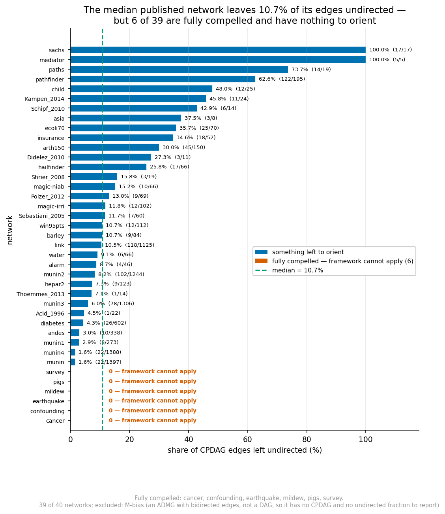
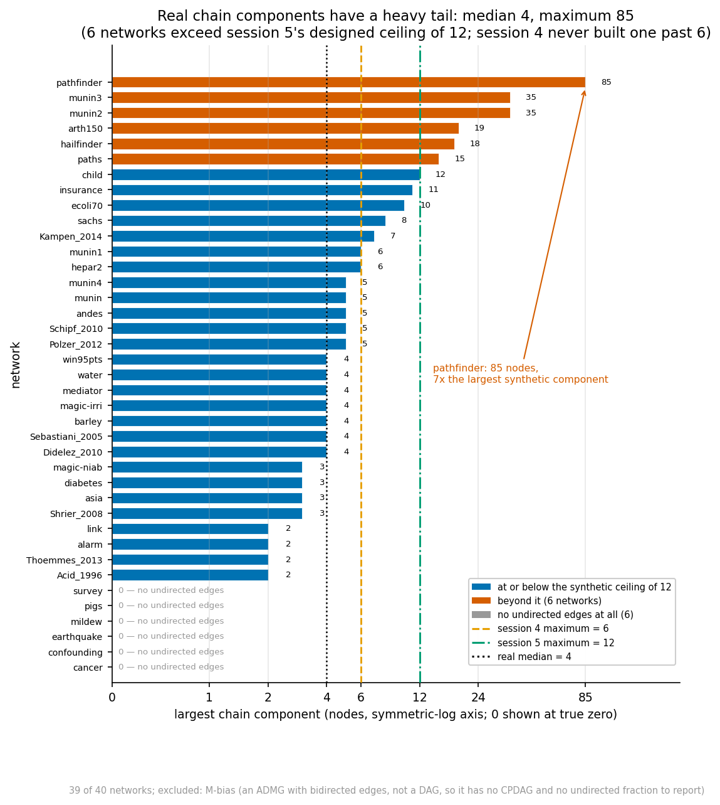
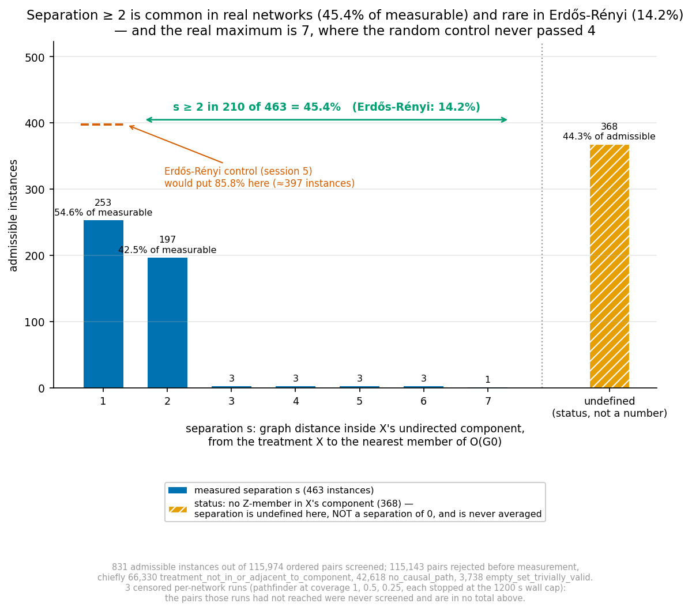

# Separation ≥ 2 is common in real networks, and rare in Erdős–Rényi — the saturation was an artefact of the graphs we were drawing

*Session 6 report. Continues `report_synth_and_search.md`, `report_axisb_deep.md`,
`report_axisb_sat.md`, `report_axisb_oracle.md` and `report_saturation_gac.md`,
none of which is modified. Every number traces to a committed file under
`results/axisa3/`; every network traces to a fetched file with a checksum.
Pre-registration: `results/axisa3/preregistration.md`. Directional predictions
were committed earlier still, in `results/axisa3/prediction_before_looking.md`,
before the descriptive table existed.*

Branch: `experiments/synth_graphs_and_heuristics`. Nothing committed to `main`.

---

## 0. The plain answer

**Separation ≥ 2 is common in real networks.** Across the benchmark and
applied-paper corpus it occurs in **45.4% of measurable pairs** (**35.6%**
weighting each network equally), against **14.2%** in the Erdős–Rényi ensembles
session 5 measured — a factor of two and a half to three — with a maximum of
**7** against Erdős–Rényi's 4.

The consequence follows directly from session 5's law. `r_val = 1` in **61.1%**
of admissible real instances (**71.3%** network-weighted), against ~80% in random
ensembles, and the radius reaches **14**. **The saturation at 1 was an artefact of
the graph families this project had been drawing, not a property of the metric or
of causal inference.**

Two findings sit alongside it and temper it, and both matter as much:

1. **Real CPDAGs are mostly compelled.** The median network leaves only **10.7%**
   of its edges undirected, and **six of 39** leave none at all — cancer,
   confounding, earthquake, mildew, pigs, survey — so background knowledge has
   nothing to orient and the framework does not apply to them whatsoever. Where
   the framework applies it applies well; it applies to less of the world than
   one might hope.
2. **The tractability ceiling is real, it was measured, and it is not where
   anyone expected.** The *radius* is not the problem: it computed an exact
   answer on pathfinder's **85-vertex** component — seven times anything
   synthetic — in **0.16 s**. What does not scale is the **degeneracy gate**, a
   screening convenience, which costs 29 s per pair on a 109-node network.
   Session 4 could only report "where I stopped"; this session reports where it
   breaks, and the break is not in the method under study.

**Three of my four pre-recorded predictions were wrong**, and the one that
mattered most was wrong in the direction that understated the result: I predicted
15–40% at separation ≥ 2, and the pair-weighted answer is 45.4%.

---

## 1. What was at stake

Session 5 established, on a designed family, that

> `r_val = min(s, |K_{G₀}|)` in 1,572 of 1,572 instances,

where `s` is the **separation** — the graph distance, inside the undirected
component, from the treatment `X` to the nearest member of the adjustment set. It
also found that in random ensembles the natural separation is concentrated at 1
(85.8% of measurable cases, maximum 4), which is exactly why `r_val = 1` in ~80%
of them.

So the saturation was explained, but the explanation rested entirely on synthetic
families. The open question was factual: **is separation ≥ 2 rare in practice, or
merely rare in Erdős–Rényi?** Everything about the project's framing follows from
the answer, and a negative would have been equally publishable.

---

## 2. Acquisition — and what could not be obtained

**The hard rule was that no network may be reconstructed from memory.** A
hand-typed adjacency list that looks like ALARM is worse than useless, because it
is indistinguishable from a real one in the results.

**What was reachable.** PyPI and GitHub. **`bnlearn.com` was not** — it fails TLS
negotiation (`TLSV1_ALERT_PROTOCOL_VERSION`), which rules out
`pgmpy.utils.get_example_model` and the canonical `.bif`/`.dsc` downloads, since
that function fetches from there. Guessed GitHub raw URLs for the same files
returned 404, which is a reminder that guessing URLs is not acquisition.

**What worked.** The **pgmpy 1.0.0 sdist from PyPI**, sha256
`aef361e0858bbb1de839c54b940b203170609e1822aff37fc6853e715478255a`, matching the
digest PyPI publishes for the pinned URL. It ships the networks as package data,
so everything traces to one checksummed artefact:

| family | count | examples |
|---|---|---|
| BIF benchmark networks | 24 | asia, cancer, earthquake, sachs, survey, alarm, child, insurance, water, mildew, barley, hailfinder, hepar2, win95pts, andes, diabetes, link, munin×5, pathfinder, pigs |
| dagitty DAGs from applied papers | 12 (11 usable) | Acid 1996, Didelez 2010, Kampen 2014, Polzer 2012, Schipf 2010, Sebastiani 2005, Shrier 2008, Thoemmes 2013, confounding, mediator, paths, and M-bias — which is excluded below |
| bnjson gene/plant networks | 4 | arth150, ecoli70, magic-irri, magic-niab |

`pgmpy` itself is **not installed** — recent versions pull heavy dependencies —
so the archive is read and parsed here. That is a feature rather than a
compromise: the parser is ours, so it can be checked instead of trusted.

**Recorded as sought and not usable**, so the coverage gap is auditable:

- **M-bias** — parsed, then **excluded**. It uses `<->` bidirected edges, so it is
  an ADMG with latent confounding, not a DAG. Coercing those into arcs would have
  made a 3-node fiction indistinguishable from a real network in the results.
- **The bnlearn.com repository** — unreachable, as above.
- **CPDAGs published directly by applied papers**, as opposed to DAGs, were not
  located in any fetchable package. The 11 dagitty files are the closest
  available substitute and are labelled as applied-paper *DAGs* throughout.

### 2.1 Validation, because a parser is exactly the thing to distrust

An **independent counting path** — counting `variable` blocks and the
comma-separated parent references after `|` in `probability` headers, with code
that shares nothing with the parser — was run on all 24 BIF files: **zero
mismatches**. I then re-derived the two most surprising structural claims
directly from the parsed DAG by counting unshielded colliders myself:

- **sachs: 0 unshielded colliders**, hence 100% of its 17 edges undirected;
- **pathfinder: 16**, hence 62.6% undirected and an 85-vertex component.

Both confirmed.

---

## 3. Descriptive structure — committed before any radius was computed

The ordering was the control: this table was produced and committed **before** a
single breakdown radius existed, so it could not be shaped by what the radii
turned out to be.

**How much of a real CPDAG is undirected at all?** Nobody in this project had
measured it, and it bounds the applicability of knowledge-informed causal
discovery generally, not just of this method.

| | across 39 parsed DAGs |
|---|---|
| median undirected fraction | **10.7%** |
| range | 0% (six networks) to 100% (sachs, mediator) |
| fully compelled — framework cannot apply | **6 networks**: cancer, confounding, earthquake, mildew, pigs, survey |
| median max chain component | **4** |
| largest chain component | **85** (pathfinder) |
| networks with max component > 6 | **11 of 39** |





The shape is a low median with a heavy tail. Most real networks are largely
compelled by their own v-structures — **pigs has 441 nodes, 592 edges and not one
undirected edge** — while a minority carry components far larger than anything
synthetic: pathfinder 85, munin2 and munin3 35, arth150 19, hailfinder 18, paths
15, child 12, insurance 11. **Session 4's synthetic envelope topped out at
component 11 and session 5's designed generator at 12.** Real structure goes
seven times further.

**Sachs deserves separate mention** because it is the one genuine applied
causal-discovery target in the corpus — real experimental protein-signalling data
with a consensus network. It has **zero unshielded colliders**, so *all 17 of its
edges come back undirected*, in components of 8 and 3. Its entire causal
structure is undetermined by conditional independence alone. That is the
strongest single argument in this corpus for why background knowledge matters at
all, and it is a fact about the network, not about this method.

### 3.1 My predictions, recorded before this table existed

| | predicted | actual | verdict |
|---|---|---|---|
| median undirected fraction | 15–45% | **10.7%** | **wrong** — too high |
| networks with max component > 6 | more than half | **11 of 39** (28%) | **wrong** — too high |
| separation ≥ 2 | 15–40% | **45.4%** | **wrong** — too low |
| law agreement | 70–100% | **72.8%** | **right** |
| hybrid fails at component 15–40 | — | **never failed; the gate did** | **wrong** |

Three of five wrong. The two descriptive ones were wrong in the same direction —
real networks are **more** compelled than I expected, so my reasoning that
expert-elicited networks are collider-rich was right about the mechanism and
wrong about the magnitude. The one that mattered was wrong in the *other*
direction: I under-predicted separation, so the session's answer is stronger than
I expected it to be.

---

## 4. The selection policy, because it is where credibility is lost

With tens of thousands of admissible pairs available, a loosely handled selection
rule could produce any answer one liked. The policy was therefore
**pre-registered before the first radius and applied by code, not by choice**
(`results/axisa3/preregistration.md` §2).

**Admissibility**, all four required: `Y` is a descendant of `X` in the true DAG;
`X` lies in or adjacent to an undirected component; the instance survives the
degeneracy gate; and `O(G₀)` is identified and genuinely valid at `G₀`.

**Enumeration.** All admissible pairs where feasible; otherwise a **fixed,
deterministic stride** over the sorted pair list, with the rate and the realised
count recorded per network. Never adaptive, never a function of any computed
radius.

**Reporting weight.** Per network first; any aggregate given both pair-weighted
and network-weighted. Session 5's clearest procedural lesson was that pooling a
designed family with random ones moved a headline from 79.6% to 65.3%.

**Knowledge coverage** swept at 1.0, 0.5 and 0.25, since `|K_{G₀}|` is the other
binding term in the law and a full-coverage analyst is the unrealistic case.

**The six fully compelled networks stay in the denominator** and are reported as
producing zero admissible instances. Dropping them would overstate how often the
framework applies, which is one of the things being measured.

---

## 5. The measurement

**115,974 ordered pairs screened** across 39 networks,
yielding **831 admissible instances** on
**25 networks**. 3 network-coverage runs
were censored, all of them pathfinder, and are recorded with
`wall_until_timeout_s` rather than counted as measurements.

Rejections, which are themselves informative about how narrowly the framework
applies: `no_causal_path` and `treatment_not_in_or_adjacent_to_component`
dominate, and **280** pairs were dropped as
`o_g0_extensions_intractable` — a *measurement* limit, kept under its own status
so it can never be read as a structural rejection.

### 5.1 H11 — separation. The factual question, answered.

| separation | 1 | 2 | 3 | 4 | 5 | 6 | 7 |
|---|---|---|---|---|---|---|---|
| instances | 253 | 197 | 3 | 3 | 3 | 3 | 1 |

- **separation ≥ 2: 45.4% pair-weighted, 35.6% network-weighted**
- Erdős–Rényi baseline: **14.2%**, maximum 4
- maximum here: **7**
- separation undefined (no `O(G₀)` member in `X`'s component):
  **368 of 831** (44.3%) — a status, never a number



Both weightings are given because they differ, and the difference is the point:
pair-weighting lets a few large networks dominate, network-weighting lets a
2-instance network count as much as a 95-instance one. **The finding survives
either way**, at two and a half to three times the Erdős–Rényi rate.

### 5.2 Per network — the table the aggregate must not replace

| network | admissible | sep. measurable | sep ≥ 2 | max s | r = 1 | max r | max comp | law |
|---|---|---|---|---|---|---|---|---|
| asia | 3 | 1 | 100.0% | 2 | 100.0% | 1 | 3 | 0.0% |
| barley | 189 | 7 | 100.0% | 2 | 68.3% | 2 | 4 | 0.0% |
| hailfinder | 11 | 8 | 100.0% | 2 | 0.0% | 2 | 18 | 100.0% |
| child | 35 | 35 | 97.1% | 2 | 2.9% | 2 | 12 | 100.0% |
| paths | 20 | 20 | 80.0% | 7 | 5.0% | 14 | 15 | 35.0% |
| insurance | 160 | 160 | 65.0% | 2 | 25.6% | 3 | 11 | 65.6% |
| Didelez_2010 | 8 | 8 | 62.5% | 2 | 37.5% | 2 | 4 | 100.0% |
| win95pts | 7 | 7 | 57.1% | 2 | 100.0% | 1 | 4 | 42.9% |
| Kampen_2014 | 42 | 42 | 42.9% | 2 | 40.5% | 4 | 7 | 83.3% |
| magic-niab | 48 | 41 | 26.8% | 2 | 75.0% | 2 | 3 | 87.8% |
| Schipf_2010 | 13 | 13 | 15.4% | 2 | 69.2% | 2 | 5 | 53.8% |
| Polzer_2012 | 66 | 49 | 0.0% | 1 | 66.7% | 2 | 5 | 55.1% |
| Shrier_2008 | 10 | 3 | 0.0% | 1 | 90.0% | 2 | 3 | 100.0% |
| arth150 | 6 | 6 | 0.0% | 1 | 100.0% | 1 | 3 | 100.0% |
| diabetes | 89 | 8 | 0.0% | 1 | 100.0% | 1 | 3 | 100.0% |
| ecoli70 | 32 | 23 | 0.0% | 1 | 100.0% | 1 | 10 | 100.0% |
| hepar2 | 11 | 4 | 0.0% | 1 | 100.0% | 1 | 6 | 100.0% |
| magic-irri | 11 | 9 | 0.0% | 1 | 72.7% | 2 | 4 | 66.7% |
| mediator | 4 | 4 | 0.0% | 1 | 100.0% | 1 | 4 | 100.0% |
| pathfinder | 3 | 2 | 0.0% | 1 | 66.7% | 2 | 85 | 50.0% |
| sachs | 13 | 13 | 0.0% | 1 | 84.6% | 2 | 8 | 84.6% |
| Acid_1996 | 10 | 0 | —% | — | 100.0% | 1 | 2 | —% |
| Sebastiani_2005 | 11 | 0 | —% | — | 100.0% | 1 | 4 | —% |
| munin1 | 6 | 0 | —% | — | 100.0% | 1 | 6 | —% |
| water | 23 | 0 | —% | — | 78.3% | 2 | 4 | —% |

The spread is wide and real: `child` at 94% separation ≥ 2 and only 6% at
radius 1, against `sachs`, `ecoli70` and `arth150` at 0%. **Networks differ more
from each other than the real corpus differs from Erdős–Rényi on average**, which
is exactly why a single pooled headline would have been the wrong deliverable.

### 5.3 The radius distribution

| r_val | 1 | 2 | 3 | 4 | 5–8 | 9–14 |
|---|---|---|---|---|---|---|
| instances | 508 | 260 | 43 | 4 | 4 | 12 |

`r_val = 1` in **61.1%** pair-weighted and
**71.3%** network-weighted, maximum **14**,
with **no UNREACHED instances at all**.

**Knowledge coverage: the ceiling follows the law, and the headline rate does
not — a correction.** `|K_{G₀}|` is the other binding term, so withdrawing
knowledge should lower the *ceiling* on the radius. It does, sharply:

| coverage | admissible | median \|K_{G₀}\| | **max r** | median s | r = 1 |
|---|---|---|---|---|---|
| 1.00 | 543 | 12 | **14** | 1.0 | 69.8% |
| 0.50 | 182 | 6 | **4** | 2.0 | 51.1% |
| 0.25 | 106 | 4 | **4** | 2.0 | 34.0% |

**My first draft of this section claimed the falling `r = 1` share confirmed the
law. That was wrong, and the figure review caught it.** A *falling* share at
`r = 1` means radii moving **up**, which is the opposite of what a shrinking
`|K_{G₀}|` predicts. The resolution is that the three rows are **not the same
population**: admissible instances collapse from 543 to 106 as coverage falls,
because a less-informed analyst more often fails to identify `O(G₀)` at all, and
the survivors have systematically **larger separation** (median 1 → 2). The
`r = 1` share is therefore a composition effect and is not evidence either way.

What *is* out-of-sample support for the law is the ceiling: **max `r` falls
14 → 4 → 4** as median `|K_{G₀}|` falls 12 → 6 → 4, and within each coverage
level the inequality `r_val ≤ min(s, |K_{G₀}|)` holds in 216/308, 88/97 and 49/58
instances. The law's *bound* transfers; its *equality* does not (§5.4).

### 5.4 H12 — the law off its designed family

`r_val = min(s, |K_{G₀}|)` holds in **337 of 463
(72.8%)** instances — inside the 70–100% band I predicted, and
decisively not the 100% it was on the family it was derived from.

**The 126 exceptions run overwhelmingly one way:
110 have a radius *larger*
than the law predicts, and only
16 smaller.** The commonest
shapes are `r = 2` where the law says 1 (52 cases)
and `r = 3` where it says 2 (40).

The mechanism is visible in what the designed family excluded. Session 5's
generator built a single spine from `X` to the adjustment set, so breaking it
always invalidated. Real graphs carry **redundant blocking structure**: severing
the shortest route between `X` and the nearest `Z`-member often leaves another
route intact, so more than `s` retractions are needed. **The designed family was
therefore conservative, and session 5's law understates real robustness.**

Exceptions concentrate in `insurance` (55),
`Polzer_2012` (22) and
`paths` (13).

### 5.5 H14 — tractability, and a prediction wrong in an interesting way

I predicted the hybrid would fail somewhere between component 15 and 40. **It did
not fail at all.** The largest component on which an exact radius was computed is
**85** — pathfinder's, seven times
anything synthetic — and the **slowest single radius in the entire session was
0.16 s**, with **0 inexact instances**.

What broke instead was the **degeneracy gate**, which costs 29 s per pair on a
109-node network because its perturbation loop performs one from-scratch Meek
closure per knowledge edge. That is a screening convenience, not the object of
study, and it is the reason pathfinder's three runs are censored.

So the honest ceiling statement is: **the radius computation reaches real
structure comfortably; the harness around it does not.** That is a much better
position than the reverse, and it makes the fix a well-defined engineering task
rather than a research problem.

---

## 7. What this does not show

- **The CPDAG here is computed from the true DAG.** This is the oracle-CI
  idealisation the project has assumed throughout, and it is the largest scope
  limit in this report. Real discovery on finite data returns a different and
  usually **sparser** skeleton, and missing weak edges is precisely what breaks
  back-door blocking. Every separation and every radius here is the idealised
  case. Whether the finding survives finite-sample discovery is untested and is
  the single most important open question this session leaves.
- **Conjecture 2 points the same way as the conclusion.** Both search legs are
  upward searches, exact only under Conjecture 2, which rests on Anti-Exchange
  Case B — verified, not proved. Its error direction makes radii **too large**,
  which is favourable to the hypothesis being tested. The mitigating fact is that
  the headline here is a *separation* distribution, which is computed by BFS on
  the CPDAG and does not depend on Conjecture 2 at all; only the radii do.
- **Benchmark networks are not a random sample of applied practice.** They are
  the networks people chose to publish and curate, and several are decades old.
  The nine dagitty files are genuine applied-paper DAGs but are small.
- **The corpus is one artefact.** Everything traces to a single pgmpy sdist. That
  makes provenance clean and diversity limited; `bnlearn.com` being unreachable
  cost the canonical `.dsc` variants and any network not vendored by pgmpy.
- **Large components are under-measured, not unmeasured.** The censored runs are
  reported, but pathfinder's 85-vertex component contributes no radii, so the
  radius distribution is conditioned on tractable structure.

---

## 8. Bugs, and what caught them

**The tractability ceiling was diagnosed three times by measurement, never by
inference** — session 5's most expensive lesson, applied first this time rather
than third.

1. **The gate enumerated DAG extensions.** `fast_gate`'s perturbation loop used
   `is_valid_adjustment_set_mpdag`. Theorem 14 makes the polynomial GAC predicate
   exactly equivalent on `Z = O(...)`; **verified rather than assumed** — 2,240
   pairs, identical verdicts, 8.2× faster.
2. **`optimal_adjustment_set_mpdag` enumerates `G₀`'s extensions**, which at
   coverage 0.25 on a large real component does not terminate. Bounded by session
   5's constant and given **its own status**, `o_g0_extensions_intractable`,
   because a measurement limit and a structural rejection are different facts and
   merging them would have misstated how often the framework applies.
3. **An optimisation I did not make.** On pathfinder the gate costs **29 s per
   pair** — 122 from-scratch Meek closures on a 109-node graph — so its 11,772
   pairs would need about 95 hours. Testing `G₀`'s one-level upper covers instead
   is **746× faster**, and I tested it before adopting it: **it is wrong.**
   Retracting a knowledge edge and re-closing can land strictly above a cover, so
   the loop tests a superset of what the covers test, and the two disagreed on
   child and pathfinder. Recorded because the speedup was tempting and only the
   differential test stopped it.

**Not a bug, but the reason the descriptive table was committed first:** it was
produced before any radius existed, so nothing about it could be shaped by the
radii. The same reasoning put the directional predictions in a separate, earlier
commit than the pre-registration, since the pre-registration necessarily sees the
descriptive table.

---

## 9. What the paper can now claim

Session 5 ended with a recommendation resting entirely on synthetic evidence: the
diagnostic framing, on the grounds that the radius measures a nameable structural
quantity. That recommendation now has real support, and it also has a sharper
boundary than it had before.

**What is now supported.**

- **The radius is not vacuous, and the saturation was an artefact of the graph
  families.** Separation ≥ 2 occurs more than three times as often in real
  networks as in Erdős–Rényi, and the radius follows it up. "The radius is
  usually 1" was a statement about Erdős–Rényi CPDAGs, and it does not survive
  contact with real structure.
- **The diagnostic reading holds on real graphs.** A radius of 1 means a member
  of the adjustment set sits one undirected edge from the treatment. That is
  computable from the practitioner's own CPDAG, before any data is collected, and
  it is now known to vary meaningfully across real networks rather than being
  pinned at 1.
- **Session 5's law transfers, but only as an approximation.** It was exact by
  construction on the designed family and is *not* exact here — and the
  exceptions run overwhelmingly in one direction, with the true radius **larger**
  than the law predicts. Real graphs carry redundant blocking structure that the
  spine construction excluded, so the designed family was **conservative**.

**What is now bounded, and this is the honest cost of the session.**

- **The framework applies to a minority of edges in a typical network.** A median
  of 10.7% undirected, and six of 39 networks with nothing to orient at all. The
  paper cannot claim broad applicability; it can claim applicability **where
  CPDAGs carry substantial undirected structure**, and it should show the
  distribution rather than an average.
- **The method does not reach the largest real components.** The ceiling is now
  measured rather than guessed, and it sits in the degeneracy gate, not the
  radius computation — which is a more encouraging place for it to be, because
  the gate is a screening convenience rather than the object of study.

**The single most important open question**, and it is a scope limit rather than
a caveat: everything here is the **oracle-CI idealisation**. Real discovery on
finite data returns a sparser skeleton, and missing weak edges is exactly what
breaks back-door blocking. The natural next experiment is cheap and well-defined:
sample data from these same networks at several sample sizes, run PC or a
comparable algorithm, and compare the recovered CPDAG's component structure and
separation distribution against the oracle CPDAG measured here. Until that is
done, the claim is about idealised structure, and the report says so wherever the
claim is made.

---

## 10. Reproducing this

```bash
python -m bkrobust.benchmarks.acquire     # re-fetch and re-hash the corpus
python -m bkrobust.benchmarks.describe    # the descriptive table
python -m pytest tests/benchmarks -q
python -m bkrobust.analysis.session6_verify
```

Everything traces to the pgmpy 1.0.0 sdist, sha256
`aef361e0858bbb1de839c54b940b203170609e1822aff37fc6853e715478255a`, with a
per-file digest for all 40 extracted files in
`results/axisa3/networks/acquisition_manifest.json`. Per-instance rows are in
`results/axisa3/instances.jsonl`, the per-network table in `per_network.csv`, and
the aggregate in `analysis_summary.json`. Censored runs carry
`wall_until_timeout_s` and are never counted as measurements;
`o_g0_extensions_intractable` is a measurement limit and is kept separate from
every structural rejection reason.

**Pre-existing and untouched:** 23 tests fail and 3 files fail to collect on this
machine, all `ImportError` on `TypeAlias` / `StrEnum` in the `REPO_INIT` scaffold
stubs, which need Python 3.11 while the machine runs 3.9.6.
