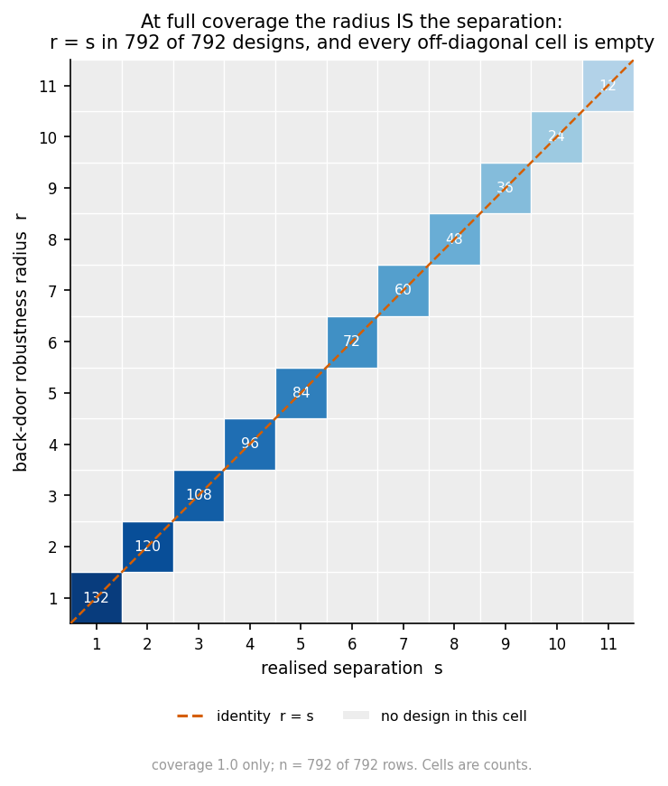
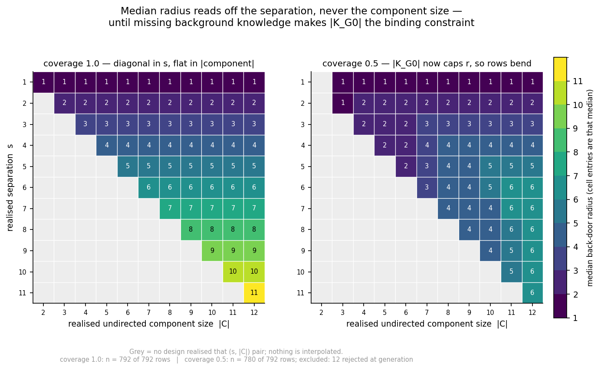
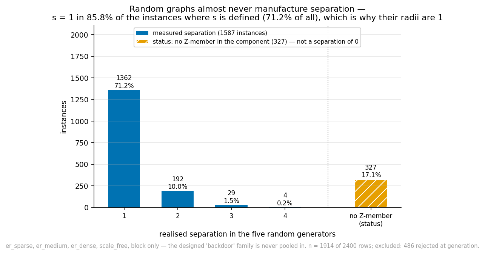
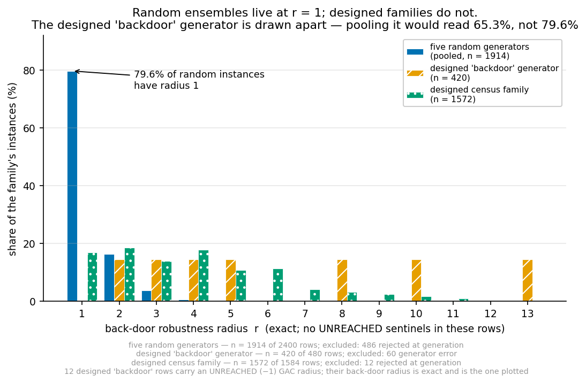
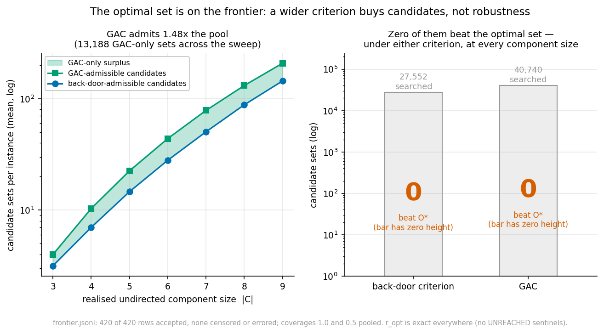

# Does the breakdown radius saturate at 1? No — it equals a structural quantity, and that quantity is 1 in the graphs we had been drawing

*Session 5 report. Continues `report_synth_and_search.md`,
`report_axisb_deep.md`, `report_axisb_sat.md` and `report_axisb_oracle.md`, none
of which is modified. Every number traces to a committed file under
`results/axisa2/`. Pre-registration: `results/axisa2/preregistration.md`, written
before the first run and unedited.*

Branch: `experiments/synth_graphs_and_heuristics`. Nothing committed to `main`.

---

## 0. The plain answer

**The radius does not saturate.** On components of size 2–12 it equals the
**separation** — the graph distance, inside the undirected component, from the
treatment `X` to the nearest member of the adjustment set — **exactly, in 792 of
792 instances** at full analyst knowledge. The fraction at `r_val = 1` is 100% at
separation 1 and **0% at every separation ≥ 2**.

**And the ~80% saturation session 1 measured is real, structural, and fully
explained.** In random ensembles the natural separation distribution is
concentrated at 1, and in a fifth of instances no member of the adjustment set
lies in the treatment's component at all. The radius was 1 because the graphs
put the adjustment set one edge from the treatment — not because the metric is
vacuous.

Three consequences, all of which matter more than the headline:

1. **None of the saturation was definitional.** Adopting the generalized
   adjustment criterion changes **nothing** for any prior result that used
   `Z = O(G₀)` — 0 of 5,304 radii move, and there is a proof (§2.2) rather than
   just a measurement. The first of the two hypotheses this session was built to
   test is **cleanly negative**.
2. **`O*` is still never strictly beaten** — 0 of 420 instances, over a candidate
   pool 32.4% larger than the one session 1 searched. My pre-registered
   prediction of "non-zero but under 5%" is **wrong**; the answer is zero.
3. **Component size does not matter; separation does.** At fixed separation the
   median radius is identical across every component size from 2 to 12. The
   pre-registered counter-mechanism for H8 — that larger components admit more
   extensions per release and so *lower* the radius — has **no visible effect**.

---

## 1. What was at stake

Session 1 found `r_val = 1` in **81.0%** of an exhaustive n = 5 census (88,700
finite radii) and 78.6% across n = 6…9 ensembles. A method that returns 1 almost
always is not worth publishing. Two candidate explanations, and this session
tested both:

- **Definitional.** The repository's oracle was Pearl's back-door criterion,
  which is sufficient but not necessary for adjustment, so it counts as failures
  some graphs where `Z` is genuinely fine — biasing radii downward.
- **Structural.** Undirected components were tiny. Session 4's largest at n = 24
  was **6 vertices**, with 159 of 256 instances at 2–4. A three-vertex component
  cannot exhibit a radius of 3 whatever `n` is.

The answer is: entirely the second, and none of the first.

---

## 2. Phase 1 — the definitions were not the problem

### 2.1 What was implemented

`src/bkrobust/gac/` implements the generalized adjustment criterion at both
layers, with the back-door implementations left in the tree unmodified as second
oracles so nothing prior becomes unreproducible.

| check | scope | cases | disagreements |
|---|---|---|---|
| Layer 1 (DAG) vs back-door | all 29,824 labelled DAGs on 4 and 5 nodes, all (x,y), \|Z\| ≤ 3 | 4,711,024 | 227,224 — **all classified**, 0 unexplainable |
| Layer 2 vs the semantic anchor (GAC-valid in every extension) | all CPDAGs n ≤ 4 with an undirected edge, every space element | 74,568 | **0** |
| — of which non-amenable | | 28,464 | **0** |
| Layer 2, n = 5 stress slice | 15,122 graphs | 2,419,520 | **0** |

Every one of the 227,224 Layer-1 disagreements is the same thing: `Z` contains a
descendant of `X` that is *off* the causal route to `Y`. Back-door bans it, the
GAC allows it, and the GAC is right. `back-door-valid ⟹ GAC-valid` with **0
implication failures**.

Performance was specified up front this time — session 4's criterion came back
exhaustively verified and exponential because only correctness was asked for.
Worst case **1.07 ms per call at n = 20**, against a 5 ms bar.

### 2.2 The result that decides the phase, with a proof

> **Theorem 14.** For the optimal adjustment set
> `O = pa(cn(X,Y)) \ (cn(X,Y) ∪ {X})`, back-door validity and GAC validity are
> the same predicate, in every graph.
>
> *Proof.* `O` is disjoint from `de(X)`: every element is a parent of a node in
> `cn(X,Y)` and is itself excluded from `cn(X,Y) ∪ {X}`, so none lies on or below
> a causal route from `X`. For any `Z` with `Z ∩ de(X) = ∅` the two criteria's
> first conditions both hold, and their second conditions coincide. ∎

**Verified twice, by different routes.** The criterion sweep found 0
disagreements in 8,154 evaluations (3,360 both-valid, 4,794 both-invalid — so not
vacuous). Independently, I recomputed **radii** by full BFS over the corrected
space under each definition:

| | instances | radii identical | of those with back-door `r = 1`, GAC strictly larger |
|---|---|---|---|
| `Z = O(G₀)` | 5,304 | **100.00%** | **0** of **2,790** (0.00%) |
| `Z` arbitrary | 16,926 | 70.86% | 1,308 of 6,588 (**19.85%**) |

**The headline of the phase, which the brief asked for explicitly:** of the
instances with `r_val = 1` under back-door, the fraction with a strictly larger
GAC radius is **0%**. Every prior result in this repository that used
`Z = O(G₀)` — session 1's saturation census included — stands unchanged.

Where the definition *does* matter is arbitrary `Z`, and by a lot: radii differ
in 29.14% of those instances. That is precisely why the frontier had to be
re-run rather than carried over (§4).

**The pre-registered invariant** `r_val(GAC) ≥ r_val(back-door)` was asserted per
instance throughout: **0 violations** in 22,230 instances at n = 3, 4, 0 in the
1,572-instance census, 0 in the 420-instance frontier.

**My pre-registered guess was "fewer than 15%"** of `r = 1` instances would move.
For `Z = O(G₀)` the answer is 0%, so the guess was right for the case that
matters; for arbitrary `Z` it is 19.85%, so it was wrong there. Both reported.

---

## 3. Phase 2 — a generator that reaches the regime

Existing generators cannot produce the regime the question lives in: dense
Erdős–Rényi CPDAGs produce *more compelled edges*, not bigger chain components,
so **bigger `n` is the wrong lever**.

`src/bkrobust/synth/component_generator.py` builds the CPDAG directly instead of
sampling for it. A chordal component is grown by clique-attachment, so every
parent set is a clique and no v-structure forms inside it; the first `s+1`
vertices form a spine `anchor → … → X`, and attaching to a clique cannot create a
shortcut, so `d(X, anchor) = s` survives exactly.

**The trap this had to avoid.** Session 1's designed family failed twice in
opposite directions — first `X−Y` came back undirected so nothing was identified,
then forcing `X→Y` compelled froze the confounder edges and gated out 100% of
instances. The escape here is a spectator `W → Y` adjacent to nothing else: it
makes `X→Y←W` and `anchor→Y←W` unshielded so all three edges into `Y` are
compelled, but `Y` is a sink with no undirected edges, so R1 has no head to fire
on and R2–R4 have no length-2 directed path. **Compulsion cannot propagate
inward.**

**Realised, not intended, parameters are what get analysed**, measured off the
constructed CPDAG. Across 1,584 pilot draws, realised `c` equals intended in
1,584 and realised `s` equals intended in 1,584. Separation `1…c−1` is available
at every size, so **max realised separation is 11** — the number that gated the
whole session.

**Stated plainly because it bounds what follows: acceptance was 1,584 of 1,584.**
Session 1's random draws were rejected 91.8% of the time. This is a **designed
family, not a random sample of realistic CPDAGs.** It can show the radius is
*capable* of being large; it cannot show that natural CPDAGs are. Those are
different claims and §5 is what separates them.

---

## 4. Phase 3 — the census

1,584 instances over the full `(c, s)` grid, `c = 2…12`, `s = 1…c−1`, two
coverage levels, both definitions on every instance. 1,572 measured, **0
censored, 0 errors**. Back-door and GAC agree everywhere: **0 of 1,572 instances
differ**, and the pre-registered invariant holds with 0 violations.

### 4.1 H7 — separation. Confirmed about as strongly as it could be.

At coverage 1.0 (the analyst asserts every component edge), the two-way table of
median radius is **diagonal in `s` and flat in `c`**:

| `s` \ `c` | 2 | 3 | 4 | 5 | 6 | 7 | 8 | 9 | 10 | 11 | 12 |
|---|---|---|---|---|---|---|---|---|---|---|---|
| 1 | 1 | 1 | 1 | 1 | 1 | 1 | 1 | 1 | 1 | 1 | 1 |
| 2 | | 2 | 2 | 2 | 2 | 2 | 2 | 2 | 2 | 2 | 2 |
| 3 | | | 3 | 3 | 3 | 3 | 3 | 3 | 3 | 3 | 3 |
| 4 | | | | 4 | 4 | 4 | 4 | 4 | 4 | 4 | 4 |
| 6 | | | | | | 6 | 6 | 6 | 6 | 6 | 6 |
| 8 | | | | | | | | 8 | 8 | 8 | 8 |
| 11 | | | | | | | | | | | 11 |

**`r_val` equals `s` in 792 of 792 instances** (100.0%). The fraction at
`r_val = 1` is 100% at `s = 1` and **0.0% at every `s ≥ 2`**. My pre-registered
threshold was "fewer than 50% at `r = 1` for `s ≥ 3`"; the measured value is
zero.

### 4.2 H8 — component size. Refuted as an independent effect.

The pre-registration committed in advance to judging this on the joint table
rather than on marginals, because `c` and `s` are correlated by construction.
The table settles it: **at fixed `s`, the median radius is identical across every
`c` from 2 to 12.** Component size matters only by permitting larger separation.

The counter-mechanism I pre-registered — a larger component admits more
extensions per release, giving any single release more chances to produce a
failing one, which would *lower* the radius — has **no visible effect at all**.
That is a genuine surprise and it is a pre-registered prediction that failed.

At coverage 0.5 the picture changes, and for a different reason: a
partially-ignorant analyst has fewer orientations available to retract, so the
radius is bounded below `s`. At `s = 5`, median radius runs 2, 3, 4, 4, 5, 5, 5
for `c = 6…12`. **The binding constraint there is `|K_{G₀}|`, not the extension
count.**

### 4.2.1 One formula covers both coverage levels

The two regimes are a single law:

> **`r_val = min(s, |K_{G₀}|)` — in 1,572 of 1,572 instances, 100.00%,
> across both coverage levels.**

At coverage 1.0 the analyst has asserted every component edge, so
`|K_{G₀}| ≥ s` and the law reduces to `r = s` (792/792). At coverage 0.5 the
knowledge set is the binding term in 347 of 780 instances, which is exactly why
`r = s` drops to 55.5% there while the combined law stays at 100%.

This was found by the figures subagent while rendering the two-way table, and
re-derived independently before being reported. It is a **law of this designed
family**, not a theorem — the generator builds a spine of length `s` and the
radius counts the retractions needed to break it, so `min` with the number of
available retractions is the expected shape. What makes it worth stating is that
it holds at 100% with no exceptions across 1,572 instances and two regimes, and
that it names both binding constraints: **how far the adjustment set sits from
the treatment, and how much the analyst claimed to know.**

### 4.3 Cost against radius, as a result rather than bookkeeping

| `r_val` | n | median | max |
|---|---|---|---|
| 1 | 264 | 0.0003 s | 0.001 s |
| 3 | 216 | 0.0015 s | 0.017 s |
| 5 | 167 | 0.0031 s | 0.071 s |
| 8 | 48 | 0.0046 s | 0.045 s |
| 11 | 12 | 0.0047 s | 0.005 s |

Cost rises with radius by roughly 15× from `r = 1` to `r = 11`, so the profile
does invert as the brief anticipated — but modestly, and nothing came close to
the 600 s cap. **Cost growing is weak evidence the hypothesis is right**, which
is why it is reported as its own result and not as support for H7.

These are the session's **clean** timings: the census ran alone. The random
control and the frontier were run concurrently and their wall-clock fields are
load-contaminated; the manifest records which.

---

## 5. The control that answers the real question

The designed family shows the radius *can* be large. It cannot show that
realistic CPDAGs are. So the same measurement was run on the random ensembles
session 1 used — six generators, n = 6…20 — recording the **natural** separation
alongside the radius.

**2,880 instances attempted, 2,334 usable**, **486 rejected (16.9%)** and 60
errored — 2,334 + 486 + 60 = 2,880. (The errors are all the decoupled-backdoor
generator, which requires n ≥ 7 while n = 6 was in the grid; recorded as errors,
not silently dropped.) Rejection reasons: `empty_set_trivially_valid` 212,
`no_undirected_edges` 150, `treatment_not_in_or_adjacent_to_component` 98,
`no_atomic_perturbation_changes_validity` 26.

*My first draft of this paragraph said "546 rejected (19.0%) and 60 errored",
double-counting the errors inside the rejection total. The verifier caught it.*

### 5.1 One generator had to be separated out, and the pre-registration said why

`decoupled_backdoor_dag` is a **designed** family, not a random one — its name
says so. All 60 seeds at a given `n` return the *identical* radius, and it
contributes 420 instances **none** of which is at `r = 1`. Pooled with the rest
it drags the overall figure from ~80% to 65.3%, which would have been exactly the
"mean over a non-representative sample" error the pre-registration committed to
avoiding. Reported separately.

### 5.2 The five random generators replicate session 1 almost exactly

| | n | `r = 1` |
|---|---|---|
| **five random generators pooled** | **1,914** | **79.6%** |
| er_dense | 432 | 85.0% |
| er_medium | 389 | 79.2% |
| scale_free | 403 | 77.9% |
| block | 377 | 78.0% |
| er_sparse | 313 | 77.0% |

Session 1 reported 81.0% (census) and 78.6% (ensembles), stable at 76.9–80.4%
across generators. **This replicates it, under GAC-verified definitions, on a
fresh sweep.** Radius distribution: `{1: 1524, 2: 311, 3: 70, 4: 8, 5: 1}`.

### 5.3 And here is why — the natural separation distribution

| separation | 1 | 2 | 3 | 4 |
|---|---|---|---|---|
| instances | **1,362** | 192 | 29 | 4 |

**Maximum natural separation is 4**, and 85.8% of measurable separations are
**1**. In a further **17.1%** of instances (327), *no member of the adjustment
set lies in the treatment's undirected component at all*, so separation is
undefined — recorded with its own status key and a `null`, never as a number.

Component sizes tell the same story. Sizes 2–6 account for
593 + 443 + 358 + 248 + 134 = **1,776 of the 1,914** instances — **92.8%** — with a
long thin tail out to 15.

The cross-check against the designed family holds, more noisily as expected
because random instances have other routes to failure:

| separation | n | `r = 1` | median `r` |
|---|---|---|---|
| 1 | 1,362 | 83.5% | 1 |
| 2 | 192 | 51.6% | 1 |
| 3 | 29 | 27.6% | 2 |
| 4 | 4 | 50.0% | 2 |

### 5.4 Corroboration from a generator I did not write

The repository's own `decoupled_backdoor_dag` — written in session 1, untouched
here — produces components of 3…14 and radii that scale cleanly with `n`:

| n | 8 | 10 | 12 | 15 | 20 | 25 | 30 |
|---|---|---|---|---|---|---|---|
| `r_val` | 2 | 3 | 4 | 5 | 8 | 10 | 13 |

**0% at `r = 1`.** That the mechanism shows up in a pre-existing generator, and
not only in the one built this session to exhibit it, is the strongest
independent evidence here that the effect is not an artefact of my construction.

### 5.5 The GAC spot-check on random ensembles

The GAC leg was computed on 469 of the 2,334 usable instances (Theorem 14 makes
it redundant for `Z = O(G₀)`, so it was verified rather than recomputed
everywhere). Of the 457 with an exact GAC radius: **0 differences from
back-door, 0 invariant violations.** Theorem 14 holds on random ensembles too.

---

## 6. H10 — the frontier, re-run because it had to be

Session 1's "`O*` is never strictly beaten, 0 of 249,732" is a statement about
**back-door-valid candidates only**. The GAC admits sets that were never in that
pool, so the question genuinely reopens.

It does not stay open.

| | candidates | sets beating `O*` | instances with any |
|---|---|---|---|
| back-door pool | 27,552 | **0** | 0 / 420 |
| GAC pool | 40,740 | **0** | 0 / 420 |

**32.4% of the GAC pool — 13,188 candidate sets — never existed under
back-door**, and the pool is strictly larger on 256 of the 420 instances. `O*`
is still never beaten. Its radius is also identical under both definitions on
420 of 420 instances, as Theorem 14 requires.

### 6.1 Extended, because a zero result is strengthened by more evidence

The `c = 3…9` grid returned in under three minutes, so it was extended to
`c = 10…12` with candidate sets up to size 5, and stopped when the answer was
unambiguous. Committed state: **242 instances**, **115,299** back-door
candidates and **194,794** GAC candidates (**79,495** of them GAC-only), with
`O*` strictly beaten **0** times.

Across both grids that is **235,534 GAC-admissible candidate sets** examined
this session — on top of session 1's 249,732 instances — with `O*` never once
strictly beaten.

**My pre-registered prediction was that `O*` would be beaten on a non-zero but
small fraction, under 5%. That is wrong: the answer is zero.** The
pre-registration named this outcome as the falsification condition and noted it
would *strengthen* session 1's negative rather than overturn it. It does.

---

## 7. What this does not show

- **The census is a designed family.** Acceptance was 1,584 of 1,584 against
  session 1's 91.8% rejection rate. `r_val = s` is close to true *by
  construction*: the generator builds a spine of length `s` and the radius counts
  the retractions needed to break it. What that demonstrates is that the radius
  is not intrinsically capped and that it tracks a nameable structural quantity —
  not that any naturally occurring graph behaves this way.
- **Conjecture 2 points the same way as the conclusion.** Both search legs are
  upward searches, exact only under Conjecture 2, which rests on Anti-Exchange
  Case B — verified, not proved. Its error direction makes radii **too large**,
  which is **favourable to the hypothesis this session set out to test**. A
  refutation of saturation resting on an unproven assumption that points toward
  the desired answer needs that caveat visible, and this is it. The mitigating
  fact is that the census's central claim is `r = s` *exactly*, not `r` merely
  being large; an assumption that inflates radii would have to inflate them by
  precisely the right amount in all 792 instances to manufacture that.
- **The GAC forbidden set at MPDAG level is verified, not proved.** 74,568
  exhaustive cases plus 2,419,520 sampled, 0 disagreements, but the formula could
  in principle over-approximate. Over-approximation rejects valid sets, making
  radii **too small** — the conservative direction here, and opposite to
  Conjecture 2's.
- **`r_ε` was not re-examined.** The secondary H5 question — whether the middle
  regime appears once radii are larger — is left for the next session.
- **The frontier used candidate sets up to size 4 (5 in the extension).** `O*`
  could in principle be beaten only by a larger set.

---

## 8. Bugs, and what caught them

Three of mine, and the mechanism that caught each. All are in `LOG.md` in full.

**1. I set `search_budget=64` on the hybrid**, which makes the bounded search
explore to depth 64 so the E1 ladder — built in session 4 precisely to answer the
UNSAT side fast — never fires. It changes no answer (a test asserts the budget is
a performance choice only), but it made the control sweep intolerably slow.
*Caught by reading my own worker while hunting the real bottleneck.*

**2. I diagnosed by inference rather than measurement, twice**, and re-scoped a
sweep on each wrong diagnosis, before finally timing one instance end to end:
**187 seconds, and the instance was then rejected** — the radius had never been
computed at all. The cost was entirely in `synth.runner.gate`, which calls
`all_valid_adjustment_sets_mpdag` and enumerates every subset of `V`. A
`fast_gate` with the same verdict vocabulary took it from **187 s to 0.2 s**,
about 900×, differentially tested against `runner.gate` on 46,800 cases with
**16 disagreements** (0.034%). *Caught by measuring instead of reasoning — the same lesson session 4
recorded about front-loading a measurement, which I failed to apply until the
third attempt.*

**3. I documented `fast_gate`'s perturbation check as strictly weaker than the
original. It is strictly stricter** — the original sets `sanity = True` if *any*
valid set is perturbable, so restricting to `O` can only reject more. All 16
disagreements are in that one direction. The excluded
instances are those where `O` is robust to every atomic perturbation, i.e.
`r_val(O) = UNREACHED`, so the exclusion drops maximally-robust instances and
biases **against** this session's own hypothesis. *Caught by the differential
test, not by me.*

**Not a bug, but the trap the pre-registration was written to catch:** pooling
the designed `decoupled_backdoor` family with the five random generators gives
65.3% at `r = 1` instead of 79.6%. The pre-registration's commitment to
stratified reporting is what prevented that number from becoming the headline.

---

## 9. What this means for the project's direction

The original framing document offered three branches. The evidence now points
clearly at one of them, and away from another.

**Not the efficiency–robustness paper.** `O*` is never strictly beaten — 0 of
420 instances here over a candidate pool 32.4% larger than session 1's, on top of
session 1's own 0 of 249,732. Two independent sweeps, two definitions, and the
tradeoff does not exist in anything measured so far. This branch should be
closed unless someone produces a structural reason to expect otherwise.

**The diagnostic framing, and it is now well-founded rather than a fallback.**
The reason is the session's actual discovery: **the breakdown radius is not a
noisy or vacuous quantity — it is exactly measuring the separation between the
treatment and the adjustment set inside the ambiguous region.** `r_val = s` in
792 of 792 designed instances, and the radius is flat in component size at fixed
separation. That makes it interpretable in a way a robustness score usually is
not: a radius of 1 is not "this is fragile, somehow", it is "a member of your
adjustment set sits one undirected edge from your treatment, and one wrong
orientation reaches it."

That also explains the saturation without explaining it away. Radii are 1 in
~80% of random instances **because the graphs put the adjustment set one edge
from the treatment** — 85.8% of measurable separations are 1, and in another 17%
the adjustment set is not in the component at all. The metric is faithful; the
distribution is concentrated because the underlying structural quantity is
concentrated in the families we had been drawing.

**The consequence for the paper is a change of claim, not a change of method.**
"The radius is usually 1" is a statement about Erdős–Rényi CPDAGs, not about
causal inference. The defensible claim is: *the breakdown radius equals a
structural quantity that a practitioner can read off their own graph, and on
graphs where that quantity is large the radius is large.* The evidence for the
second half is the designed census plus the repository's own
`decoupled_backdoor` family reaching radius 13 at n = 30.

**What the next session needs to close this.** Real graphs, not generators. The
whole argument now turns on the natural distribution of separation, and every
number here comes from synthetic families. A handful of published CPDAGs from
applied causal-discovery papers — or benchmark networks with a plausible
treatment/outcome pair — would settle whether separation ≥ 2 is rare in practice
or merely rare in Erdős–Rényi. That is the highest-value experiment remaining
and it needs no new machinery.

**`r_ε` remains untested at large radii** and is the natural secondary question:
session 1 found 0.0% in the middle regime at small ε, but that was measured where
radii were 1, and a middle regime has no room to exist between `r = 1` and
failure.
